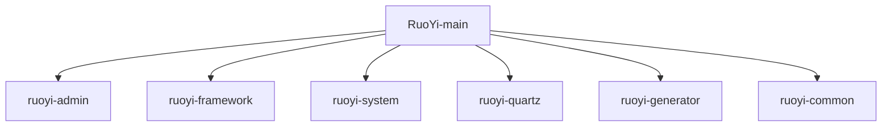

# 基础信息

|      |      |
|------|------|
| 名称 | RuoYi-main |
| 编码语言 | .java |
| 代码路径 | RuoYi-main |
| 包名 | RuoYi-main |
| 概述说明 | Java后台管理系统，涵盖监控、前端、文件、系统、工具和API文档等功能，支持高效运营和数据管理。 |

# 说明

## 概述

该代码模块是一个基于Java的综合性Web应用程序，主要由多个子模块组成，涵盖了监控管理、前端页面处理、文件操作、系统管理、工具构建、API文档访问、异步任务管理、会话管理、用户认证与授权、数据源动态切换、防止重复提交请求、日志记录、数据权限过滤、权限检查、任务调度、代码生成、JSON数据处理、表格分页管理、权限控制、核心实体数据管理、文本处理、枚举定义、自定义注解、常量管理、安全性增强、动态数据源配置、异常处理以及工具类集合等功能。这些模块共同构成了一个全面的后台管理系统，支持企业或组织的高效运营、数据管理、用户交互和系统监控。每个子模块通过多个控制器类、服务类、工具类和核心类的协同工作，确保了系统的稳定性、安全性和性能。

## 主要业务场景

1. **监控管理**
   - **服务器监控**：通过`ServerController`监控服务器状态，生成视图路径以便查看相关信息。
   - **在线用户管理**：`SysUserOnlineController`提供在线用户列表和批量强制下线功能。
   - **缓存监控**：`CacheController`负责监控缓存状态，提供缓存清理功能。
   - **Druid数据源监控**：`DruidController`处理Druid数据源相关请求，确保权限控制。
   - **登录日志管理**：`SysLogininforController`管理登录日志，支持查看、导出、删除和账户解锁。
   - **系统操作日志管理**：`SysOperlogController`提供操作日志的查看、导出、删除和清理功能。

2. **前端页面处理**
   - **表单处理**：`DemoFormController`处理表单相关请求，支持按钮、下拉框和时间轴等功能。
   - **模态窗口与弹层处理**：`DemoDialogController`处理模态窗口、弹层等请求，确保界面元素正确加载。
   - **表格数据处理**：`DemoTableController`管理用户、地区和文档数据，支持多种表格操作。
   - **图表与数据可视化**：`DemoReportController`处理ECharts、Peity等图表请求，支持数据可视化。
   - **用户操作管理**：`DemoOperateController`提供表格展示、数据查询、新增、修改、删除、导出和导入功能。
   - **图标资源管理**：`DemoIconController`支持FontAwesome和Glyphicons图标的动态生成。

3. **文件操作**
   - **文件下载与上传**：`CommonController`支持文件下载、单个文件上传、多个文件上传以及本地资源下载。

4. **系统管理**
   - **用户管理**：`SysUserController`负责用户的新增、删除、修改、查询、导入和导出。
   - **角色与权限管理**：`SysRoleController`处理角色的增删改查、权限分配和用户授权。
   - **字典管理**：`SysDictTypeController`和`SysDictDataController`管理字典类型和字典数据。
   - **部门管理**：`SysDeptController`管理部门的增删改查操作。
   - **岗位管理**：`SysPostController`处理岗位信息的查看、列表获取、导出、删除、新增和修改。
   - **系统配置**：`SysConfigController`管理系统参数的增删改查和缓存刷新。
   - **公告管理**：`SysNoticeController`管理公告信息的查询、新增、修改和删除。
   - **菜单管理**：`SysMenuController`管理菜单的增删改查操作，支持权限控制。
   - **个人信息管理**：`SysProfileController`处理密码重置、信息修改和头像更新。
   - **登录与注册**：`SysLoginController`和`SysRegisterController`分别处理用户的登录和注册流程。
   - **验证码生成**：`SysCaptchaController`生成数学和字符类型的验证码。
   - **首页与系统管理**：`SysIndexController`管理首页、锁屏、解锁、主题切换、菜单切换及系统介绍。

5. **工具构建与API文档访问**
   - **工具构建**：`BuildController`处理工具构建相关请求，确保只有授权用户能够访问。
   - **Swagger API文档访问**：`SwaggerController`将请求重定向至Swagger UI页面，方便开发者查看和测试API文档。
   - **用户信息管理**：`TestController`提供获取用户列表、查看用户详细信息、新增用户、更新用户信息和删除用户的功能。

6. **异步任务管理与资源清理**
   - **异步任务管理**：`AsyncFactory`负责同步会话管理和操作日志记录，确保关键操作的一致性和可追溯性。
   - **资源清理**：`ShutdownManager`在系统关闭时负责清理会话、异步任务和缓存，避免资源泄漏。
   - **线程池管理**：`AsyncManager`通过线程池管理异步任务，确保任务执行的可控性和安全性。

7. **用户认证与授权**
   - **用户认证**：`UserRealm`实现用户认证和授权，管理用户角色和权限，确保系统访问的安全性。
   - **登录与密码验证**：`SysLoginService`和`SysPasswordService`处理用户登录和密码验证，防止未授权访问和恶意攻击。

8. **会话管理**
   - **会话信息管理**：`OnlineSession`和`OnlineSessionDAO`管理用户会话信息，确保会话的实时性和一致性。
   - **会话同步与数量管理**：`SyncOnlineSessionFilter`和`KickoutSessionFilter`处理会话同步和会话数量管理，优化会话资源的分配。

9. **数据源动态切换**
   - **多数据源管理**：`DynamicDataSource`实现多数据源的动态切换，支持复杂的数据源管理需求，提升系统的高可用性。

10. **防止重复提交请求**
    - **拦截器机制**：通过拦截器机制防止重复提交请求，确保数据一致性和系统资源的有效利用，适用于高并发场景。

11. **日志记录与权限检查**
    - **操作日志记录**：`LogAspect`记录操作日志，排除敏感信息，便于系统行为的追踪和分析。
    - **权限验证**：`PermissionsAspect`在方法执行前进行权限验证，确保用户具备相应权限，增强系统的安全性。

12. **数据权限过滤**
    - **数据权限控制**：`DataScopeAspect`根据用户角色和权限过滤数据，防止未经授权的数据访问，保障数据安全。

13. **系统资源监控与全局异常处理**
    - **资源监控**：`Mem`、`Sys`、`SysFile`、`CPU`、`JVM`等类监控服务器资源状态，确保系统运行的稳定性。
    - **异常处理**：全局异常处理器捕获和处理各类异常，提供清晰的错误反馈，提升用户体验和系统稳定性。

14. **配置管理与国际化支持**
    - **配置管理**：`ConfigService`和`I18nConfig`提供灵活的配置管理和多语言支持，满足不同场景下的需求。
    - **安全性配置**：`ShiroConfig`和`FilterConfig`实现系统的安全性配置，确保用户认证、授权和安全防护的高效管理。

15. **任务调度**
    - **任务执行**：`JobInvokeUtil`类解析目标字符串并调用相应的方法，确保任务能够准确地被执行。
    - **Cron表达式处理**：`CronUtils`类提供了Cron表达式的验证、下次执行时间的计算以及近10次执行时间的列举功能，确保任务调度的准确性和可预测性。
    - **任务管理**：`ScheduleUtils`类提供了任务创建、触发策略配置以及白名单检查等功能，帮助用户高效地创建和管理Quartz任务，确保任务执行的安全性和可靠性。
    - **日志记录与异常处理**：`AbstractQuartzJob`抽象类在执行任务前后自动记录日志，并集成了异常处理机制，确保系统的稳定性和可追踪性。
    - **任务并发控制**：`QuartzDisallowConcurrentExecution`类通过配置禁止任务并发执行，确保在同一时间只有一个任务实例在运行，避免数据竞争或资源冲突。

16. **代码生成**
    - **Velocity引擎初始化**：`VelocityInitializer`类负责初始化Velocity引擎，配置资源加载器和字符集，确保引擎能够正确加载资源并处理字符编码，为后续的模板渲染提供基础支持。
    - **表信息管理**：`GenUtils`类用于初始化表信息和列属性，包括表名转换、字段类型设置以及查询条件配置，确保数据库表的相关信息能够被准确管理和配置。
    - **代码模板生成**：`VelocityUtils`类提供了路径配置、模板变量设置、文件命名以及导入包管理等功能，帮助用户高效生成符合需求的代码模板，简化开发流程，提升代码的一致性和可维护性。
    - **业务表管理**：通过`GenTableServiceImpl`类，用户可以执行对业务表的查询、修改、删除、导入以及生成代码等操作。这些功能涵盖了业务表管理的主要需求，帮助用户高效地管理和操作业务表数据。
    - **业务字段管理**：通过`GenTableColumnServiceImpl`类，用户可以执行对业务字段的查询、新增、修改和删除操作。这些操作确保了业务字段数据的准确性和时效性，提升了系统的灵活性和可维护性。
    - **表结构映射**：通过`GenTableColumn`类，开发者可以定义数据库表列的属性，并将其映射到Java对象中，便于后续操作。
    - **代码生成配置**：使用`GenTable`类，开发者可以配置生成代码所需的关键参数，如表结构、字段属性、代码输出路径以及使用的模板类型。
    - **自动化代码生成**：结合`GenTable`和`GenTableColumn`类的功能，开发者可以快速生成符合表结构的代码，减少手动编写代码的工作量，提高开发效率。
    - **数据库表与字段的CRUD操作**：该模块提供了对数据库表和字段的基本操作，包括查询表信息、查询字段信息、插入新表或字段、更新表或字段信息以及删除表或字段等。这些操作是代码生成器核心功能的基础。
    - **动态生成代码**：通过获取数据库表和字段的元数据信息，代码生成器可以根据这些信息动态生成对应的实体类、Mapper接口、Service层代码以及Controller层代码，从而减少开发者的重复劳动，提高开发效率。
    - **数据库元数据的管理与维护**：该模块还负责维护数据库表和字段的元数据信息，确保代码生成器能够准确反映数据库结构的变化，并生成与数据库结构一致的代码。

17. **JSON数据处理**
    - **序列化与反序列化**：提供JSON数据的序列化与反序列化功能，支持从文件、流、字符串和字节数组中读取和写入JSON数据，适用于对象持久化和系统间数据传输。
    - **JSON结构管理**：通过`JSONObject`类高效管理和操作JSON结构，支持动态修改和查询。

18. **表格数据分页管理**
    - **分页管理**：通过`TableDataInfo`、`PageDomain`和`TableSupport`类提供高效的分页管理功能，适用于数据查询结果的展示和管理。

19. **权限控制**
    - **权限上下文管理**：通过`PermissionContextHolder`类管理权限上下文，确保权限信息在请求处理过程中有效传递和访问，提升系统安全性和一致性。

20. **核心实体数据管理**
    - **实体数据管理**：管理系统的核心实体数据（如菜单、用户、角色、字典、部门），支持数据的导入导出、层级关系管理和状态控制。

21. **文本处理**
    - **数据类型转换**：提供数据类型转换、字符集转换和字符串格式化功能，确保文本处理的准确性和一致性。

22. **枚举定义**
    - **常量标准化**：通过枚举类标准化系统中的常量值（如业务状态、数据源类型、脱敏规则、操作类型等），提高代码的可读性和可维护性。

23. **自定义注解**
    - **功能扩展**：支持匿名访问控制、敏感数据处理、数据源切换、Excel导出、日志记录、数据权限控制和重复提交控制等功能。

24. **常量管理**
    - **常量集中管理**：集中管理字符集、语言、请求协议、状态标识、缓存配置、资源路径等常量，确保系统在不同环境下的一致性和稳定性。

25. **安全性增强**
    - **XSS防护**：通过`XssFilter`、`XssValidator`和`XssHttpServletRequestWrapper`类防止跨站脚本攻击（XSS），确保系统在处理用户输入时的安全性。

26. **动态数据源配置**
    - **数据源切换**：通过`ThreadLocal`机制管理动态数据源，支持多线程环境下的数据源切换。

27. **异常处理**
    - **自定义异常**：提供一系列自定义异常类，支持错误码、嵌套异常、错误提示和明细信息，确保系统在异常情况下的健壮性和可维护性。

28. **工具类集合**
    - **功能集成**：提供缓存管理、IP地址处理、反射操作、日期处理、用户会话管理、Spring容器操作、敏感信息脱敏、精确运算、HTTP请求处理、字符串操作、Cookie管理、国际化支持、线程管理、Bean操作、唯一标识符生成、SQL安全性增强、分页处理、Excel文件处理、文件处理、请求参数转换、HTTP请求、字典缓存管理、异常处理、安全处理、日志记录以及HTML内容安全处理等功能，简化开发流程，提升代码的可维护性、安全性和效率。

### 包内部结构视图

该流程图展示了RuoYi项目的主要模块及其层级关系。RuoYi-main作为根节点，包含了多个子模块，如ruoyi-admin、ruoyi-framework、ruoyi-system等。每个子模块都直接隶属于RuoYi-main，形成了一个清晰的项目结构。这种模块化设计有助于代码的组织和维护，同时也方便开发者快速定位和理解各个模块的功能。

# 文件列表 File List

| 名称   | 类型  | 说明 |
|-------|------|-------------|
| [ruoyi-common](ruoyi-common/src/main/java/com/_module.md) | module | 该模块提供JSON序列化、反序列化及数据操作功能，支持多种数据格式，简化JSON处理流程。 |
| [ruoyi-generator](ruoyi-generator/src/main/java/com/_module.md) | module | 基于Velocity的代码生成工具，管理表信息与列属性，简化开发流程，提升一致性。 |
| [ruoyi-admin](ruoyi-admin/src/main/java/com/_module.md) | module | 若依应用启动类排除数据源配置，确保灵活运行。系统涵盖监控、前端、文件、系统管理等功能，支持高效运营和数据安全。 |
| [ruoyi-quartz](ruoyi-quartz/src/main/java/com/_module.md) | module | Quartz任务调度模块，支持任务执行、Cron处理、日志记录和并发控制。 |
| [ruoyi-system](ruoyi-system/src/main/java/com/_module.md) | module | 该模块涵盖用户、角色、部门等核心功能，支持增删改查、权限校验及日志管理，确保系统高效稳定运行。 |
| [ruoyi-framework](ruoyi-framework/src/main/java/com/_module.md) | module | 代码模块涵盖异步任务、会话管理、资源清理、数据源切换、重复提交拦截、安全配置、权限验证、日志记录等功能，确保系统稳定性、安全性和高效性。 |

