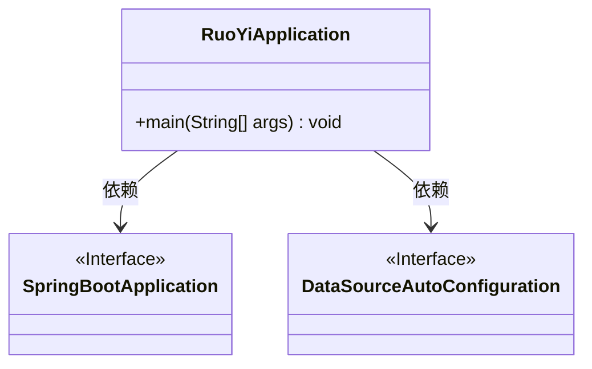
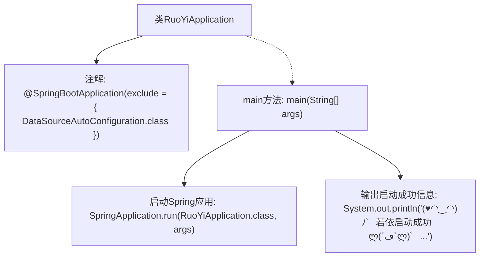

# 基础信息

|      |      |
|------|------|
| 名称 | RuoYiApplication |
| 编码语言 | .java |
| 代码路径 | RuoYi-main/ruoyi-admin/src/main/java/com/ruoyi/RuoYiApplication.java |
| 包名 | com.ruoyi |
| 依赖项 | ['org.springframework.boot.SpringApplication', 'org.springframework.boot.autoconfigure.SpringBootApplication', 'org.springframework.boot.autoconfigure.jdbc.DataSourceAutoConfiguration'] |
| 概述说明 | 若依应用启动类排除数据源配置，启动成功输出特定信息。 |

# 说明

若依应用启动类在启动过程中排除了数据源的自动配置，确保应用能够在不需要数据源的情况下正常运行。当应用成功启动时，系统会输出特定的信息，以确认应用已顺利启动并进入运行状态。这一设计使得应用在特定场景下更加灵活，能够适应不同的配置需求。

# 类列表 Class Summary

| 名称   | 类型  | 说明 |
|-------|------|-------------|
| RuoYiApplication | class | 若依应用启动类，排除数据源自动配置，启动成功时输出特定信息。 |

## 类 RuoYiApplication

|      |      |
|------|------|
| 访问范围 | @SpringBootApplication(exclude = { DataSourceAutoConfiguration.class });public |
| 类型 | class |
| 名称 | RuoYiApplication |
| 说明 | 若依应用启动类，排除数据源自动配置，启动成功时输出特定信息。 |

### UML类图

这段代码定义了一个名为 `RuoYiApplication` 的类，该类使用了 `@SpringBootApplication` 注解，并排除了 `DataSourceAutoConfiguration` 类的自动配置。`RuoYiApplication` 类包含一个 `main` 方法，该方法通过 `SpringApplication.run` 启动 Spring Boot 应用，并在启动成功后打印一段艺术字形式的启动成功信息。`SpringBootApplication` 和 `DataSourceAutoConfiguration` 是接口，`RuoYiApplication` 依赖于这两个接口。

### 内部方法调用关系图

这段代码是一个Spring Boot应用的启动类，使用`@SpringBootApplication`注解来标记主类，并排除了`DataSourceAutoConfiguration`自动配置。`main`方法中通过`SpringApplication.run`启动Spring应用，随后输出一段格式化的启动成功信息。该代码的主要作用是初始化并启动Spring Boot应用，并在控制台打印出启动成功的提示信息。

### 字段列表 Field List

| 名称  | 类型  | 说明 |
|-------|-------|------|

### 方法列表 Method List

| 名称  | 类型  | 说明 |
|-------|-------|------|
| main | void | Java主方法启动若依应用并输出成功信息。 |

