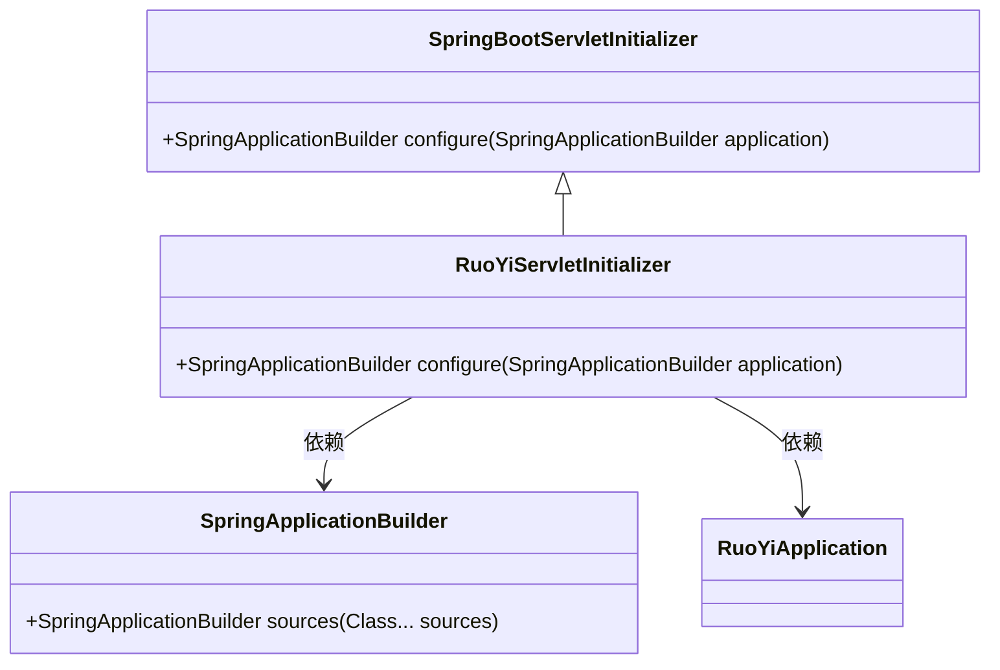
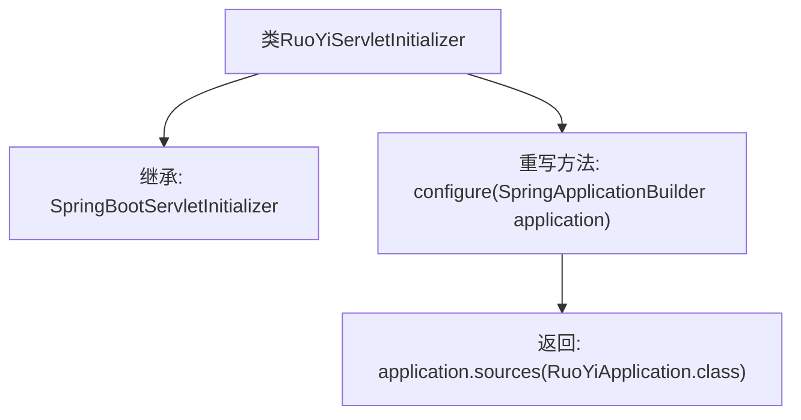

# 基础信息

|      |      |
|------|------|
| 名称 | RuoYiServletInitializer |
| 编码语言 | .java |
| 代码路径 | RuoYi-main/ruoyi-admin/src/main/java/com/ruoyi/RuoYiServletInitializer.java |
| 包名 | com.ruoyi |
| 依赖项 | ['org.springframework.boot.builder.SpringApplicationBuilder', 'org.springframework.boot.web.servlet.support.SpringBootServletInitializer'] |
| 概述说明 | RuoYiServletInitializer继承SpringBootServletInitializer，配置Spring启动类。 |

# 说明

RuoYiServletInitializer类继承自SpringBootServletInitializer，用于配置Spring应用的启动类。通过这种方式，可以确保Spring应用在Servlet容器中正确初始化和启动。该类的设计遵循了Spring Boot的标准实践，使得应用能够顺利部署到支持Servlet的服务器环境中。

# 类列表 Class Summary

| 名称   | 类型  | 说明 |
|-------|------|-------------|
| RuoYiServletInitializer | class | RuoYiServletInitializer继承SpringBootServletInitializer，配置Spring应用启动类。 |

## 类 RuoYiServletInitializer

|      |      |
|------|------|
| 访问范围 | public |
| 类型 | class |
| 名称 | RuoYiServletInitializer |
| 说明 | RuoYiServletInitializer继承SpringBootServletInitializer，配置Spring应用启动类。 |

### UML类图

类图描述：  
`RuoYiServletInitializer` 继承自 `SpringBootServletInitializer`，并重写了 `configure` 方法。该方法接收一个 `SpringApplicationBuilder` 对象，并调用其 `sources` 方法，将 `RuoYiApplication` 类作为参数传递。`RuoYiServletInitializer` 依赖于 `SpringApplicationBuilder` 和 `RuoYiApplication` 类，用于配置和启动 Spring Boot 应用。

### 内部方法调用关系图

这段代码定义了一个名为 `RuoYiServletInitializer` 的类，该类继承自 `SpringBootServletInitializer`。在类中，重写了 `configure` 方法，该方法接收一个 `SpringApplicationBuilder` 对象作为参数，并返回调用 `sources` 方法的结果，将 `RuoYiApplication` 类作为参数传递给 `sources` 方法。这段代码的主要作用是配置 Spring Boot 应用程序的启动类，以便在 Servlet 容器中运行。

### 字段列表 Field List

| 名称  | 类型  | 说明 |
|-------|-------|------|

### 方法列表 Method List

| 名称  | 类型  | 说明 |
|-------|-------|------|
| configure | SpringApplicationBuilder | 重写SpringApplicationBuilder配置，指定RuoYiApplication为启动类。 |

