# 基础信息

|      |      |
|------|------|
| 名称 | web |
| 编码语言 | .java |
| 代码路径 | RuoYi-main/ruoyi-admin/src/main/java/com/ruoyi/web |
| 包名 | RuoYi-main.ruoyi-admin.src.main.java.com.ruoyi.web |
| 概述说明 | Swagger配置类支持自动生成API文档，灵活启用或禁用。 |

# 说明

## 概述

该代码模块是一个基于Java的Web应用程序，主要分为多个子模块，涵盖了监控管理、前端页面处理、文件操作、系统管理、工具构建以及API文档访问等功能。这些模块共同构成了一个全面的后台管理系统，支持企业或组织的高效运营、数据管理、用户交互和系统监控。每个子模块通过多个控制器类实现了对不同业务场景的支持，确保系统的稳定性、安全性和性能。

## 主要业务场景

1. **监控管理**
   - **服务器监控**：通过`ServerController`监控服务器状态，生成视图路径以便查看相关信息。
   - **在线用户管理**：`SysUserOnlineController`提供在线用户列表和批量强制下线功能。
   - **缓存监控**：`CacheController`负责监控缓存状态，提供缓存清理功能。
   - **Druid数据源监控**：`DruidController`处理Druid数据源相关请求，确保权限控制。
   - **登录日志管理**：`SysLogininforController`管理登录日志，支持查看、导出、删除和账户解锁。
   - **系统操作日志管理**：`SysOperlogController`提供操作日志的查看、导出、删除和清理功能。

2. **前端页面处理**
   - **表单处理**：`DemoFormController`处理表单相关请求，支持按钮、下拉框和时间轴等功能。
   - **模态窗口与弹层处理**：`DemoDialogController`处理模态窗口、弹层等请求，确保界面元素正确加载。
   - **表格数据处理**：`DemoTableController`管理用户、地区和文档数据，支持多种表格操作。
   - **图表与数据可视化**：`DemoReportController`处理ECharts、Peity等图表请求，支持数据可视化。
   - **用户操作管理**：`DemoOperateController`提供表格展示、数据查询、新增、修改、删除、导出和导入功能。
   - **图标资源管理**：`DemoIconController`支持FontAwesome和Glyphicons图标的动态生成。

3. **文件操作**
   - **文件下载与上传**：`CommonController`支持文件下载、单个文件上传、多个文件上传以及本地资源下载。

4. **系统管理**
   - **用户管理**：`SysUserController`负责用户的新增、删除、修改、查询、导入和导出。
   - **角色与权限管理**：`SysRoleController`处理角色的增删改查、权限分配和用户授权。
   - **字典管理**：`SysDictTypeController`和`SysDictDataController`管理字典类型和字典数据。
   - **部门管理**：`SysDeptController`管理部门的增删改查操作。
   - **岗位管理**：`SysPostController`处理岗位信息的查看、列表获取、导出、删除、新增和修改。
   - **系统配置**：`SysConfigController`管理系统参数的增删改查和缓存刷新。
   - **公告管理**：`SysNoticeController`管理公告信息的查询、新增、修改和删除。
   - **菜单管理**：`SysMenuController`管理菜单的增删改查操作，支持权限控制。
   - **个人信息管理**：`SysProfileController`处理密码重置、信息修改和头像更新。
   - **登录与注册**：`SysLoginController`和`SysRegisterController`分别处理用户的登录和注册流程。
   - **验证码生成**：`SysCaptchaController`生成数学和字符类型的验证码。
   - **首页与系统管理**：`SysIndexController`管理首页、锁屏、解锁、主题切换、菜单切换及系统介绍。

5. **工具构建与API文档访问**
   - **工具构建**：`BuildController`处理工具构建相关请求，确保只有授权用户能够访问。
   - **Swagger API文档访问**：`SwaggerController`将请求重定向至Swagger UI页面，方便开发者查看和测试API文档。
   - **用户信息管理**：`TestController`提供获取用户列表、查看用户详细信息、新增用户、更新用户信息和删除用户的功能。

通过这些功能，该模块为系统管理员和开发者提供了全面的监控、管理、操作和交互工具，确保系统的高效运行和数据的安全性。

### 包内部结构视图

```mermaid
graph TD
    web --> core
    web --> controller
    web --> common
    web --> system
    web --> tool
    core --> config
    config --> SwaggerConfig.java
    controller --> monitor
    monitor --> ServerController.java
    monitor --> SysUserOnlineController.java
    monitor --> CacheController.java
    monitor --> DruidController.java
    monitor --> SysLogininforController.java
    monitor --> SysOperlogController.java
    controller --> demo
    demo --> controller
    controller --> DemoFormController.java
    controller --> DemoDialogController.java
    controller --> DemoTableController.java
    controller --> DemoReportController.java
    controller --> DemoOperateController.java
    controller --> DemoIconController.java
    demo --> domain
    domain --> UserOperateModel.java
    domain --> CustomerModel.java
    domain --> GoodsModel.java
    common --> CommonController.java
    system --> SysDictTypeController.java
    system --> SysDeptController.java
    system --> SysRegisterController.java
    system --> SysConfigController.java
    system --> SysNoticeController.java
    system --> SysMenuController.java
    system --> SysProfileController.java
    system --> SysDictDataController.java
    system --> SysPostController.java
    system --> SysIndexController.java
    system --> SysRoleController.java
    system --> SysLoginController.java
    system --> SysCaptchaController.java
    system --> SysUserController.java
    tool --> BuildController.java
    tool --> SwaggerController.java
    tool --> TestController.java
```

该流程图展示了RuoYi项目中`web`模块的层级结构，包括`core`、`controller`、`common`、`system`和`tool`等主要目录及其子目录和文件。每个目录下包含多个控制器或配置文件，反映了项目的模块化设计和功能划分。

# 文件列表 File List

| 名称   | 类型  | 说明 |
|-------|------|-------------|
| [core](core/_module.md) | package | Swagger配置类支持启用状态配置，通过扫描注解生成API文档。 |
| [controller](controller/_module.md) | package | 监控管理模块用于系统状态和日志监控，包含服务器、在线用户、缓存、数据源、登录日志和操作日志管理。 |

