# 基础信息

|      |      |
|------|------|
| 名称 | CommonController |
| 编码语言 | .java |
| 代码路径 | RuoYi-main/ruoyi-admin/src/main/java/com/ruoyi/web/controller/common/CommonController.java |
| 包名 | com.ruoyi.web.controller.common |
| 依赖项 | ['java.util.ArrayList', 'java.util.List', 'javax.servlet.http.HttpServletRequest', 'javax.servlet.http.HttpServletResponse', 'org.slf4j.Logger', 'org.slf4j.LoggerFactory', 'org.springframework.beans.factory.annotation.Autowired', 'org.springframework.http.MediaType', 'org.springframework.stereotype.Controller', 'org.springframework.web.bind.annotation.GetMapping', 'org.springframework.web.bind.annotation.PostMapping', 'org.springframework.web.bind.annotation.RequestMapping', 'org.springframework.web.bind.annotation.ResponseBody', 'org.springframework.web.multipart.MultipartFile', 'com.ruoyi.common.config.RuoYiConfig', 'com.ruoyi.common.config.ServerConfig', 'com.ruoyi.common.constant.Constants', 'com.ruoyi.common.core.domain.AjaxResult', 'com.ruoyi.common.utils.StringUtils', 'com.ruoyi.common.utils.file.FileUploadUtils', 'com.ruoyi.common.utils.file.FileUtils'] |
| 概述说明 | CommonController负责文件下载、单文件上传、多文件上传及本地资源下载。 |

# 说明

CommonController负责处理多种文件操作功能，包括文件下载、单个文件上传、多个文件上传以及本地资源下载。该控制器通过集成这些功能，为用户提供了全面的文件管理支持，确保文件操作的高效性和可靠性。无论是下载文件还是上传单个或多个文件，CommonController都能有效处理，同时支持本地资源的下载需求，满足多样化的文件操作场景。

# 类列表 Class Summary

| 名称   | 类型  | 说明 |
|-------|------|-------------|
| CommonController | class | CommonController处理文件下载、单个文件上传、多个文件上传及本地资源下载。 |

## 类 CommonController

|      |      |
|------|------|
| 访问范围 | @Controller;@RequestMapping("/common");public |
| 类型 | class |
| 名称 | CommonController |
| 说明 | CommonController处理文件下载、单个文件上传、多个文件上传及本地资源下载。 |

### UML类图

```mermaid
classDiagram
    class CommonController {
        -Logger log
        -ServerConfig serverConfig
        -String FILE_DELIMETER
        +void fileDownload(String fileName, Boolean delete, HttpServletResponse response, HttpServletRequest request)
        +AjaxResult uploadFile(MultipartFile file)
        +AjaxResult uploadFiles(List~MultipartFile~ files)
        +void resourceDownload(String resource, HttpServletRequest request, HttpServletResponse response)
    }
    class ServerConfig {
        <<Interface>>
        +String getUrl()
    }
    class FileUtils {
        <<Interface>>
        +boolean checkAllowDownload(String fileName)
        +void setAttachmentResponseHeader(HttpServletResponse response, String fileName)
        +void writeBytes(String filePath, OutputStream outputStream)
        +void deleteFile(String filePath)
        +String getName(String fileName)
    }
    class FileUploadUtils {
        <<Interface>>
        +String upload(String filePath, MultipartFile file)
    }
    class RuoYiConfig {
        <<Interface>>
        +String getDownloadPath()
        +String getUploadPath()
        +String getProfile()
    }
    class StringUtils {
        <<Interface>>
        +String format(String format, Object... args)
        +String join(List~String~ list, String delimiter)
        +String substringAfter(String str, String separator)
        +String substringAfterLast(String str, String separator)
    }
    class Constants {
        <<Interface>>
        +String RESOURCE_PREFIX
    }
    class AjaxResult {
        +AjaxResult success()
        +AjaxResult error(String message)
        +void put(String key, Object value)
    }
    class MultipartFile {
        <<Interface>>
        +String getOriginalFilename()
    }
    class HttpServletResponse {
        <<Interface>>
        +void setContentType(String contentType)
        +OutputStream getOutputStream()
    }
    class HttpServletRequest {
        <<Interface>>
    }
    CommonController --> ServerConfig : 依赖
    CommonController --> FileUtils : 依赖
    CommonController --> FileUploadUtils : 依赖
    CommonController --> RuoYiConfig : 依赖
    CommonController --> StringUtils : 依赖
    CommonController --> Constants : 依赖
    CommonController --> AjaxResult : 依赖
    CommonController --> MultipartFile : 依赖
    CommonController --> HttpServletResponse : 依赖
    CommonController --> HttpServletRequest : 依赖
```

**描述：**
`CommonController` 是一个控制器类，处理文件的上传和下载请求。它依赖于多个工具类和接口，如 `ServerConfig`、`FileUtils`、`FileUploadUtils`、`RuoYiConfig`、`StringUtils`、`Constants`、`AjaxResult`、`MultipartFile`、`HttpServletResponse` 和 `HttpServletRequest`。通过这些依赖，`CommonController` 实现了文件的上传、下载和资源管理功能。

### 内部方法调用关系图

```mermaid
graph TD
    A["类CommonController"]
    B["属性: Logger log"]
    C["属性: ServerConfig serverConfig"]
    D["属性: String FILE_DELIMETER"]
    E["方法: fileDownload(String fileName, Boolean delete, HttpServletResponse response, HttpServletRequest request)"]
    F["方法: uploadFile(MultipartFile file)"]
    G["方法: uploadFiles(List<MultipartFile> files)"]
    H["方法: resourceDownload(String resource, HttpServletRequest request, HttpServletResponse response)"]
    I["调用: FileUtils.checkAllowDownload(fileName)"]
    J["调用: FileUtils.setAttachmentResponseHeader(response, realFileName)"]
    K["调用: FileUtils.writeBytes(filePath, response.getOutputStream())"]
    L["调用: FileUtils.deleteFile(filePath)"]
    M["调用: FileUploadUtils.upload(filePath, file)"]
    N["调用: serverConfig.getUrl()"]
    O["调用: FileUtils.getName(fileName)"]
    P["调用: StringUtils.join(urls, FILE_DELIMETER)"]
    Q["调用: StringUtils.join(fileNames, FILE_DELIMETER)"]
    R["调用: StringUtils.join(newFileNames, FILE_DELIMETER)"]
    S["调用: StringUtils.join(originalFilenames, FILE_DELIMETER)"]
    T["调用: FileUtils.checkAllowDownload(resource)"]
    U["调用: FileUtils.setAttachmentResponseHeader(response, downloadName)"]
    V["调用: FileUtils.writeBytes(downloadPath, response.getOutputStream())"]

    A --> B
    A --> C
    A --> D
    A --> E
    A --> F
    A --> G
    A --> H
    E --> I
    E --> J
    E --> K
    E --> L
    F --> M
    F --> N
    F --> O
    G --> M
    G --> N
    G --> O
    G --> P
    G --> Q
    G --> R
    G --> S
    H --> T
    H --> U
    H --> V
```

该流程图展示了`CommonController`类的结构及其方法之间的调用关系。`CommonController`类包含四个主要方法：`fileDownload`、`uploadFile`、`uploadFiles`和`resourceDownload`，这些方法分别处理文件下载、单个文件上传、多个文件上传和本地资源下载。每个方法内部调用了多个工具类方法，如`FileUtils`、`FileUploadUtils`和`StringUtils`，以实现文件操作和字符串处理。流程图中清晰地展示了这些方法之间的调用链，帮助理解代码的执行流程。

### 字段列表 Field List

| 名称  | 类型  | 说明 |
|-------|-------|------|
| serverConfig | ServerConfig | 自动注入服务器配置实例。 |
| FILE_DELIMETER = "," | String | 定义私有静态常量文件分隔符为逗号。 |
| log = LoggerFactory.getLogger(CommonController.class) | Logger | CommonController类中定义了一个静态日志记录器。 |

### 方法列表 Method List

| 名称  | 类型  | 说明 |
|-------|-------|------|
| uploadFile | AjaxResult | 上传文件并返回文件信息，包括URL、文件名、新文件名和原始文件名。 |
| uploadFiles | AjaxResult | 上传文件并返回文件信息，包括URL、文件名、新文件名和原始文件名。 |
| fileDownload | void | 实现文件下载功能，检查文件名合法性，设置响应头，支持下载后删除文件。 |
| resourceDownload | void | GET方法实现资源下载，检查合法性后设置响应头并输出文件流。 |

