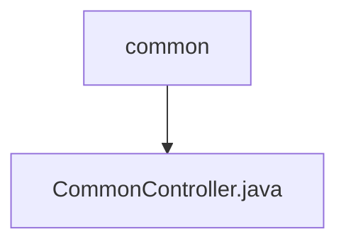

# 基础信息

|      |      |
|------|------|
| 名称 | common |
| 编码语言 | .java |
| 代码路径 | RuoYi-main/ruoyi-admin/src/main/java/com/ruoyi/web/controller/common |
| 包名 | RuoYi-main.ruoyi-admin.src.main.java.com.ruoyi.web.controller.common |
| 概述说明 | CommonController负责文件下载、单文件上传、多文件上传及本地资源下载。 |

# 说明

CommonController负责处理多种文件操作功能，包括文件下载、单个文件上传、多个文件上传以及本地资源下载。该控制器通过集成这些功能，为用户提供了全面的文件管理支持，确保文件操作的高效性和可靠性。无论是下载文件还是上传单个或多个文件，CommonController都能有效处理，同时支持本地资源的下载需求，满足多样化的文件操作场景。

### 包内部结构视图

流程图展示了路径的层级关系，其中`common`文件夹包含`CommonController.java`文件。该结构清晰地反映了文件在项目中的位置，帮助开发者快速理解项目的目录组织。

# 文件列表 File List

| 名称   | 类型  | 说明 |
|-------|------|-------------|
| [CommonController.java](CommonController.md) | file | CommonController负责文件下载、单文件上传、多文件上传及本地资源下载。 |

