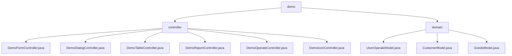

# 基础信息

|      |      |
|------|------|
| 名称 | demo |
| 编码语言 | .java |
| 代码路径 | RuoYi-main/ruoyi-admin/src/main/java/com/ruoyi/web/controller/demo |
| 包名 | RuoYi-main.ruoyi-admin.src.main.java.com.ruoyi.web.controller.demo |
| 概述说明 | Java Web模块处理表单、模态、表格、图表、用户操作及图标，支持多种业务场景和数据管理。 |

# 说明

## 概述
该代码模块是一个基于Java的Web应用程序，主要用于处理和管理前端页面的各种请求，涵盖了表单、模态窗口、表格、图表、用户操作以及图标等多种功能。模块通过多个控制器类实现了对不同业务场景的支持，确保用户界面的正确加载和流畅交互。每个控制器负责处理特定类型的请求，并返回相应的视图路径或资源，从而为系统提供了全面的数据展示和操作功能。此外，模块还涉及用户、客户和商品信息的管理，提供了对这些实体进行增删改查操作的功能，适用于多种需要数据管理和分析的业务场景。

## 主要业务场景
1. **表单处理**  
   - **DemoFormController**：负责处理表单相关请求，包括按钮、下拉框和时间轴等功能。用户表单模型包含用户ID、编号、姓名和手机号等字段，提供了构造和访问这些字段的方法。该控制器确保表单数据的正确处理和页面路径的返回。

2. **模态窗口与弹层处理**  
   - **DemoDialogController**：负责处理模态窗口、弹层、表单、表格等各类请求，并根据请求内容返回相应的视图路径。该控制器确保用户界面元素的正确加载和显示，提供流畅的用户交互体验。

3. **表格数据处理**  
   - **DemoTableController**：负责处理与表格相关的请求，涉及用户、地区和文档数据，并提供多种表格操作功能。支持用户表、区域表和文档表的数据管理，确保表格数据的正确展示和操作。

4. **图表与数据可视化**  
   - **DemoReportController**：负责处理与ECharts、Peity、Sparkline和Metrics相关的请求。该控制器管理这些图表和数据可视化工具的请求，确保系统能够正确生成和展示所需的图表和数据，满足不同的数据展示需求。

5. **用户操作管理**  
   - **DemoOperateController**：负责管理用户操作，提供了多种功能，包括表格展示、数据查询、新增记录、修改记录、删除记录、数据导出以及数据导入等。这些功能覆盖了用户在使用过程中可能涉及的主要操作需求，确保了对数据的全面管理和操作便捷性。

6. **图标资源管理**  
   - **DemoIconController**：负责处理图标请求，支持两种图标路径：FontAwesome和Glyphicons。该控制器的主要功能是根据请求类型和参数，动态生成并返回相应的图标资源，确保系统能够灵活地展示不同类型的图标，满足多样化的界面设计需求。

7. **用户管理**  
   - **UserOperateModel**：通过该类，系统可以方便地管理用户的基本信息（如姓名、年龄、联系方式等），并支持添加、删除、更新和查询用户信息的操作。适用于需要用户注册、信息维护和权限管理的场景。

8. **客户管理**  
   - **CustomerModel**：用于记录客户的基本信息（如姓名、手机号码、性别、生日等）以及相关的商品数据。该类便于系统对客户信息进行管理和分析，适用于客户关系管理（CRM）和销售分析等场景。

9. **商品管理**  
   - **GoodsModel**：用于表示商品信息，包含商品名称、重量、价格、日期和种类等属性。通过该类，系统可以方便地访问和修改商品信息，适用于商品库存管理、销售记录和商品分类等场景。

这些控制器和模型类的设计使得系统能够高效地管理和维护用户、客户和商品数据，适用于多种需要数据管理和分析的业务场景。

### 包内部结构视图

该流程图展示了`demo`目录下的层级结构，包含`controller`和`domain`两个子目录。`controller`目录下包含多个控制器文件，如`DemoFormController.java`和`DemoDialogController.java`等。`domain`目录下则包含多个模型文件，如`UserOperateModel.java`和`CustomerModel.java`。整体结构清晰，反映了项目的模块化设计。

# 文件列表 File List

| 名称   | 类型  | 说明 |
|-------|------|-------------|
| [domain](domain/_module.md) | package | 用户模型类管理用户信息，客户模型记录客户及商品数据，商品模型类表示商品属性。 |
| [controller](controller/_module.md) | package | Demo控制器处理表单、模态窗口、表格、图表、用户操作和图标请求，返回相应视图路径。 |

