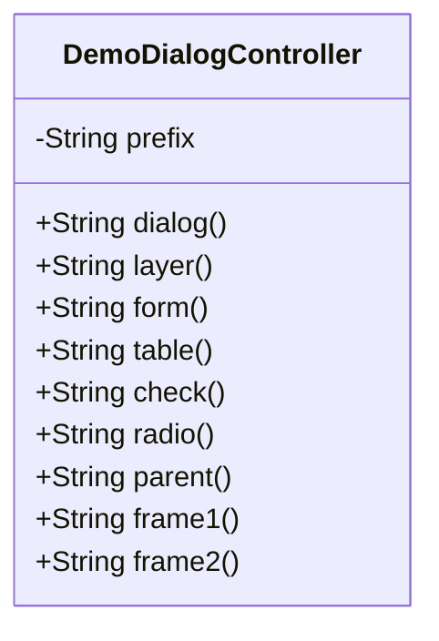
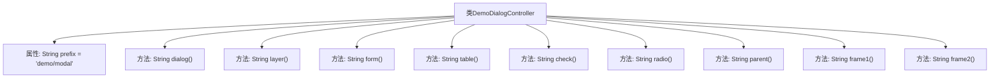

# 基础信息

|      |      |
|------|------|
| 名称 | DemoDialogController |
| 编码语言 | .java |
| 代码路径 | RuoYi-main/ruoyi-admin/src/main/java/com/ruoyi/web/controller/demo/controller/DemoDialogController.java |
| 包名 | com.ruoyi.web.controller.demo.controller |
| 依赖项 | ['org.springframework.stereotype.Controller', 'org.springframework.web.bind.annotation.GetMapping', 'org.springframework.web.bind.annotation.RequestMapping'] |
| 概述说明 | DemoDialogController处理模态窗口、弹层、表单、表格请求，返回视图路径。 |

# 说明

DemoDialogController负责处理模态窗口、弹层、表单、表格等各类请求，并根据请求内容返回相应的视图路径。该控制器确保用户界面元素的正确加载和显示，提供流畅的用户交互体验。

# 类列表 Class Summary

| 名称   | 类型  | 说明 |
|-------|------|-------------|
| DemoDialogController | class | DemoDialogController处理模态窗口、弹层、表单、表格等请求，返回对应视图路径。 |

## 类 DemoDialogController

|      |      |
|------|------|
| 访问范围 | @Controller;@RequestMapping("/demo/modal");public |
| 类型 | class |
| 名称 | DemoDialogController |
| 说明 | DemoDialogController处理模态窗口、弹层、表单、表格等请求，返回对应视图路径。 |

### UML类图

这段代码定义了一个名为 `DemoDialogController` 的控制器类，该类处理与模态窗口、弹层组件、表单、表格等相关的请求。每个方法都通过 `@GetMapping` 注解映射到特定的URL路径，并返回一个字符串，该字符串表示视图的路径。控制器类中的 `prefix` 变量用于统一管理视图路径的前缀，避免重复代码。这个类的主要作用是处理用户请求并返回相应的视图页面。

### 内部方法调用关系图

该流程图描述了`DemoDialogController`类的结构及其内部方法。该类包含一个属性`prefix`和多个`@GetMapping`注解的方法，每个方法返回一个基于`prefix`的路径字符串。这些方法分别对应不同的模态窗口、弹层组件、表单、表格等功能的路径映射。

### 字段列表 Field List

| 名称  | 类型  | 说明 |
|-------|-------|------|
| prefix = "demo/modal" | String | 私有字符串变量prefix被赋值为"demo/modal"。 |

### 方法列表 Method List

| 名称  | 类型  | 说明 |
|-------|-------|------|
| parent | String | GET请求映射返回父级表格路径。 |
| check | String | 定义GET请求映射，返回指定路径字符串。 |
| dialog | String | GetMapping注解定义返回dialog页面的方法。 |
| frame1 | String | GetMapping注解定义frame1方法，返回指定路径字符串。 |
| form | String | GET请求映射到"/form"，返回指定前缀的"/form"页面。 |
| layer | String | GET请求映射到/layer，返回前缀加/layer的字符串。 |
| radio | String | Get请求映射到/radio，返回路径为prefix加/table/radio。 |
| table | String | 该方法映射GET请求到/table路径，返回指定前缀加/table的字符串。 |
| frame2 | String | 定义GET请求/frame2，返回路径prefix/table/frame2。 |

