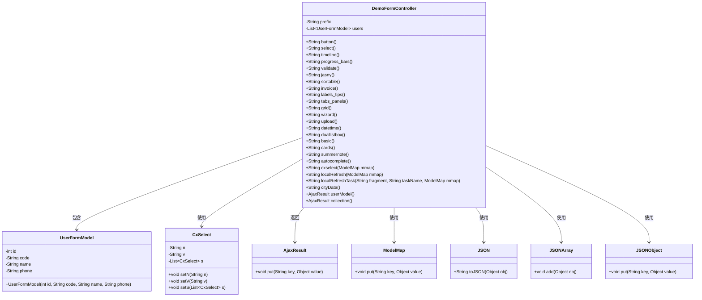
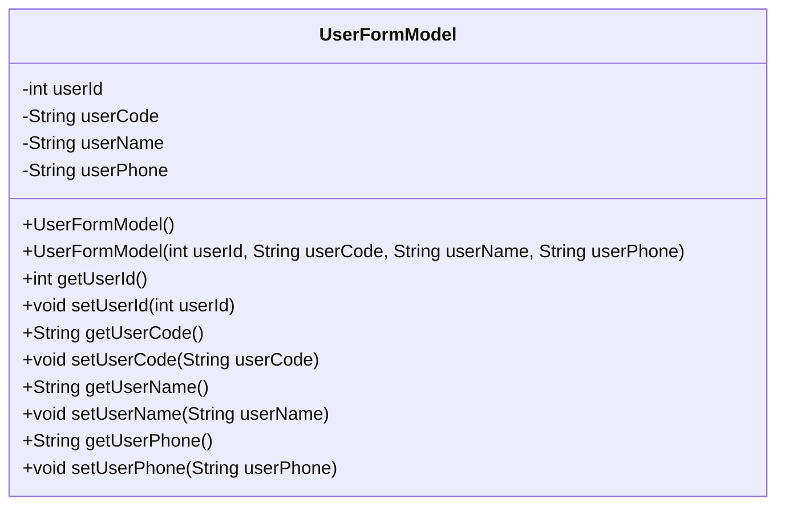

# 基础信息

|      |      |
|------|------|
| 名称 | DemoFormController |
| 编码语言 | .java |
| 代码路径 | RuoYi-main/ruoyi-admin/src/main/java/com/ruoyi/web/controller/demo/controller/DemoFormController.java |
| 包名 | com.ruoyi.web.controller.demo.controller |
| 依赖项 | ['java.util.ArrayList', 'java.util.List', 'org.springframework.stereotype.Controller', 'org.springframework.ui.ModelMap', 'org.springframework.web.bind.annotation.GetMapping', 'org.springframework.web.bind.annotation.PostMapping', 'org.springframework.web.bind.annotation.RequestMapping', 'org.springframework.web.bind.annotation.ResponseBody', 'com.alibaba.fastjson.JSON', 'com.ruoyi.common.core.domain.AjaxResult', 'com.ruoyi.common.core.domain.CxSelect', 'com.ruoyi.common.json.JSONObject', 'com.ruoyi.common.json.JSONObject.JSONArray', 'com.ruoyi.common.utils.StringUtils'] |
| 概述说明 | DemoFormController处理表单请求，管理用户模型，返回页面路径。 |

# 说明

DemoFormController负责处理表单相关请求，涵盖按钮、下拉框和时间轴等功能，并返回相应的页面路径。用户表单模型包含用户ID、编号、姓名和手机号等字段，提供了构造和访问这些字段的方法。

# 类列表 Class Summary

| 名称   | 类型  | 说明 |
|-------|------|-------------|
| DemoFormController | class | DemoFormController处理表单相关请求，包含按钮、下拉框、时间轴等功能，返回对应页面路径。 |
| UserFormModel | class | 用户表单模型包含用户ID、编号、姓名和手机号，提供构造和访问方法。 |

## 类 DemoFormController

|      |      |
|------|------|
| 访问范围 | @Controller;@RequestMapping("/demo/form");public |
| 类型 | class |
| 名称 | DemoFormController |
| 说明 | DemoFormController处理表单相关请求，包含按钮、下拉框、时间轴等功能，返回对应页面路径。 |

### UML类图

**描述：**
`DemoFormController` 是一个Spring MVC控制器，负责处理与表单相关的请求。它包含多个方法，每个方法对应一个特定的表单页面或功能，如按钮、下拉框、时间轴等。控制器通过`ModelMap`传递数据到视图，并使用`AjaxResult`返回JSON格式的响应。`UserFormModel`和`CxSelect`是用于数据存储和处理的模型类。控制器还依赖于`JSON`、`JSONArray`和`JSONObject`来处理JSON数据。

### 内部方法调用关系图

```mermaid
graph TD
    A["类DemoFormController"]
    B["属性: String prefix"]
    C["静态属性: List<UserFormModel> users"]
    D["初始化块: 添加用户数据"]
    E["方法: String button()"]
    F["方法: String select()"]
    G["方法: String timeline()"]
    H["方法: String progress_bars()"]
    I["方法: String validate()"]
    J["方法: String jasny()"]
    K["方法: String sortable()"]
    L["方法: String invoice()"]
    M["方法: String labels_tips()"]
    N["方法: String tabs_panels()"]
    O["方法: String grid()"]
    P["方法: String wizard()"]
    Q["方法: String upload()"]
    R["方法: String datetime()"]
    S["方法: String duallistbox()"]
    T["方法: String basic()"]
    U["方法: String cards()"]
    V["方法: String summernote()"]
    W["方法: String autocomplete()"]
    X["方法: String cxselect(ModelMap mmap)"]
    Y["方法: String localRefresh(ModelMap mmap)"]
    Z["方法: String localRefreshTask(String fragment, String taskName, ModelMap mmap)"]
    AA["方法: String cityData()"]
    AB["方法: AjaxResult userModel()"]
    AC["方法: AjaxResult collection()"]

    A --> B
    A --> C
    A --> D
    A --> E
    A --> F
    A --> G
    A --> H
    A --> I
    A --> J
    A --> K
    A --> L
    A --> M
    A --> N
    A --> O
    A --> P
    A --> Q
    A --> R
    A --> S
    A --> T
    A --> U
    A --> V
    A --> W
    A --> X
    A --> Y
    A --> Z
    A --> AA
    A --> AB
    A --> AC
```

这段代码定义了一个名为 `DemoFormController` 的控制器类，用于处理与表单相关的各种请求。类中包含多个 `@GetMapping` 和 `@PostMapping` 注解的方法，每个方法对应一个特定的表单功能，如按钮、下拉框、时间轴等。此外，类中还包含一些静态数据和初始化块，用于初始化用户数据。每个方法返回的字符串通常用于指定视图路径，而 `@ResponseBody` 注解的方法则直接返回数据。

### 字段列表 Field List

| 名称  | 类型  | 说明 |
|-------|-------|------|
| prefix = "demo/form" | String | 定义私有字符串变量prefix，值为"demo/form"。 |
| users = new ArrayList<UserFormModel>() | List<UserFormModel> | 私有静态用户表单模型列表初始化。 |

### 方法列表 Method List

| 名称  | 类型  | 说明 |
|-------|-------|------|
| button | String | Get请求映射返回按钮路径。 |
| progress_bars | String | 控制器方法返回进度条页面路径。 |
| select | String | GET请求映射到/select，返回指定前缀路径。 |
| userModel | AjaxResult | GET请求获取用户模型，返回状态码200及用户数据。 |
| wizard | String | GetMapping注解映射/wizard路径，返回指定前缀的wizard视图。 |
| duallistbox | String | GetMapping映射duallistbox方法返回指定路径。 |
| datetime | String | 获取日期时间路径并返回前缀加日期时间字符串。 |
| collection | AjaxResult | Get请求返回包含五个字符串的数组。 |
| summernote | String | 控制器方法返回summernote视图路径。 |
| grid | String | 控制器方法映射路径为"/grid"，返回视图路径为前缀加"/grid"。 |
| cxselect | String | 获取淘宝、天猫、聚划算、京东等电商平台数据的API接口。 |
| validate | String | GET请求映射到/validate路径，返回prefix和/validate拼接的字符串。 |
| labels_tips | String | 该代码定义了一个GET请求处理方法，返回指定路径的前缀加"/labels_tips"。 |
| tabs_panels | String | GetMapping映射返回tabs_panels视图路径。 |
| timeline | String | 该方法使用@GetMapping注解映射"/timeline"路径，返回前缀加"/timeline"的字符串。 |
| localRefreshTask | String | 该方法通过HTTP POST请求处理本地刷新任务，生成并返回包含任务信息的JSON数组。 |
| basic | String | 定义GET请求路径/basic，返回前缀加/basic的字符串。 |
| upload | String | Spring Boot中定义GET请求路径为/upload，返回指定前缀的upload页面。 |
| jasny | String | GetMapping注解定义返回前缀加jasny的路径。 |
| cards | String | 定义GET请求/cards路径，返回prefix拼接/cards的字符串。 |
| localRefresh | String | GET请求处理本地刷新，传递任务数据到页面，包含名称、类型和日期，设置最小值和最大值。 |
| autocomplete | String | GET请求映射到/autocomplete路径，返回前缀加/autocomplete的字符串。 |
| cityData | String | 接口返回湖南省和广东省的市区县数据。 |
| sortable | String | GetMapping注解定义路径为/sortable，返回前缀加/sortable的字符串。 |
| invoice | String | 获取发票路径并返回指定前缀的发票页面。 |

## 类 UserFormModel

|      |      |
|------|------|
| 访问范围 | None |
| 类型 | class |
| 名称 | UserFormModel |
| 说明 | 用户表单模型包含用户ID、编号、姓名和手机号，提供构造和访问方法。 |

### UML类图

**描述：**  
`UserFormModel` 类用于表示用户表单数据，包含用户ID、用户编号、用户姓名和用户手机等属性。类提供了默认构造函数和带参构造函数，以及每个属性的getter和setter方法，便于对用户数据的获取和修改。该类主要用于在应用程序中封装和传递用户信息。

### 内部方法调用关系图

```mermaid
graph TD
    A["类UserFormModel"]
    B["属性: int userId"]
    C["属性: String userCode"]
    D["属性: String userName"]
    E["属性: String userPhone"]
    F["构造方法: UserFormModel()"]
    G["构造方法: UserFormModel(int userId, String userCode, String userName, String userPhone)"]
    H["方法: int getUserId()"]
    I["方法: void setUserId(int userId)"]
    J["方法: String getUserCode()"]
    K["方法: void setUserCode(String userCode)"]
    L["方法: String getUserName()"]
    M["方法: void setUserName(String userName)"]
    N["方法: String getUserPhone()"]
    O["方法: void setUserPhone(String userPhone)"]

    A --> B
    A --> C
    A --> D
    A --> E
    A --> F
    A --> G
    A --> H
    A --> I
    A --> J
    A --> K
    A --> L
    A --> M
    A --> N
    A --> O
```

这段代码定义了一个名为 `UserFormModel` 的类，用于管理用户的基本信息。类中包含四个私有属性：`userId`、`userCode`、`userName` 和 `userPhone`，分别表示用户ID、用户编号、用户姓名和用户手机号。类提供了两个构造方法：一个无参构造方法和一个带参构造方法，用于初始化这些属性。此外，类还提供了每个属性的 `getter` 和 `setter` 方法，用于获取和设置属性值。

### 字段列表 Field List

| 名称  | 类型  | 说明 |
|-------|-------|------|
| userId | int | 定义了一个私有整型变量userId。 |
| userCode | String | 定义私有字符串变量userCode。 |
| userName | String | 声明一个私有字符串变量userName。 |
| userPhone | String | 私有字符串变量存储用户电话号码。 |

### 方法列表 Method List

| 名称  | 类型  | 说明 |
|-------|-------|------|
| setUserCode | void | 设置用户代码的方法。 |
| getUserPhone | String | 获取用户电话号码的方法。 |
| getUserName | String | 获取用户名的Java方法。 |
| setUserPhone | void | 设置用户电话号码的方法。 |
| getUserId | int | 获取用户ID的方法，返回用户ID值。 |
| setUserId | void | 设置用户ID的方法，接受整数参数。 |
| setUserName | void | 设置用户名的Java方法，将输入参数赋值给成员变量。 |
| getUserCode | String | 获取用户代码的方法，返回userCode变量。 |

