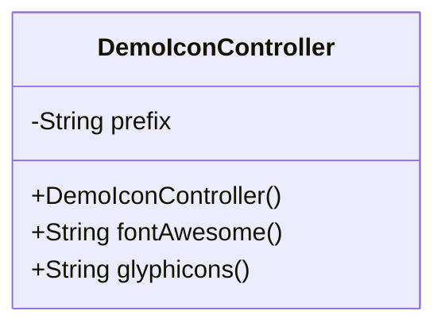
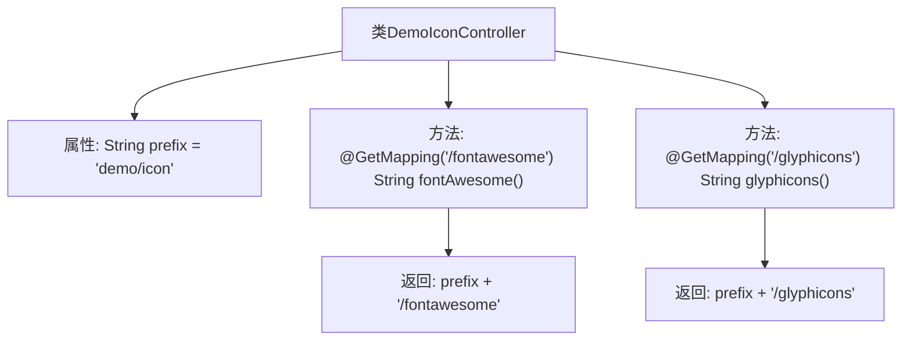

# 基础信息

|      |      |
|------|------|
| 名称 | DemoIconController |
| 编码语言 | .java |
| 代码路径 | RuoYi-main/ruoyi-admin/src/main/java/com/ruoyi/web/controller/demo/controller/DemoIconController.java |
| 包名 | com.ruoyi.web.controller.demo.controller |
| 依赖项 | ['org.springframework.stereotype.Controller', 'org.springframework.web.bind.annotation.GetMapping', 'org.springframework.web.bind.annotation.RequestMapping'] |
| 概述说明 | DemoIconController处理FontAwesome和Glyphicons图标请求。 |

# 说明

DemoIconController负责处理图标请求，支持两种图标路径：FontAwesome和Glyphicons。该控制器的主要功能是根据请求类型和参数，动态生成并返回相应的图标资源，确保系统能够灵活地展示不同类型的图标，满足多样化的界面设计需求。通过集成这两种广泛使用的图标库，DemoIconController为开发者提供了便捷的图标管理解决方案。

# 类列表 Class Summary

| 名称   | 类型  | 说明 |
|-------|------|-------------|
| DemoIconController | class | DemoIconController处理图标请求，包含FontAwesome和Glyphicons两种图标路径。 |

## 类 DemoIconController

|      |      |
|------|------|
| 访问范围 | @Controller;@RequestMapping("/demo/icon");public |
| 类型 | class |
| 名称 | DemoIconController |
| 说明 | DemoIconController处理图标请求，包含FontAwesome和Glyphicons两种图标路径。 |

### UML类图

这段代码定义了一个名为 `DemoIconController` 的控制器类，它用于处理与图标相关的请求。类中包含一个私有字符串 `prefix`，用于存储路径前缀。该类提供了两个公有方法：`fontAwesome()` 和 `glyphicons()`，分别用于返回 FontAwesome 和 Glyphicons 图标的视图路径。这两个方法通过 `@GetMapping` 注解映射到特定的 URL 路径，分别处理 `/demo/icon/fontawesome` 和 `/demo/icon/glyphicons` 的 GET 请求。

### 内部方法调用关系图

这段代码定义了一个Spring MVC控制器`DemoIconController`，它处理两个不同的GET请求路径`/demo/icon/fontawesome`和`/demo/icon/glyphicons`。每个请求映射到一个方法，分别返回视图路径`demo/icon/fontawesome`和`demo/icon/glyphicons`。代码结构清晰，通过`@Controller`和`@GetMapping`注解实现了请求的路由和视图的返回。

### 字段列表 Field List

| 名称  | 类型  | 说明 |
|-------|-------|------|
| prefix = "demo/icon" | String | 私有字符串变量prefix被初始化为"demo/icon"。 |

### 方法列表 Method List

| 名称  | 类型  | 说明 |
|-------|-------|------|
| glyphicons | String | GetMapping映射glyphicons路径，返回指定前缀加glyphicons的字符串。 |
| fontAwesome | String | Get请求映射到/fontawesome路径，返回前缀加/fontawesome的字符串。 |

