# 基础信息

|      |      |
|------|------|
| 名称 | DemoOperateController |
| 编码语言 | .java |
| 代码路径 | RuoYi-main/ruoyi-admin/src/main/java/com/ruoyi/web/controller/demo/controller/DemoOperateController.java |
| 包名 | com.ruoyi.web.controller.demo.controller |
| 依赖项 | ['java.util.ArrayList', 'java.util.LinkedHashMap', 'java.util.List', 'java.util.Map', 'org.springframework.stereotype.Controller', 'org.springframework.ui.ModelMap', 'org.springframework.web.bind.annotation.GetMapping', 'org.springframework.web.bind.annotation.PathVariable', 'org.springframework.web.bind.annotation.PostMapping', 'org.springframework.web.bind.annotation.RequestMapping', 'org.springframework.web.bind.annotation.ResponseBody', 'org.springframework.web.multipart.MultipartFile', 'com.ruoyi.common.core.controller.BaseController', 'com.ruoyi.common.core.domain.AjaxResult', 'com.ruoyi.common.core.page.PageDomain', 'com.ruoyi.common.core.page.TableDataInfo', 'com.ruoyi.common.core.page.TableSupport', 'com.ruoyi.common.core.text.Convert', 'com.ruoyi.common.exception.ServiceException', 'com.ruoyi.common.utils.StringUtils', 'com.ruoyi.common.utils.poi.ExcelUtil', 'com.ruoyi.web.controller.demo.domain.CustomerModel', 'com.ruoyi.web.controller.demo.domain.UserOperateModel'] |
| 概述说明 | DemoOperateController类管理用户操作，支持表格展示、查询、增删改、导入导出功能。 |

# 说明

DemoOperateController类负责管理用户操作，提供了多种功能，包括表格展示、数据查询、新增记录、修改记录、删除记录、数据导出以及数据导入等。这些功能覆盖了用户在使用过程中可能涉及的主要操作需求，确保了对数据的全面管理和操作便捷性。

# 类列表 Class Summary

| 名称   | 类型  | 说明 |
|-------|------|-------------|
| DemoOperateController | class | DemoOperateController类管理用户操作，提供表格展示、查询、新增、修改、删除、导出、导入等功能。 |

## 类 DemoOperateController

|      |      |
|------|------|
| 访问范围 | @Controller;@RequestMapping("/demo/operate");public |
| 类型 | class |
| 名称 | DemoOperateController |
| 说明 | DemoOperateController类管理用户操作，提供表格展示、查询、新增、修改、删除、导出、导入等功能。 |

### UML类图

```mermaid
classDiagram
    class DemoOperateController {
        -String prefix
        -Map~Integer, UserOperateModel~ users
        +DemoOperateController()
        +String table()
        +String other()
        +TableDataInfo list(UserOperateModel userModel)
        +String add(ModelMap mmap)
        +AjaxResult addSave(UserOperateModel user)
        +AjaxResult addSave(CustomerModel customerModel)
        +String edit(Integer userId, ModelMap mmap)
        +AjaxResult editSave(UserOperateModel user)
        +AjaxResult export(UserOperateModel user)
        +AjaxResult importTemplate()
        +AjaxResult importData(MultipartFile file, boolean updateSupport)
        +AjaxResult remove(String ids)
        +String detail(Integer userId, ModelMap mmap)
        +AjaxResult clean()
        +String importUser(List~UserOperateModel~ userList, Boolean isUpdateSupport)
    }
    class BaseController {
        <<Interface>>
    }
    class UserOperateModel {
        +Integer userId
        +String userNo
        +String userName
        +String sex
        +String phone
        +String email
        +Double salary
        +String status
        +UserOperateModel(Integer userId, String userNo, String userName, String sex, String phone, String email, Double salary, String status)
        +String getSearchValue()
        +String getUserName()
        +Integer getUserId()
        +void setUserId(Integer userId)
    }
    class TableDataInfo {
        +List~UserOperateModel~ rows
        +Integer total
        +void setRows(List~UserOperateModel~ rows)
        +void setTotal(Integer total)
    }
    class PageDomain {
        +Integer pageNum
        +Integer pageSize
        +Integer getPageNum()
        +Integer getPageSize()
    }
    class TableSupport {
        +PageDomain buildPageRequest()
    }
    class ExcelUtil~T~ {
        +ExcelUtil(Class~T~ clazz)
        +AjaxResult exportExcel(List~T~ list, String sheetName)
        +AjaxResult importTemplateExcel(String sheetName)
        +List~T~ importExcel(InputStream inputStream)
    }
    class AjaxResult {
        +AjaxResult success()
        +AjaxResult success(Object data)
    }
    class CustomerModel {
        +String toString()
    }
    class MultipartFile {
        +InputStream getInputStream()
    }
    class ServiceException {
        +ServiceException(String message)
    }
    class Convert {
        +Integer[] toIntArray(String ids)
    }

    DemoOperateController --> BaseController : 继承
    DemoOperateController --> UserOperateModel : 依赖
    DemoOperateController --> TableDataInfo : 依赖
    DemoOperateController --> PageDomain : 依赖
    DemoOperateController --> TableSupport : 依赖
    DemoOperateController --> ExcelUtil~UserOperateModel~ : 依赖
    DemoOperateController --> AjaxResult : 依赖
    DemoOperateController --> CustomerModel : 依赖
    DemoOperateController --> MultipartFile : 依赖
    DemoOperateController --> ServiceException : 依赖
    DemoOperateController --> Convert : 依赖
```

**描述**：`DemoOperateController` 是一个控制器类，继承自 `BaseController`，主要用于处理用户操作相关的请求。它包含了多个方法，如查询用户列表、新增用户、修改用户、删除用户、导入导出数据等。该类依赖于多个其他类，如 `UserOperateModel`、`TableDataInfo`、`PageDomain` 等，用于处理数据的分页、导出、导入等操作。通过这些方法，控制器能够有效地管理用户数据，并响应前端请求。

### 内部方法调用关系图

```mermaid
graph TD
    A["类DemoOperateController"]
    B["属性: String prefix"]
    C["属性: Map<Integer, UserOperateModel> users"]
    D["初始化块: 初始化users"]
    E["方法: String table()"]
    F["方法: String other()"]
    G["方法: TableDataInfo list(UserOperateModel userModel)"]
    H["方法: String add(ModelMap mmap)"]
    I["方法: AjaxResult addSave(UserOperateModel user)"]
    J["方法: AjaxResult addSave(CustomerModel customerModel)"]
    K["方法: String edit(Integer userId, ModelMap mmap)"]
    L["方法: AjaxResult editSave(UserOperateModel user)"]
    M["方法: AjaxResult export(UserOperateModel user)"]
    N["方法: AjaxResult importTemplate()"]
    O["方法: AjaxResult importData(MultipartFile file, boolean updateSupport)"]
    P["方法: AjaxResult remove(String ids)"]
    Q["方法: String detail(Integer userId, ModelMap mmap)"]
    R["方法: AjaxResult clean()"]
    S["方法: String importUser(List<UserOperateModel> userList, Boolean isUpdateSupport)"]

    A --> B
    A --> C
    A --> D
    A --> E
    A --> F
    A --> G
    A --> H
    A --> I
    A --> J
    A --> K
    A --> L
    A --> M
    A --> N
    A --> O
    A --> P
    A --> Q
    A --> R
    A --> S
```

这段代码是一个Spring MVC控制器类，用于处理用户操作相关的请求。它包含了对用户数据的增删改查、导入导出等功能。初始化块中预先加载了25个用户数据，后续的请求处理逻辑围绕这些数据进行操作。代码通过注解将HTTP请求映射到具体的方法，并返回相应的视图或数据。

### 字段列表 Field List

| 名称  | 类型  | 说明 |
|-------|-------|------|
| prefix = "demo/operate" | String | 私有字符串变量prefix赋值为"demo/operate"。 |
| users = new LinkedHashMap<Integer, UserOperateModel>() | Map<Integer, UserOperateModel> | 私有静态LinkedHashMap存储用户操作模型。 |

### 方法列表 Method List

| 名称  | 类型  | 说明 |
|-------|-------|------|
| export | AjaxResult | 导出用户数据为Excel文件。 |
| addSave | AjaxResult | 处理客户添加请求并返回成功结果。 |
| clean | AjaxResult | 清理用户数据并返回成功结果。 |
| table | String | Get请求映射返回指定路径的表格页面。 |
| detail | String | 通过用户ID获取用户详情并返回视图路径。 |
| list | TableDataInfo | 接口根据条件过滤用户列表并分页返回数据。 |
| add | String | 该方法处理GET请求，返回添加页面的路径。 |
| importTemplate | AjaxResult | 获取用户数据导入模板的API接口。 |
| addSave | AjaxResult | POST请求添加用户，生成用户ID并保存，返回成功结果。 |
| edit | String | 通过用户ID获取并编辑用户信息。 |
| importUser | String | 导入用户数据，验证并更新或添加用户，返回成功或失败信息。 |
| remove | AjaxResult | 删除指定用户ID的接口，返回操作成功结果。 |
| editSave | AjaxResult | PostMapping注解处理编辑请求，保存用户信息并返回成功结果。 |
| importData | AjaxResult | 通过Excel文件导入用户数据，支持更新操作，返回处理结果。 |
| other | String | 定义GET请求路径为/other，返回prefix拼接/other的字符串。 |

