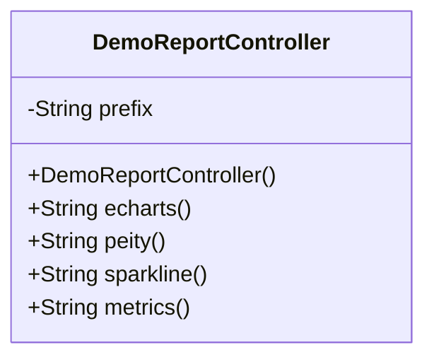
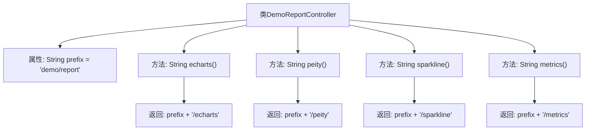

# 基础信息

|      |      |
|------|------|
| 名称 | DemoReportController |
| 编码语言 | .java |
| 代码路径 | RuoYi-main/ruoyi-admin/src/main/java/com/ruoyi/web/controller/demo/controller/DemoReportController.java |
| 包名 | com.ruoyi.web.controller.demo.controller |
| 依赖项 | ['org.springframework.stereotype.Controller', 'org.springframework.web.bind.annotation.GetMapping', 'org.springframework.web.bind.annotation.RequestMapping'] |
| 概述说明 | DemoReportController处理ECharts、Peity、Sparkline和Metrics的请求。 |

# 说明

DemoReportController负责处理与ECharts、Peity、Sparkline和Metrics相关的请求。该控制器管理这些图表和数据可视化工具的请求，确保系统能够正确生成和展示所需的图表和数据。通过处理这些请求，DemoReportController为用户提供了丰富的可视化数据展示功能，支持多种图表类型，满足不同的数据展示需求。

# 类列表 Class Summary

| 名称   | 类型  | 说明 |
|-------|------|-------------|
| DemoReportController | class | DemoReportController处理ECharts、Peity、Sparkline和Metrics的请求。 |

## 类 DemoReportController

|      |      |
|------|------|
| 访问范围 | @Controller;@RequestMapping("/demo/report");public |
| 类型 | class |
| 名称 | DemoReportController |
| 说明 | DemoReportController处理ECharts、Peity、Sparkline和Metrics的请求。 |

### UML类图

该代码定义了一个名为 `DemoReportController` 的控制器类，用于处理与报告相关的请求。类中包含一个私有成员 `prefix`，用于存储路径前缀。类中定义了四个公有方法，分别处理不同的图表请求，并返回相应的视图路径。这些方法通过 `@GetMapping` 注解映射到特定的 URL 路径，分别用于处理 ECharts、Peity、Sparkline 和 Metrics 图表的请求。

### 内部方法调用关系图

这段代码定义了一个名为 `DemoReportController` 的控制器类，用于处理不同的报告相关请求。类中包含一个私有属性 `prefix`，用于存储路径前缀。类中定义了四个方法，分别处理不同的请求路径：`echarts()`、`peity()`、`sparkline()` 和 `metrics()`。每个方法返回的字符串都是 `prefix` 加上特定的路径后缀，用于返回相应的视图路径。

### 字段列表 Field List

| 名称  | 类型  | 说明 |
|-------|-------|------|
| prefix = "demo/report" | String | 变量prefix被初始化为字符串"demo/report"。 |

### 方法列表 Method List

| 名称  | 类型  | 说明 |
|-------|-------|------|
| metrics | String | 该代码定义了一个返回指标路径的GET请求处理函数。 |
| echarts | String | 该方法通过GetMapping映射/echarts路径，返回前缀加/echarts的字符串。 |
| peity | String | Get请求映射到"/peity"，返回前缀加"/peity"。 |
| sparkline | String | Get请求映射到/sparkline路径，返回prefix加上/sparkline的字符串。 |

