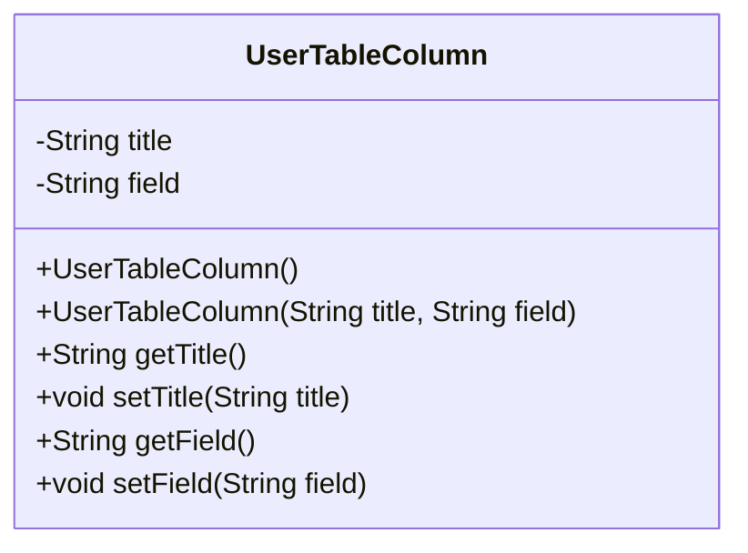
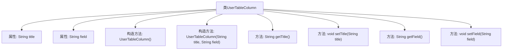
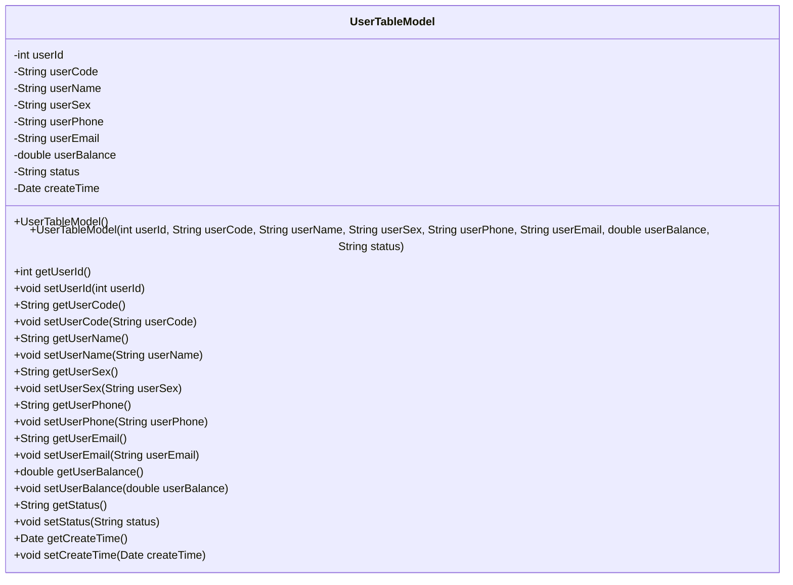
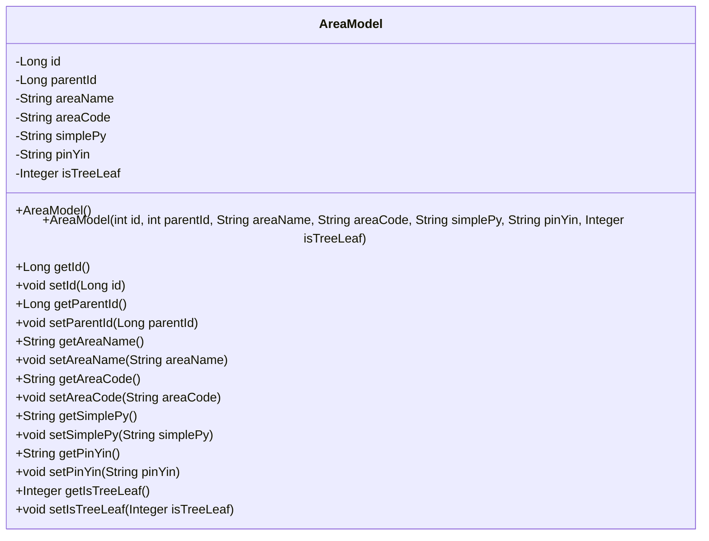
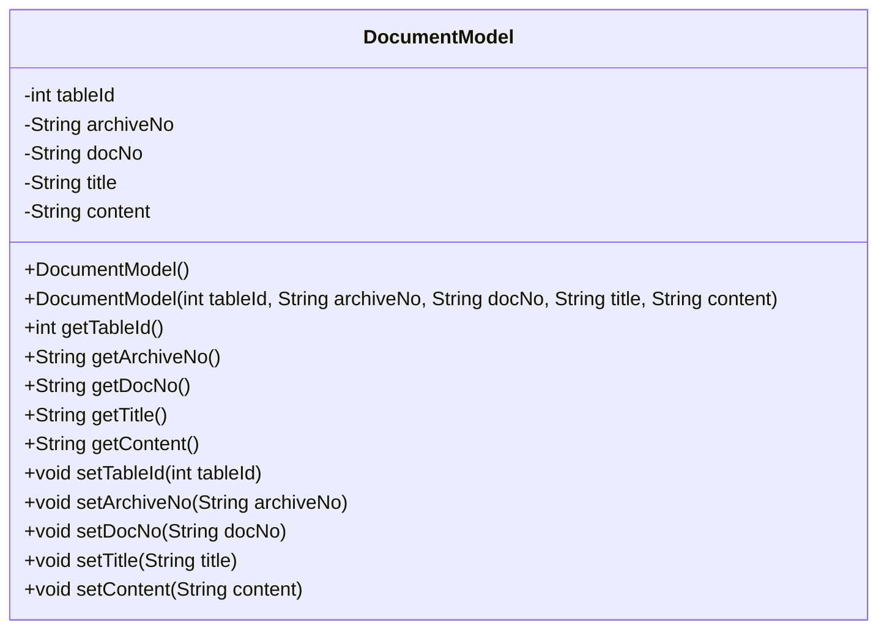

```mermaid
graph TD
    A["类DemoTableController"]
    B["属性: String prefix"]
    C["静态属性: List<UserTableModel> users"]
    D["静态属性: List<AreaModel> areas"]
    E["静态属性: List<UserTableColumn> columns"]
    F["静态属性: List<DocumentModel> documents"]
    G["方法: search()"]
    H["方法: footer()"]
    I["方法: groupHeader()"]
    J["方法: export()"]
    K["方法: exportSelected()"]
    L["方法: exportData(UserTableModel userModel, String userIds)"]
    M["方法: remember()"]
    N["方法: cookie()"]
    O["方法: pageGo()"]
    P["方法: params()"]
    Q["方法: multi()"]
    R["方法: button()"]
    S["方法: data(ModelMap mmap)"]
    T["方法: fixedColumns()"]
    U["方法: event()"]
    V["方法: detail()"]
    W["方法: child()"]
    X["方法: image()"]
    Y["方法: curd()"]
    Z["方法: reorderRows()"]
    AA["方法: reorderColumns()"]
    AB["方法: resizable()"]
    AC["方法: editable()"]
    AD["方法: subdata()"]
    AE["方法: refresh()"]
    AF["方法: print()"]
    AG["方法: headerStyle()"]
    AH["方法: dynamicColumns()"]
    AI["方法: virtualScroll()"]
    AJ["方法: customView()"]
    AK["方法: textSearch()"]
    AL["方法: asynTree()"]
    AM["方法: other()"]
    AN["方法: ajaxColumns(UserTableColumn userColumn)"]
    AO["方法: list(UserTableModel userModel)"]
    AP["方法: textList(BaseEntity baseEntity)"]
    AQ["方法: treeList(AreaModel areaModel)"]
    AR["方法: listChild(AreaModel areaModel)"]

    A --> B
    A --> C
    A --> D
    A --> E
    A --> F
    A --> G
    A --> H
    A --> I
    A --> J
    A --> K
    A --> L
    A --> M
    A --> N
    A --> O
    A --> P
    A --> Q
    A --> R
    A --> S
    A --> T
    A --> U
    A --> V
    A --> W
    A --> X
    A --> Y
    A --> Z
    A --> AA
    A --> AB
    A --> AC
    A --> AD
    A --> AE
    A --> AF
    A --> AG
    A --> AH
    A --> AI
    A --> AJ
    A --> AK
    A --> AL
    A --> AM
    A --> AN
    A --> AO
    A --> AP
    A --> AQ
    A --> AR
```

```mermaid
graph TD
    A["类DocumentModel"]
    B["属性: int tableId"]
    C["属性: String archiveNo"]
    D["属性: String docNo"]
    E["属性: String title"]
    F["属性: String content"]
    G["构造方法: DocumentModel()"]
    H["构造方法: DocumentModel(int tableId, String archiveNo, String docNo, String title, String content)"]
    I["方法: int getTableId()"]
    J["方法: String getArchiveNo()"]
    K["方法: String getDocNo()"]
    L["方法: String getTitle()"]
    M["方法: String getContent()"]
    N["方法: void setTableId(int tableId)"]
    O["方法: void setArchiveNo(String archiveNo)"]
    P["方法: void setDocNo(String docNo)"]
    Q["方法: void setTitle(String title)"]
    R["方法: void setContent(String content)"]

    A --> B
    A --> C
    A --> D
    A --> E
    A --> F
    A --> G
    A --> H
    A --> I
    A --> J
    A --> K
    A --> L
    A --> M
    A --> N
    A --> O
    A --> P
    A --> Q
    A --> R
```

# 基础信息

|      |      |
|------|------|
| 名称 | DemoTableController |
| 编码语言 | .java |
| 代码路径 | RuoYi-main/ruoyi-admin/src/main/java/com/ruoyi/web/controller/demo/controller/DemoTableController.java |
| 包名 | com.ruoyi.web.controller.demo.controller |
| 依赖项 | ['java.util.ArrayList', 'java.util.Arrays', 'java.util.Collections', 'java.util.Date', 'java.util.List', 'org.springframework.stereotype.Controller', 'org.springframework.ui.ModelMap', 'org.springframework.web.bind.annotation.GetMapping', 'org.springframework.web.bind.annotation.PostMapping', 'org.springframework.web.bind.annotation.RequestMapping', 'org.springframework.web.bind.annotation.ResponseBody', 'com.fasterxml.jackson.annotation.JsonFormat', 'com.ruoyi.common.annotation.Excel', 'com.ruoyi.common.annotation.Excel.ColumnType', 'com.ruoyi.common.core.controller.BaseController', 'com.ruoyi.common.core.domain.AjaxResult', 'com.ruoyi.common.core.domain.BaseEntity', 'com.ruoyi.common.core.page.PageDomain', 'com.ruoyi.common.core.page.TableDataInfo', 'com.ruoyi.common.core.page.TableSupport', 'com.ruoyi.common.core.text.Convert', 'com.ruoyi.common.utils.DateUtils', 'com.ruoyi.common.utils.StringUtils', 'com.ruoyi.common.utils.poi.ExcelUtil'] |
| 概述说明 | DemoTableController处理表格请求，涉及用户、地区、文档数据及操作功能。各类包含属性及访问方法。 |

# 说明

DemoTableController负责处理与表格相关的请求，涉及用户、地区和文档数据，并提供多种表格操作功能。UserTableColumn类包含表头和字段属性，支持构造和访问方法。用户表模型类包括用户ID、编号、姓名、性别、手机、邮箱、余额、状态及创建时间等属性。AreaModel类包含区域ID、父ID、名称、代码、拼音及子节点标识。DocumentModel类包括编号、档号、文件编号、标题和内容属性，并提供构造和访问方法。

# 类列表 Class Summary

| 名称   | 类型  | 说明 |
|-------|------|-------------|
| DemoTableController | class | DemoTableController处理表格相关请求，包含用户、地区、文档数据及多种表格操作功能。 |
| UserTableColumn | class | UserTableColumn类包含表头和字段属性，提供构造和访问方法。 |
| UserTableModel | class | 用户表模型类，包含用户ID、编号、姓名、性别、手机、邮箱、余额、状态及创建时间等属性。 |
| AreaModel | class | AreaModel类包含区域ID、父ID、名称、代码、拼音及子节点标识。 |
| DocumentModel | class | DocumentModel类包含编号、档号、文件编号、标题和内容属性，提供构造和访问方法。 |

## 类 DemoTableController

|      |      |
|------|------|
| 访问范围 | @Controller;@RequestMapping("/demo/table");public |
| 类型 | class |
| 名称 | DemoTableController |
| 说明 | DemoTableController处理表格相关请求，包含用户、地区、文档数据及多种表格操作功能。 |

### UML类图

```mermaid
classDiagram
    class DemoTableController {
        -String prefix
        -List~UserTableModel~ users
        -List~AreaModel~ areas
        -List~UserTableColumn~ columns
        -List~DocumentModel~ documents
        +DemoTableController()
        +String search()
        +String footer()
        +String groupHeader()
        +String export()
        +String exportSelected()
        +AjaxResult exportSelected(UserTableModel userModel, String userIds)
        +String remember()
        +String cookie()
        +String pageGo()
        +String params()
        +String multi()
        +String button()
        +String data(ModelMap mmap)
        +String fixedColumns()
        +String event()
        +String detail()
        +String child()
        +String image()
        +String curd()
        +String reorderRows()
        +String reorderColumns()
        +String resizable()
        +String editable()
        +String subdata()
        +String refresh()
        +String print()
        +String headerStyle()
        +String dynamicColumns()
        +String virtualScroll()
        +String customView()
        +String textSearch()
        +String asynTree()
        +String other()
        +AjaxResult ajaxColumns(UserTableColumn userColumn)
        +TableDataInfo list(UserTableModel userModel)
        +TableDataInfo textList(BaseEntity baseEntity)
        +TableDataInfo treeList(AreaModel areaModel)
        +List~AreaModel~ listChild(AreaModel areaModel)
    }

    class UserTableModel {
        -Long userId
        -String userCode
        -String userName
        -String userPhone
        -String userEmail
        -Double userBalance
        -String status
        +UserTableModel(Long userId, String userCode, String userName, String userPhone, String userEmail, Double userBalance, String status)
        +Long getUserId()
        +String getUserCode()
        +String getUserName()
        +String getUserPhone()
        +String getUserEmail()
        +Double getUserBalance()
        +String getStatus()
    }

    class AreaModel {
        -Long areaId
        -Long parentId
        -String areaName
        -String areaCode
        -String areaShortName
        -String areaFullName
        -Integer status
        +AreaModel(Long areaId, Long parentId, String areaName, String areaCode, String areaShortName, String areaFullName, Integer status)
        +Long getAreaId()
        +Long getParentId()
        +String getAreaName()
        +String getAreaCode()
        +String getAreaShortName()
        +String getAreaFullName()
        +Integer getStatus()
    }

    class UserTableColumn {
        -String title
        -String field
        +UserTableColumn(String title, String field)
        +String getTitle()
        +String getField()
    }

    class DocumentModel {
        -Long documentId
        -String documentCode
        -String documentTitle
        -String documentContent
        +DocumentModel(Long documentId, String documentCode, String documentTitle, String documentContent)
        +Long getDocumentId()
        +String getDocumentCode()
        +String getDocumentTitle()
        +String getDocumentContent()
    }

    class BaseEntity {
        -String searchValue
        +BaseEntity()
        +String getSearchValue()
    }

    class TableDataInfo {
        -List~Object~ rows
        -Long total
        +TableDataInfo()
        +List~Object~ getRows()
        +Long getTotal()
        +void setRows(List~Object~ rows)
        +void setTotal(Long total)
    }

    class AjaxResult {
        -Integer code
        -String msg
        -Object data
        +AjaxResult()
        +Integer getCode()
        +String getMsg()
        +Object getData()
        +void setCode(Integer code)
        +void setMsg(String msg)
        +void setData(Object data)
    }

    class PageDomain {
        -Integer pageNum
        -Integer pageSize
        +PageDomain()
        +Integer getPageNum()
        +Integer getPageSize()
        +void setPageNum(Integer pageNum)
        +void setPageSize(Integer pageSize)
    }

    class TableSupport {
        +PageDomain buildPageRequest()
    }

    class ExcelUtil~T~ {
        +ExcelUtil(Class~T~ clazz)
        +AjaxResult exportExcel(List~T~ list, String sheetName)
    }

    DemoTableController --> UserTableModel : 使用
    DemoTableController --> AreaModel : 使用
    DemoTableController --> UserTableColumn : 使用
    DemoTableController --> DocumentModel : 使用
    DemoTableController --> BaseEntity : 使用
    DemoTableController --> TableDataInfo : 使用
    DemoTableController --> AjaxResult : 使用
    DemoTableController --> PageDomain : 使用
    DemoTableController --> TableSupport : 使用
    DemoTableController --> ExcelUtil : 使用
```

### 描述
`DemoTableController` 是一个控制器类，负责处理与表格相关的请求。它管理用户数据、地区数据、表格列数据和文档数据，并提供了多种表格操作功能，如搜索、导出、分页、动态列等。通过依赖 `UserTableModel`、`AreaModel`、`UserTableColumn` 等类，控制器能够处理复杂的数据操作，并通过 `AjaxResult` 和 `TableDataInfo` 返回结果。

### 内部方法调用关系图

**描述：**
`DemoTableController` 是一个基于Spring MVC的控制器类，主要负责处理与表格相关的请求。它包含多个静态属性用于存储用户、区域、列和文档数据，并提供了丰富的请求处理方法，如数据导出、表格操作、动态列处理等。每个方法都通过不同的URL路径映射到特定的功能，确保用户能够灵活地操作和展示表格数据。

### 字段列表 Field List

| 名称  | 类型  | 说明 |
|-------|-------|------|
| prefix = "demo/table" | String | 变量prefix被赋值为"demo/table"。 |
| columns = new ArrayList<UserTableColumn>() | List<UserTableColumn> | 私有静态列表存储用户表列对象。 |
| areas = new ArrayList<AreaModel>() | List<AreaModel> | 私有静态列表用于存储AreaModel对象。 |
| users = new ArrayList<UserTableModel>() | List<UserTableModel> | 私有静态用户列表初始化为空数组。 |
| documents = new ArrayList<DocumentModel>() | List<DocumentModel> | 定义静态私有文档模型列表变量。 |

### 方法列表 Method List

| 名称  | 类型  | 说明 |
|-------|-------|------|
| footer | String | 该方法使用Get请求返回页脚路径。 |
| event | String | 该方法通过Get请求返回事件页面的路径。 |
| textSearch | String | GET请求处理，返回textSearch路径。 |
| cookie | String | GetMapping方法返回前缀加/cookie的字符串。 |
| dynamicColumns | String | GetMapping方法返回动态列页面的路径。 |
| editable | String | Spring Boot控制器方法返回可编辑页面路径。 |
| listChild | List<AreaModel> | 通过父ID和区域名查询子区域列表。 |
| reorderRows | String | GetMapping注解定义reorderRows方法，返回指定路径前缀。 |
| list | TableDataInfo | 通过用户名过滤用户列表并分页返回结果。 |
| reorderColumns | String | GetMapping映射reorderColumns方法，返回指定前缀路径。 |
| textList | TableDataInfo | POST请求处理文本列表，支持搜索条件过滤和分页返回。 |
| params | String | 定义一个GET请求路径为"/params"的方法，返回前缀加"/params"的字符串。 |
| fixedColumns | String | GET请求映射到/fixedColumns，返回固定列页面路径。 |
| resizable | String | Get请求映射到/resizable路径，返回指定前缀加/resizable的字符串。 |
| pageGo | String | 该方法通过Get请求返回指定页面路径。 |
| detail | String | GET请求映射到"/detail"，返回前缀加"/detail"的字符串。 |
| remember | String | Get请求映射到/remember路径，返回prefix拼接/remember的字符串。 |
| data | String | 获取用户数据并返回视图路径。 |
| exportSelected | AjaxResult | 导出用户数据，根据ID筛选并生成Excel文件。 |
| exportSelected | String | 该方法通过GET请求处理"/exportSelected"路径，返回指定前缀的导出页面。 |
| export | String | 该方法通过Get请求导出数据，返回指定路径的前缀加export。 |
| search | String | 定义一个GET请求处理方法，返回指定前缀的搜索页面路径。 |
| button | String | 控制器方法映射GET请求，返回按钮视图路径。 |
| multi | String | GET请求映射到/multi，返回prefix加/multi的字符串。 |
| customView | String | GetMapping注解定义返回自定义视图路径的方法。 |
| other | String | Get请求返回指定前缀加"/other"的字符串。 |
| asynTree | String | GetMapping注解定义异步树路径，返回前缀加asynTree。 |
| child | String | Get请求映射到/child路径，返回前缀加/child的字符串。 |
| subdata | String | 该代码定义了一个GET请求处理程序，返回指定路径的前缀加上"/subdata"。 |
| ajaxColumns | AjaxResult | 后端处理AJAX请求，动态添加用户余额列并返回结果。 |
| curd | String | GetMapping注解定义curd方法，返回prefix加/curd路径。 |
| virtualScroll | String | 该方法映射GET请求到/virtualScroll路径，返回虚拟滚动页面路径。 |
| refresh | String | 该代码为Spring Boot中定义了一个GET请求映射，返回指定前缀加"/refresh"的字符串。 |
| headerStyle | String | 该方法返回指定路径的前缀加/headerStyle。 |
| groupHeader | String | 定义GET请求路径/groupHeader，返回拼接后的字符串。 |
| image | String | 该方法通过Get请求返回指定前缀路径下的图像资源路径。 |
| treeList | TableDataInfo | 根据条件查询并分页返回父节点为0的区域列表。 |
| print | String | 该方法通过GET请求映射路径"/print"，返回前缀加"/print"的字符串。 |

## 类 UserTableColumn

|      |      |
|------|------|
| 访问范围 | None |
| 类型 | class |
| 名称 | UserTableColumn |
| 说明 | UserTableColumn类包含表头和字段属性，提供构造和访问方法。 |

### UML类图

这段代码定义了一个名为 `UserTableColumn` 的类，用于表示用户表格的列信息。类中包含两个私有属性 `title` 和 `field`，分别表示表头和字段。类提供了无参构造函数和带参构造函数，以及用于获取和设置这两个属性的公有方法。这个类主要用于存储和管理表格列的相关信息，适用于需要动态生成或修改表格列的场景。

### 内部方法调用关系图

这段代码定义了一个名为 `UserTableColumn` 的类，该类包含两个私有属性 `title` 和 `field`，分别表示表头和字段。类提供了两个构造方法，一个无参构造方法和一个带参构造方法，用于初始化 `title` 和 `field`。此外，类还提供了 `getTitle`、`setTitle`、`getField` 和 `setField` 四个方法，用于获取和设置 `title` 和 `field` 的值。流程图清晰地展示了类的结构及其内部方法之间的关系。

### 字段列表 Field List

| 名称  | 类型  | 说明 |
|-------|-------|------|
| title | String | 定义一个私有字符串类型的变量title。 |
| field | String | 声明一个私有的字符串类型字段。 |

### 方法列表 Method List

| 名称  | 类型  | 说明 |
|-------|-------|------|
| getField | String | 获取字段值的方法。 |
| setField | void | 该方法用于设置类的字段值，参数为字符串类型。 |
| getTitle | String | 获取并返回title字符串的方法。 |
| setTitle | void | 该方法用于设置对象的标题属性。 |

## 类 UserTableModel

|      |      |
|------|------|
| 访问范围 | None |
| 类型 | class |
| 名称 | UserTableModel |
| 说明 | 用户表模型类，包含用户ID、编号、姓名、性别、手机、邮箱、余额、状态及创建时间等属性。 |

### UML类图

**描述：**  
`UserTableModel` 类用于表示用户表模型，包含用户的基本信息如用户ID、用户编号、用户姓名、用户性别、用户手机、用户邮箱、用户余额、用户状态和创建时间。该类提供了默认构造函数和带参构造函数，用于初始化用户信息。此外，类中还定义了一系列的getter和setter方法，用于访问和修改这些私有属性。该类主要用于在系统中管理和操作用户数据。

### 内部方法调用关系图

```mermaid
graph TD
    A["类UserTableModel"]
    B["属性: int userId"]
    C["属性: String userCode"]
    D["属性: String userName"]
    E["属性: String userSex"]
    F["属性: String userPhone"]
    G["属性: String userEmail"]
    H["属性: double userBalance"]
    I["属性: String status"]
    J["属性: Date createTime"]
    K["构造方法: UserTableModel()"]
    L["构造方法: UserTableModel(int userId, String userCode, String userName, String userSex, String userPhone, String userEmail, double userBalance, String status)"]
    M["方法: int getUserId()"]
    N["方法: void setUserId(int userId)"]
    O["方法: String getUserCode()"]
    P["方法: void setUserCode(String userCode)"]
    Q["方法: String getUserName()"]
    R["方法: void setUserName(String userName)"]
    S["方法: String getUserSex()"]
    T["方法: void setUserSex(String userSex)"]
    U["方法: String getUserPhone()"]
    V["方法: void setUserPhone(String userPhone)"]
    W["方法: String getUserEmail()"]
    X["方法: void setUserEmail(String userEmail)"]
    Y["方法: double getUserBalance()"]
    Z["方法: void setUserBalance(double userBalance)"]
    AA["方法: String getStatus()"]
    AB["方法: void setStatus(String status)"]
    AC["方法: Date getCreateTime()"]
    AD["方法: void setCreateTime(Date createTime)"]

    A --> B
    A --> C
    A --> D
    A --> E
    A --> F
    A --> G
    A --> H
    A --> I
    A --> J
    A --> K
    A --> L
    A --> M
    A --> N
    A --> O
    A --> P
    A --> Q
    A --> R
    A --> S
    A --> T
    A --> U
    A --> V
    A --> W
    A --> X
    A --> Y
    A --> Z
    A --> AA
    A --> AB
    A --> AC
    A --> AD
```

**描述**：`UserTableModel`类是一个用户数据模型类，包含多个用户属性如用户ID、用户编号、用户姓名、用户性别、用户手机、用户邮箱、用户余额、用户状态和创建时间。类提供了无参构造方法和带参构造方法，以及每个属性的getter和setter方法。带参构造方法在初始化时会自动设置当前时间为创建时间。

### 字段列表 Field List

| 名称  | 类型  | 说明 |
|-------|-------|------|
| status | String | 定义私有字符串变量status。 |
| userId | int | 定义私有整型变量userId。 |
| userSex | String | 定义私有字符串变量userSex。 |
| userPhone | String | 定义用户手机字段，类型为字符串。 |
| userName | String | Excel注解标记用户姓名字段。 |
| userEmail | String | 定义了一个名为"用户邮箱"的私有字符串变量。 |
| userCode | String | Excel列“用户编号”定义为NUMERIC类型，对应变量userCode。 |
| createTime | Date | 定义日期格式为“年-月-日 时:分:秒”的创建时间字段。 |
| userBalance | double | 类字段"userBalance"为数值类型，表示用户余额。 |

### 方法列表 Method List

| 名称  | 类型  | 说明 |
|-------|-------|------|
| setUserSex | void | 设置用户性别的方法。 |
| getStatus | String | 该方法返回状态字符串。 |
| setUserCode | void | 设置用户代码的方法。 |
| setUserPhone | void | 设置用户电话号码的方法。 |
| getUserPhone | String | 获取用户电话号码的方法。 |
| getUserBalance | double | 获取用户余额的方法，返回值为double类型。 |
| getUserName | String | 获取用户名的字符串方法。 |
| getUserEmail | String | 获取用户邮箱的方法，返回userEmail变量。 |
| getCreateTime | Date | 该方法返回创建时间的日期对象。 |
| setStatus | void | 设置对象状态的方法，参数为字符串类型。 |
| setUserEmail | void | 设置用户邮箱的Java方法。 |
| setCreateTime | void | 设置创建时间的方法，接受Date类型参数。 |
| setUserName | void | 该方法用于设置用户名，将传入的userName赋值给当前对象的userName属性。 |
| getUserSex | String | 获取用户性别的方法，返回用户性别信息。 |
| setUserId | void | 设置用户ID的方法，将传入的userId赋值给当前对象的userId属性。 |
| setUserBalance | void | 设置用户余额的方法，接受双精度浮点数参数。 |
| getUserCode | String | 获取用户代码的方法。 |
| getUserId | int | 该方法返回用户ID。 |

## 类 AreaModel

|      |      |
|------|------|
| 访问范围 | None |
| 类型 | class |
| 名称 | AreaModel |
| 说明 | AreaModel类包含区域ID、父ID、名称、代码、拼音及子节点标识。 |

### UML类图

这段代码定义了一个名为 `AreaModel` 的类，用于表示区域模型。该类包含多个私有属性，如 `id`、`parentId`、`areaName` 等，用于存储区域的编号、父编号、区域名称等信息。类中提供了多个公有方法，用于获取和设置这些属性的值。此外，类中还定义了两个构造函数，一个无参构造函数和一个带参构造函数，用于初始化对象。这个类的主要作用是封装区域相关的数据，并提供访问和修改这些数据的方法。

### 内部方法调用关系图

```mermaid
graph TD
    A["类AreaModel"]
    B["属性: Long id"]
    C["属性: Long parentId"]
    D["属性: String areaName"]
    E["属性: String areaCode"]
    F["属性: String simplePy"]
    G["属性: String pinYin"]
    H["属性: Integer isTreeLeaf"]
    I["构造方法: AreaModel()"]
    J["构造方法: AreaModel(int id, int parentId, String areaName, String areaCode, String simplePy, String pinYin, Integer isTreeLeaf)"]
    K["方法: Long getId()"]
    L["方法: void setId(Long id)"]
    M["方法: Long getParentId()"]
    N["方法: void setParentId(Long parentId)"]
    O["方法: String getAreaName()"]
    P["方法: void setAreaName(String areaName)"]
    Q["方法: String getAreaCode()"]
    R["方法: void setAreaCode(String areaCode)"]
    S["方法: String getSimplePy()"]
    T["方法: void setSimplePy(String simplePy)"]
    U["方法: String getPinYin()"]
    V["方法: void setPinYin(String pinYin)"]
    W["方法: Integer getIsTreeLeaf()"]
    X["方法: void setIsTreeLeaf(Integer isTreeLeaf)"]

    A --> B
    A --> C
    A --> D
    A --> E
    A --> F
    A --> G
    A --> H
    A --> I
    A --> J
    A --> K
    A --> L
    A --> M
    A --> N
    A --> O
    A --> P
    A --> Q
    A --> R
    A --> S
    A --> T
    A --> U
    A --> V
    A --> W
    A --> X
```

这段代码定义了一个名为 `AreaModel` 的类，用于表示区域模型。该类包含多个属性，如 `id`、`parentId`、`areaName`、`areaCode`、`simplePy`、`pinYin` 和 `isTreeLeaf`，并提供了相应的构造方法和 getter/setter 方法。流程图展示了类的结构及其内部方法之间的调用关系，清晰地反映了类的属性和方法的层级关系。

### 字段列表 Field List

| 名称  | 类型  | 说明 |
|-------|-------|------|
| areaCode | String | 定义私有字符串变量areaCode。 |
| simplePy | String | 定义了一个私有字符串变量simplePy。 |
| parentId | Long | 定义了一个长整型的父ID变量。 |
| areaName | String | 定义了一个私有字符串变量areaName。 |
| isTreeLeaf = 1 | Integer | 私有整型变量isTreeLeaf初始化为1。 |
| pinYin | String | 定义了一个私有字符串变量pinYin。 |
| id | Long | 定义一个长整型私有变量id。 |

### 方法列表 Method List

| 名称  | 类型  | 说明 |
|-------|-------|------|
| setSimplePy | void | 设置简单拼音属性的方法。 |
| getAreaCode | String | 该方法返回区域代码值。 |
| setAreaCode | void | 设置区域代码的方法。 |
| getPinYin | String | 获取拼音字符串的方法。 |
| setPinYin | void | 设置拼音字符串的方法。 |
| setIsTreeLeaf | void | 设置树节点是否为叶子节点的方法。 |
| getId | Long | 该方法返回长整型变量id的值。 |
| getParentId | Long | 该方法返回父级ID。 |
| setAreaName | void | 设置区域名称的方法，将输入参数赋值给类成员变量。 |
| getSimplePy | String | 获取simplePy字符串的方法。 |
| getIsTreeLeaf | Integer | 该方法返回布尔值，表示是否为树形结构的叶子节点。 |
| setId | void | 该方法用于设置对象的ID属性。 |
| setParentId | void | 设置父ID的方法，将传入的parentId赋值给当前对象的parentId属性。 |
| getAreaName | String | 方法返回区域名称。 |

## 类 DocumentModel

|      |      |
|------|------|
| 访问范围 | None |
| 类型 | class |
| 名称 | DocumentModel |
| 说明 | DocumentModel类包含编号、档号、文件编号、标题和内容属性，提供构造和访问方法。 |

### UML类图

这段代码定义了一个名为 `DocumentModel` 的类，用于表示文档模型。该类包含五个私有属性：`tableId`（编号）、`archiveNo`（档号）、`docNo`（文件编号）、`title`（标题）和 `content`（内容）。类提供了两个构造函数：一个无参构造函数和一个带参构造函数，用于初始化这些属性。此外，类还提供了每个属性的 `getter` 和 `setter` 方法，以便外部代码可以访问和修改这些属性。这个类的主要作用是封装文档的相关信息，并提供对这些信息的访问和修改接口。

### 内部方法调用关系图

**描述：**  
`DocumentModel`类包含五个私有属性：`tableId`、`archiveNo`、`docNo`、`title`和`content`。类提供了两个构造方法，一个无参构造方法和一个带参构造方法，用于初始化这些属性。此外，类还提供了获取和设置这些属性的方法，分别用于读取和修改属性的值。该类的设计用于表示文档模型，能够存储和操作文档的相关信息。

### 字段列表 Field List

| 名称  | 类型  | 说明 |
|-------|-------|------|
| content | String | 私有字符串变量content定义。 |
| docNo | String | 私有字符串变量docNo。 |
| tableId | int | 定义了一个私有整型变量tableId。 |
| archiveNo | String | 私有字符串变量 archiveNo。 |
| title | String | 定义了一个私有的字符串类型变量title。 |

### 方法列表 Method List

| 名称  | 类型  | 说明 |
|-------|-------|------|
| getTableId | int | 获取并返回表ID的方法。 |
| getTitle | String | 该方法返回字符串类型的标题。 |
| setTitle | void | 设置对象的标题属性。 |
| setTableId | void | 设置表ID的方法，参数为整数类型。 |
| getDocNo | String | 方法getDocNo返回字符串类型变量docNo。 |
| getArchiveNo | String | 获取档案编号的方法，返回字符串类型的档案编号。 |
| setContent | void | 设置内容方法，将输入字符串赋值给类的content属性。 |
| setDocNo | void | 设置文档编号的方法，将输入参数赋值给类成员变量。 |
| setArchiveNo | void | 设置档案编号的方法，将传入的archiveNo赋值给当前对象的archiveNo属性。 |
| getContent | String | 该方法返回字符串类型的`content`变量值。 |

