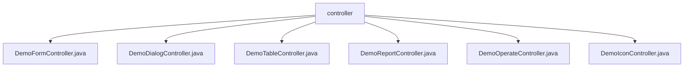

# 基础信息

|      |      |
|------|------|
| 名称 | controller |
| 编码语言 | .java |
| 代码路径 | RuoYi-main/ruoyi-admin/src/main/java/com/ruoyi/web/controller/demo/controller |
| 包名 | RuoYi-main.ruoyi-admin.src.main.java.com.ruoyi.web.controller.demo.controller |
| 概述说明 | Demo控制器处理表单、模态窗口、表格、图表、用户操作和图标请求，返回相应视图路径。 |

# 说明

## 概述
该代码模块是一个基于Java的Web应用程序，主要用于处理和管理前端页面的各种请求，涵盖了表单、模态窗口、表格、图表、用户操作以及图标等多种功能。模块通过多个控制器类实现了对不同业务场景的支持，确保用户界面的正确加载和流畅交互。每个控制器负责处理特定类型的请求，并返回相应的视图路径或资源，从而为系统提供了全面的数据展示和操作功能。

## 主要业务场景
1. **表单处理**  
   - **DemoFormController**：负责处理表单相关请求，包括按钮、下拉框和时间轴等功能。用户表单模型包含用户ID、编号、姓名和手机号等字段，提供了构造和访问这些字段的方法。该控制器确保表单数据的正确处理和页面路径的返回。

2. **模态窗口与弹层处理**  
   - **DemoDialogController**：负责处理模态窗口、弹层、表单、表格等各类请求，并根据请求内容返回相应的视图路径。该控制器确保用户界面元素的正确加载和显示，提供流畅的用户交互体验。

3. **表格数据处理**  
   - **DemoTableController**：负责处理与表格相关的请求，涉及用户、地区和文档数据，并提供多种表格操作功能。支持用户表、区域表和文档表的数据管理，确保表格数据的正确展示和操作。

4. **图表与数据可视化**  
   - **DemoReportController**：负责处理与ECharts、Peity、Sparkline和Metrics相关的请求。该控制器管理这些图表和数据可视化工具的请求，确保系统能够正确生成和展示所需的图表和数据，满足不同的数据展示需求。

5. **用户操作管理**  
   - **DemoOperateController**：负责管理用户操作，提供了多种功能，包括表格展示、数据查询、新增记录、修改记录、删除记录、数据导出以及数据导入等。这些功能覆盖了用户在使用过程中可能涉及的主要操作需求，确保了对数据的全面管理和操作便捷性。

6. **图标资源管理**  
   - **DemoIconController**：负责处理图标请求，支持两种图标路径：FontAwesome和Glyphicons。该控制器的主要功能是根据请求类型和参数，动态生成并返回相应的图标资源，确保系统能够灵活地展示不同类型的图标，满足多样化的界面设计需求。

### 包内部结构视图

该流程图展示了`controller`文件夹下的六个子文件，分别是`DemoFormController.java`、`DemoDialogController.java`、`DemoTableController.java`、`DemoReportController.java`、`DemoOperateController.java`和`DemoIconController.java`。这些文件均位于`RuoYi-main/ruoyi-admin/src/main/java/com/ruoyi/web/controller/demo/controller`路径下，属于同一个层级，直接关联到`controller`节点。

# 文件列表 File List

| 名称   | 类型  | 说明 |
|-------|------|-------------|
| [DemoIconController.java](DemoIconController.md) | file | DemoIconController处理FontAwesome和Glyphicons图标请求。 |
| [DemoDialogController.java](DemoDialogController.md) | file | DemoDialogController处理模态窗口、弹层、表单、表格请求，返回视图路径。 |
| [DemoOperateController.java](DemoOperateController.md) | file | DemoOperateController类管理用户操作，支持表格展示、查询、增删改、导入导出功能。 |
| [DemoReportController.java](DemoReportController.md) | file | DemoReportController处理ECharts、Peity、Sparkline和Metrics的请求。 |
| [DemoTableController.java](DemoTableController.md) | file | DemoTableController处理表格请求，涉及用户、地区、文档数据及操作功能。各类包含属性及访问方法。 |
| [DemoFormController.java](DemoFormController.md) | file | DemoFormController处理表单请求，管理用户模型，返回页面路径。 |

