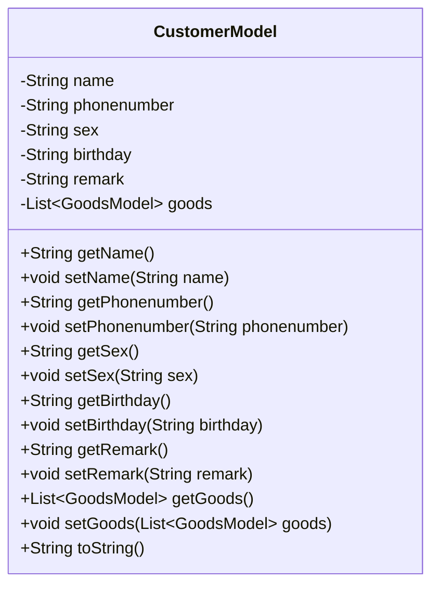

# 基础信息

|      |      |
|------|------|
| 名称 | CustomerModel |
| 编码语言 | .java |
| 代码路径 | RuoYi-main/ruoyi-admin/src/main/java/com/ruoyi/web/controller/demo/domain/CustomerModel.java |
| 包名 | com.ruoyi.web.controller.demo.domain |
| 依赖项 | ['java.util.List', 'org.apache.commons.lang3.builder.ToStringBuilder', 'org.apache.commons.lang3.builder.ToStringStyle'] |
| 概述说明 | 客户模型包含姓名、手机、性别、生日、描述和商品信息。 |

# 说明

客户模型包含多个关键字段，用于记录客户的基本信息和相关商品数据。具体字段包括客户的姓名、手机号码、性别、生日以及描述信息。此外，模型还包含了与客户相关的商品信息，用于进一步描述客户的购买或关联商品情况。这些字段共同构成了一个完整的客户模型，便于系统对客户信息进行管理和分析。

# 类列表 Class Summary

| 名称   | 类型  | 说明 |
|-------|------|-------------|
| CustomerModel | class | 客户模型包含姓名、手机、性别、生日、描述和商品信息。 |

## 类 CustomerModel

|      |      |
|------|------|
| 访问范围 | public |
| 类型 | class |
| 名称 | CustomerModel |
| 说明 | 客户模型包含姓名、手机、性别、生日、描述和商品信息。 |

### UML类图

这段代码定义了一个名为 `CustomerModel` 的类，用于表示客户信息。该类包含客户的姓名、手机号、性别、生日、描述以及商品信息等属性，并提供了相应的 getter 和 setter 方法。`toString` 方法用于将对象转换为字符串表示，便于调试和日志记录。类图中的 `CustomerModel` 类展示了其私有属性和公有方法，以及它们之间的依赖关系。

### 内部方法调用关系图

```mermaid
graph TD
    A["类CustomerModel"]
    B["属性: String name"]
    C["属性: String phonenumber"]
    D["属性: String sex"]
    E["属性: String birthday"]
    F["属性: String remark"]
    G["属性: List<GoodsModel> goods"]
    H["方法: String getName()"]
    I["方法: void setName(String name)"]
    J["方法: String getPhonenumber()"]
    K["方法: void setPhonenumber(String phonenumber)"]
    L["方法: String getSex()"]
    M["方法: void setSex(String sex)"]
    N["方法: String getBirthday()"]
    O["方法: void setBirthday(String birthday)"]
    P["方法: String getRemark()"]
    Q["方法: void setRemark(String remark)"]
    R["方法: List<GoodsModel> getGoods()"]
    S["方法: void setGoods(List<GoodsModel> goods)"]
    T["重写方法: String toString()"]

    A --> B
    A --> C
    A --> D
    A --> E
    A --> F
    A --> G
    A --> H
    A --> I
    A --> J
    A --> K
    A --> L
    A --> M
    A --> N
    A --> O
    A --> P
    A --> Q
    A --> R
    A --> S
    A --> T
```

这段代码定义了一个`CustomerModel`类，包含了客户的姓名、手机号、性别、生日、描述以及商品信息等属性，并为每个属性提供了相应的getter和setter方法。此外，重写了`toString`方法，使用`ToStringBuilder`生成多行格式的字符串表示。该类的设计主要用于存储和管理客户的相关信息，并通过方法进行属性的获取和设置。

### 字段列表 Field List

| 名称  | 类型  | 说明 |
|-------|-------|------|
| goods | List<GoodsModel> | 私有商品模型列表变量定义。 |
| name | String | 定义私有字符串类型变量name。 |
| sex | String | 声明了一个私有的字符串类型变量sex。 |
| birthday | String | 定义了一个私有的字符串类型变量birthday。 |
| remark | String | 私有字符串类型变量remark。 |
| phonenumber | String | 定义了一个私有字符串类型的电话号码变量。 |

### 方法列表 Method List

| 名称  | 类型  | 说明 |
|-------|-------|------|
| setPhonenumber | void | 定义设置电话号码的方法。 |
| setBirthday | void | 设置对象生日属性的方法。 |
| getBirthday | String | 该方法返回生日字符串。 |
| setRemark | void | 设置备注信息的Java方法。 |
| getRemark | String | 获取备注信息的Java方法。 |
| getPhonenumber | String | 该方法返回电话号码字符串。 |
| setSex | void | 设置性别属性值为指定字符串。 |
| getName | String | 获取对象名称的公共方法。 |
| getGoods | List<GoodsModel> | 获取商品列表的方法，返回商品模型集合。 |
| toString | String | 重写toString方法，输出对象的多行属性信息。 |
| setGoods | void | 设置商品列表的方法，接收商品模型列表作为参数。 |
| setName | void | 定义方法setName，用于设置对象的name属性。 |
| getSex | String | 该方法返回性别信息。 |

