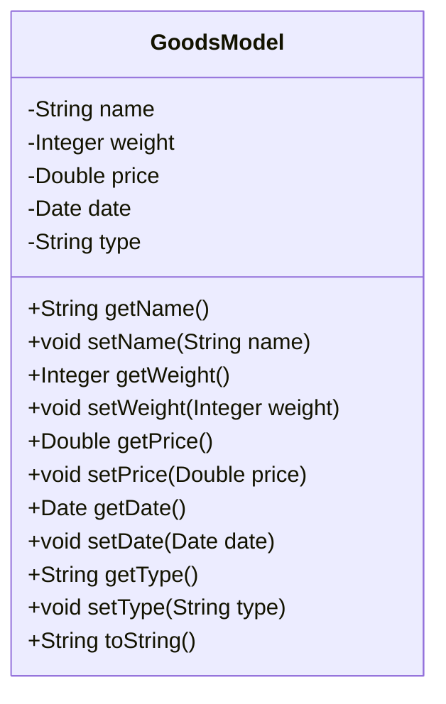

# 基础信息

|      |      |
|------|------|
| 名称 | GoodsModel |
| 编码语言 | .java |
| 代码路径 | RuoYi-main/ruoyi-admin/src/main/java/com/ruoyi/web/controller/demo/domain/GoodsModel.java |
| 包名 | com.ruoyi.web.controller.demo.domain |
| 依赖项 | ['java.util.Date', 'org.apache.commons.lang3.builder.ToStringBuilder', 'org.apache.commons.lang3.builder.ToStringStyle'] |
| 概述说明 | GoodsModel类含商品名、重量、价格、日期、种类属性及对应getter和setter方法。 |

# 说明

GoodsModel类是一个用于表示商品信息的模型类，包含五个主要属性：商品名称、重量、价格、日期和种类。每个属性都配备了相应的getter和setter方法，用于获取和设置这些属性的值。商品名称用于标识商品的名称，重量表示商品的重量，价格表示商品的售价，日期记录商品的相关日期信息，种类则用于分类商品。通过这些方法，可以方便地访问和修改商品的各种信息。

# 类列表 Class Summary

| 名称   | 类型  | 说明 |
|-------|------|-------------|
| GoodsModel | class | GoodsModel类包含商品名称、重量、价格、日期和种类属性及其getter和setter方法。 |

## 类 GoodsModel

|      |      |
|------|------|
| 访问范围 | public |
| 类型 | class |
| 名称 | GoodsModel |
| 说明 | GoodsModel类包含商品名称、重量、价格、日期和种类属性及其getter和setter方法。 |

### UML类图

这段代码定义了一个名为 `GoodsModel` 的类，用于表示商品模型。该类包含五个私有属性：`name`（商品名称）、`weight`（商品重量）、`price`（商品价格）、`date`（商品日期）和 `type`（商品种类）。每个属性都有对应的 `getter` 和 `setter` 方法，用于获取和设置属性值。此外，类中还重写了 `toString` 方法，使用 `ToStringBuilder` 类来生成格式化的字符串表示，以便于调试和日志记录。

### 内部方法调用关系图

```mermaid
graph TD
    A["类GoodsModel"]
    B["属性: String name"]
    C["属性: Integer weight"]
    D["属性: Double price"]
    E["属性: Date date"]
    F["属性: String type"]
    G["方法: String getName()"]
    H["方法: void setName(String name)"]
    I["方法: Integer getWeight()"]
    J["方法: void setWeight(Integer weight)"]
    K["方法: Double getPrice()"]
    L["方法: void setPrice(Double price)"]
    M["方法: Date getDate()"]
    N["方法: void setDate(Date date)"]
    O["方法: String getType()"]
    P["方法: void setType(String type)"]
    Q["重写方法: String toString()"]

    A --> B
    A --> C
    A --> D
    A --> E
    A --> F
    A --> G
    A --> H
    A --> I
    A --> J
    A --> K
    A --> L
    A --> M
    A --> N
    A --> O
    A --> P
    A --> Q
```

这段代码定义了一个名为 `GoodsModel` 的类，该类包含了商品的名称、重量、价格、日期和种类等属性，并提供了相应的 `getter` 和 `setter` 方法。此外，类中重写了 `toString` 方法，用于返回商品信息的格式化字符串。流程图展示了类的结构及其内部方法之间的调用关系，帮助理解类的整体设计。

### 字段列表 Field List

| 名称  | 类型  | 说明 |
|-------|-------|------|
| date | Date | 声明一个私有的日期类型变量date。 |
| name | String | 声明一个私有字符串变量name。 |
| type | String | 定义了一个私有字符串类型的变量type。 |
| weight | Integer | 私有整型变量weight用于存储重量值。 |
| price | Double | 私有双精度浮点数类型变量price。 |

### 方法列表 Method List

| 名称  | 类型  | 说明 |
|-------|-------|------|
| getPrice | Double | 该方法返回价格值。 |
| getName | String | 该方法返回字符串类型的name属性值。 |
| setWeight | void | 该方法用于设置对象的重量属性。 |
| setType | void | 定义方法设置类型变量。 |
| getType | String | 获取类型方法返回类型字段。 |
| getWeight | Integer | 获取并返回整型变量weight的值。 |
| getDate | Date | 获取日期对象的公共方法。 |
| setDate | void | 设置日期方法，将传入日期赋值给当前对象。 |
| setName | void | 方法`setName`用于设置对象属性`name`的值。 |
| setPrice | void | 该方法用于设置价格，接收一个Double类型的参数。 |
| toString | String | 重写toString方法，返回对象的多行字符串表示。 |

