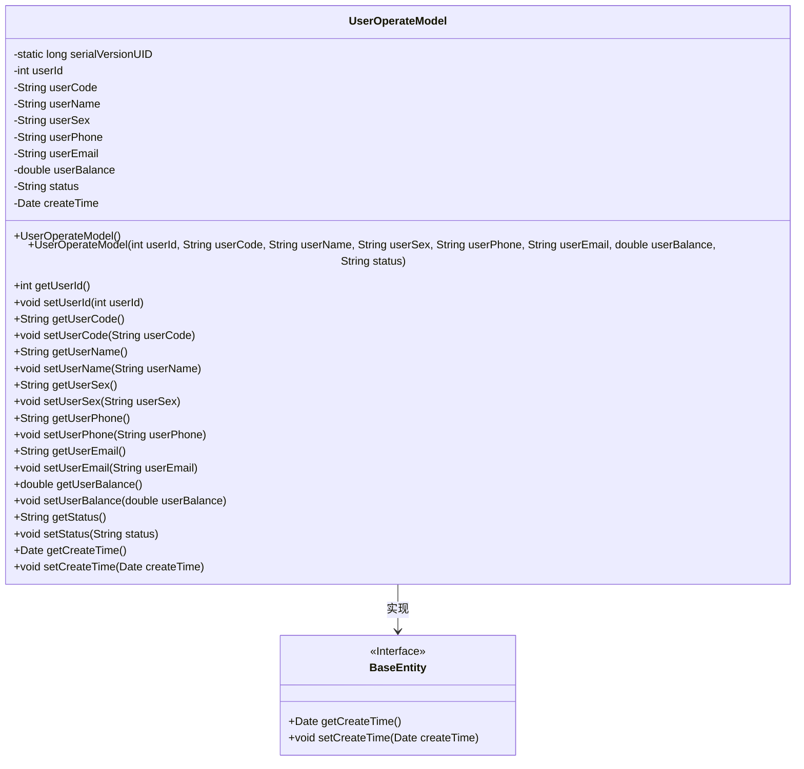

# 基础信息

|      |      |
|------|------|
| 名称 | UserOperateModel |
| 编码语言 | .java |
| 代码路径 | RuoYi-main/ruoyi-admin/src/main/java/com/ruoyi/web/controller/demo/domain/UserOperateModel.java |
| 包名 | com.ruoyi.web.controller.demo.domain |
| 依赖项 | ['java.util.Date', 'com.ruoyi.common.annotation.Excel', 'com.ruoyi.common.annotation.Excel.Type', 'com.ruoyi.common.core.domain.BaseEntity', 'com.ruoyi.common.utils.DateUtils'] |
| 概述说明 | 用户操作模型类涵盖用户信息及操作方法。 |

# 说明

用户操作模型类是一个用于管理和操作用户信息的类。该类包含用户的基本信息，如姓名、年龄、联系方式等，并提供了一系列操作方法，如添加用户、删除用户、更新用户信息和查询用户信息等。通过这些方法，可以方便地对用户数据进行增删改查操作，确保用户信息的管理和维护更加高效和便捷。该类设计简洁，功能全面，适用于各种需要用户管理的应用场景。

# 类列表 Class Summary

| 名称   | 类型  | 说明 |
|-------|------|-------------|
| UserOperateModel | class | 用户操作模型类，包含用户信息和操作方法。 |

## 类 UserOperateModel

|      |      |
|------|------|
| 访问范围 | public |
| 类型 | class |
| 名称 | UserOperateModel |
| 说明 | 用户操作模型类，包含用户信息和操作方法。 |

### UML类图

这段代码定义了一个`UserOperateModel`类，该类继承自`BaseEntity`接口。`UserOperateModel`类包含多个私有字段，如`userId`、`userCode`、`userName`等，并提供了相应的getter和setter方法。此外，该类还包含两个构造函数，一个无参构造函数和一个带参构造函数，用于初始化对象。`UserOperateModel`类实现了`BaseEntity`接口中的`getCreateTime`和`setCreateTime`方法，用于管理创建时间字段。整体设计用于表示用户操作模型，包含用户的基本信息和操作状态。

### 内部方法调用关系图

```mermaid
graph TD
    A["类UserOperateModel"]
    B["属性: int userId"]
    C["属性: String userCode"]
    D["属性: String userName"]
    E["属性: String userSex"]
    F["属性: String userPhone"]
    G["属性: String userEmail"]
    H["属性: double userBalance"]
    I["属性: String status"]
    J["属性: Date createTime"]
    K["构造方法: UserOperateModel()"]
    L["构造方法: UserOperateModel(int userId, String userCode, String userName, String userSex, String userPhone, String userEmail, double userBalance, String status)"]
    M["方法: int getUserId()"]
    N["方法: void setUserId(int userId)"]
    O["方法: String getUserCode()"]
    P["方法: void setUserCode(String userCode)"]
    Q["方法: String getUserName()"]
    R["方法: void setUserName(String userName)"]
    S["方法: String getUserSex()"]
    T["方法: void setUserSex(String userSex)"]
    U["方法: String getUserPhone()"]
    V["方法: void setUserPhone(String userPhone)"]
    W["方法: String getUserEmail()"]
    X["方法: void setUserEmail(String userEmail)"]
    Y["方法: double getUserBalance()"]
    Z["方法: void setUserBalance(double userBalance)"]
    AA["方法: String getStatus()"]
    AB["方法: void setStatus(String status)"]
    AC["重写方法: Date getCreateTime()"]
    AD["重写方法: void setCreateTime(Date createTime)"]

    A --> B
    A --> C
    A --> D
    A --> E
    A --> F
    A --> G
    A --> H
    A --> I
    A --> J
    A --> K
    A --> L
    A --> M
    A --> N
    A --> O
    A --> P
    A --> Q
    A --> R
    A --> S
    A --> T
    A --> U
    A --> V
    A --> W
    A --> X
    A --> Y
    A --> Z
    A --> AA
    A --> AB
    A --> AC
    A --> AD
```

这段代码定义了一个名为`UserOperateModel`的类，该类继承自`BaseEntity`。类中包含多个属性，如`userId`、`userCode`、`userName`等，并提供了相应的getter和setter方法。此外，类中还包含两个构造方法，一个无参构造方法和一个带参构造方法，用于初始化对象的属性。`createTime`属性的getter和setter方法被重写，以便在创建对象时自动设置当前时间。

### 字段列表 Field List

| 名称  | 类型  | 说明 |
|-------|-------|------|
| userId | int | 私有整型变量userId用于存储用户ID。 |
| userCode | String | Excel注解标记用户编号字段为userCode。 |
| userEmail | String | 用户邮箱字段定义为私有字符串类型。 |
| userPhone | String | 用户手机字段定义为私有字符串类型。 |
| userBalance | double | 用户余额字段，类型为双精度浮点数。 |
| serialVersionUID = 1L | long | 定义私有静态常量序列化版本号为1L。 |
| createTime | Date | Excel导出字段：创建时间，格式为yyyy-MM-dd HH:mm:ss。 |
| userName | String | Excel字段映射用户姓名字符串。 |
| userSex | String | 用户性别字段，0表示男，1表示女，2表示未知。 |
| status | String | 用户状态字段，0表示正常，1表示停用。 |

### 方法列表 Method List

| 名称  | 类型  | 说明 |
|-------|-------|------|
| setUserName | void | 设置用户名的Java方法。 |
| getUserEmail | String | 获取用户邮箱的方法。 |
| getUserCode | String | 该方法返回用户代码字符串。 |
| setUserCode | void | 该方法用于设置用户代码。 |
| getStatus | String | 该方法返回状态字符串。 |
| getUserPhone | String | 获取用户电话号码的方法。 |
| setUserPhone | void | 设置用户电话号码的方法。 |
| getUserBalance | double | 获取用户余额的方法，返回用户余额值。 |
| getCreateTime | Date | 重写getCreateTime方法，返回createTime字段值。 |
| getUserSex | String | 获取用户性别的方法，返回用户性别信息。 |
| setUserEmail | void | 设置用户邮箱的Java方法。 |
| setStatus | void | 设置对象状态的方法。 |
| setUserSex | void | 方法setUserSex用于设置用户性别。 |
| setCreateTime | void | 重写setCreateTime方法，用于设置创建时间。 |
| getUserName | String | 获取用户名的Java方法。 |
| setUserBalance | void | 设置用户余额的方法，将传入值赋给类变量userBalance。 |
| getUserId | int | 该方法返回用户ID。 |
| setUserId | void | 设置用户ID的方法，将传入的整数值赋给类成员变量userId。 |

