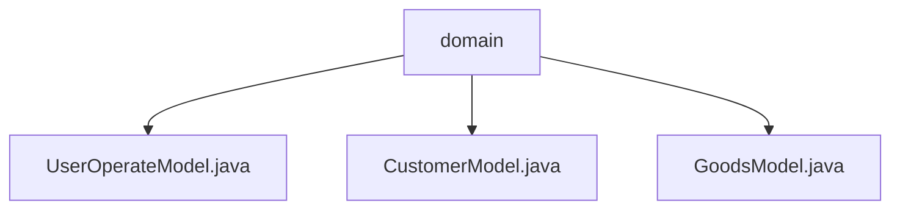

# 基础信息

|      |      |
|------|------|
| 名称 | domain |
| 编码语言 | .java |
| 代码路径 | RuoYi-main/ruoyi-admin/src/main/java/com/ruoyi/web/controller/demo/domain |
| 包名 | RuoYi-main.ruoyi-admin.src.main.java.com.ruoyi.web.controller.demo.domain |
| 概述说明 | 用户模型类管理用户信息，客户模型记录客户及商品数据，商品模型类表示商品属性。 |

# 说明

## 概述
该代码模块主要涉及用户、客户和商品信息的管理，提供了对这些实体进行增删改查操作的功能。模块包含三个核心模型类：`UserOperateModel`、`CustomerModel` 和 `GoodsModel`，分别用于管理用户信息、客户信息以及商品信息。每个模型类都设计简洁，功能全面，适用于需要高效管理和维护这些数据的应用场景。

## 主要业务场景
1. **用户管理**：通过 `UserOperateModel` 类，系统可以方便地管理用户的基本信息（如姓名、年龄、联系方式等），并支持添加、删除、更新和查询用户信息的操作。适用于需要用户注册、信息维护和权限管理的场景。
2. **客户管理**：`CustomerModel` 类用于记录客户的基本信息（如姓名、手机号码、性别、生日等）以及相关的商品数据。该类便于系统对客户信息进行管理和分析，适用于客户关系管理（CRM）和销售分析等场景。
3. **商品管理**：`GoodsModel` 类用于表示商品信息，包含商品名称、重量、价格、日期和种类等属性。通过该类，系统可以方便地访问和修改商品信息，适用于商品库存管理、销售记录和商品分类等场景。

这些模型类的设计使得系统能够高效地管理和维护用户、客户和商品数据，适用于多种需要数据管理和分析的业务场景。

### 包内部结构视图

该流程图展示了`domain`文件夹下的三个Java文件：`UserOperateModel.java`、`CustomerModel.java`和`GoodsModel.java`。这些文件均位于`domain`目录下，表示它们属于同一层级，且都与`domain`文件夹直接关联。

# 文件列表 File List

| 名称   | 类型  | 说明 |
|-------|------|-------------|
| [CustomerModel.java](CustomerModel.md) | file | 客户模型包含姓名、手机、性别、生日、描述和商品信息。 |
| [GoodsModel.java](GoodsModel.md) | file | GoodsModel类含商品名、重量、价格、日期、种类属性及对应getter和setter方法。 |
| [UserOperateModel.java](UserOperateModel.md) | file | 用户操作模型类涵盖用户信息及操作方法。 |

