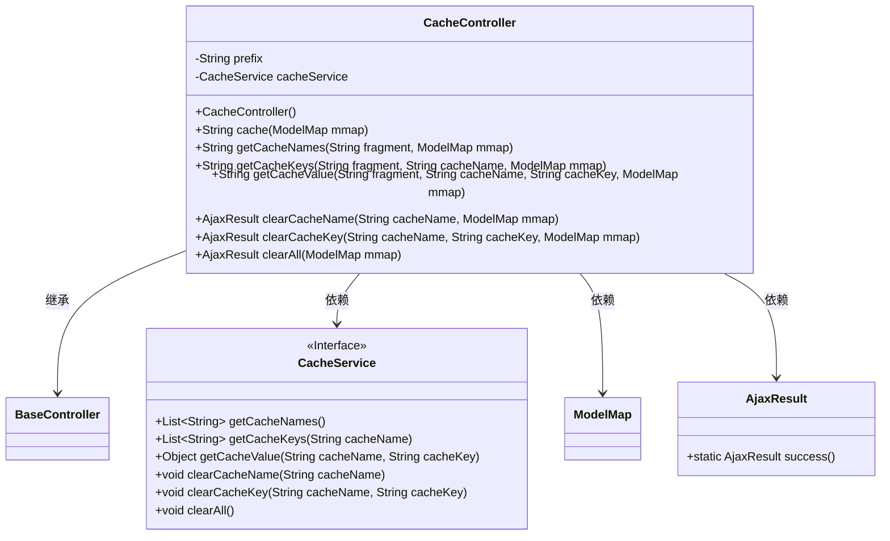
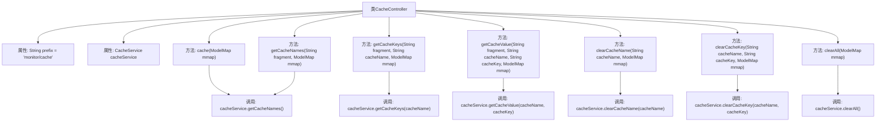

# 基础信息

|      |      |
|------|------|
| 名称 | CacheController |
| 编码语言 | .java |
| 代码路径 | RuoYi-main/ruoyi-admin/src/main/java/com/ruoyi/web/controller/monitor/CacheController.java |
| 包名 | com.ruoyi.web.controller.monitor |
| 依赖项 | ['org.apache.shiro.authz.annotation.RequiresPermissions', 'org.springframework.beans.factory.annotation.Autowired', 'org.springframework.stereotype.Controller', 'org.springframework.ui.ModelMap', 'org.springframework.web.bind.annotation.GetMapping', 'org.springframework.web.bind.annotation.PostMapping', 'org.springframework.web.bind.annotation.RequestMapping', 'org.springframework.web.bind.annotation.ResponseBody', 'com.ruoyi.common.core.controller.BaseController', 'com.ruoyi.common.core.domain.AjaxResult', 'com.ruoyi.framework.web.service.CacheService'] |
| 概述说明 | CacheController负责缓存监控，支持获取缓存名、键、值及清理缓存。 |

# 说明

CacheController负责处理缓存监控，提供获取缓存名称、键、值以及清理缓存的功能。该控制器通过监控缓存状态，确保缓存数据的有效性和一致性，同时支持对缓存进行清理操作，以维护系统性能和数据准确性。

# 类列表 Class Summary

| 名称   | 类型  | 说明 |
|-------|------|-------------|
| CacheController | class | CacheController处理缓存监控，提供获取缓存名、键、值及清理缓存功能。 |

## 类 CacheController

|      |      |
|------|------|
| 访问范围 | @Controller;@RequestMapping("/monitor/cache");public |
| 类型 | class |
| 名称 | CacheController |
| 说明 | CacheController处理缓存监控，提供获取缓存名、键、值及清理缓存功能。 |

### UML类图

这段代码定义了一个名为 `CacheController` 的控制器类，用于管理与缓存相关的操作。它继承了 `BaseController` 类，并依赖 `CacheService` 接口来执行具体的缓存操作。`CacheController` 提供了多个方法，如获取缓存名称、缓存键、缓存值，以及清除缓存等操作。这些方法通过 HTTP 请求映射到不同的 URL 路径，并返回相应的视图或 JSON 数据。`CacheService` 接口定义了缓存操作的具体方法，如获取缓存名称、缓存键、缓存值，以及清除缓存等。

### 内部方法调用关系图

这段代码定义了一个名为`CacheController`的控制器类，用于管理缓存相关的操作。该类继承自`BaseController`，并注入了`CacheService`服务。控制器提供了多个方法，包括获取缓存名称、缓存键、缓存值，以及清除缓存的操作。每个方法都通过`CacheService`调用相应的服务方法，并将结果放入`ModelMap`中，最后返回视图路径或`AjaxResult`对象。

### 字段列表 Field List

| 名称  | 类型  | 说明 |
|-------|-------|------|
| cacheService | CacheService | 自动注入缓存服务实例。 |
| prefix = "monitor/cache" | String | 定义私有字符串变量prefix，值为"monitor/cache"。 |

### 方法列表 Method List

| 名称  | 类型  | 说明 |
|-------|-------|------|
| getCacheValue | String | 获取缓存值并返回指定片段。 |
| getCacheNames | String | 权限控制，获取缓存名称，返回视图片段。 |
| clearAll | AjaxResult | 需要权限"monitor:cache:view"，清除所有缓存并返回成功结果。 |
| clearCacheName | AjaxResult | 清除指定缓存名称的接口，需监控权限，返回成功结果。 |
| clearCacheKey | AjaxResult | 需要权限监控缓存，POST请求清除指定缓存键并返回成功结果。 |
| cache | String | 该代码展示了一个带权限检查的缓存查看接口。 |
| getCacheKeys | String | 该方法通过权限检查，获取指定缓存的键并返回视图片段。 |

