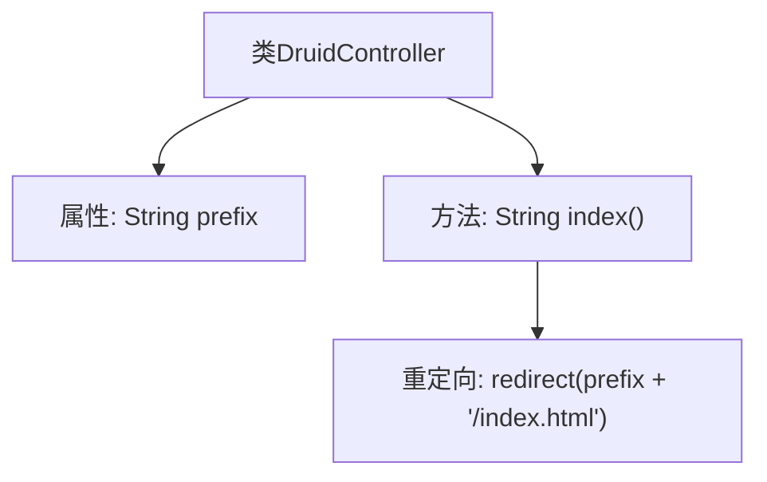

# 基础信息

|      |      |
|------|------|
| 名称 | DruidController |
| 编码语言 | .java |
| 代码路径 | RuoYi-main/ruoyi-admin/src/main/java/com/ruoyi/web/controller/monitor/DruidController.java |
| 包名 | com.ruoyi.web.controller.monitor |
| 依赖项 | ['org.apache.shiro.authz.annotation.RequiresPermissions', 'org.springframework.stereotype.Controller', 'org.springframework.web.bind.annotation.GetMapping', 'org.springframework.web.bind.annotation.RequestMapping', 'com.ruoyi.common.core.controller.BaseController'] |
| 概述说明 | DruidController继承BaseController，处理/druid请求，需monitor:data:view权限。 |

# 说明

DruidController继承自BaseController，专门负责处理/druid路径的请求。要访问该控制器中的功能，用户必须具备monitor:data:view权限。

# 类列表 Class Summary

| 名称   | 类型  | 说明 |
|-------|------|-------------|
| DruidController | class | DruidController继承BaseController，处理/druid路径请求，需monitor:data:view权限。 |


## 类 DruidController

|      |      |
|------|------|
| 访问范围 | @Controller;@RequestMapping("/monitor/data");public |
| 类型 | class |
| 名称 | DruidController |
| 说明 | DruidController继承BaseController，处理/druid路径请求，需monitor:data:view权限。 |


### UML类图

```mermaid
classDiagram
    class BaseController {
    }

    class DruidController {
        -String prefix
        +String index()
    }

    class <<Interface>> RequiresPermissions {
    }

    BaseController <|-- DruidController
    DruidController --> RequiresPermissions : 依赖
```

**描述：**
`DruidController` 是一个控制器类，继承自 `BaseController`，并依赖于 `RequiresPermissions` 接口。它包含一个私有成员 `prefix` 和一个公有方法 `index()`，该方法通过 `@RequiresPermissions` 注解进行权限控制，并返回重定向的 URL。


### 内部方法调用关系图



这段代码定义了一个名为 `DruidController` 的类，它继承自 `BaseController`。该类包含一个私有属性 `prefix`，用于存储路径前缀。`index` 方法通过 `@GetMapping` 注解映射到 `/monitor/data` 路径，并在调用时返回一个重定向的 URL，该 URL 由 `prefix` 和 `/index.html` 拼接而成。流程图展示了类的结构及其方法的调用关系。

### 字段列表 Field List

| 名称  | 类型  | 说明 |
|-------|-------|------|
| prefix = "/druid" | String | 私有字符串变量prefix被赋值为"/druid"。 |

### 方法列表 Method List

| 名称  | 类型  | 说明 |
|-------|-------|------|
| index | String | 权限要求“monitor:data:view”，GET请求重定向至指定页面。 |


