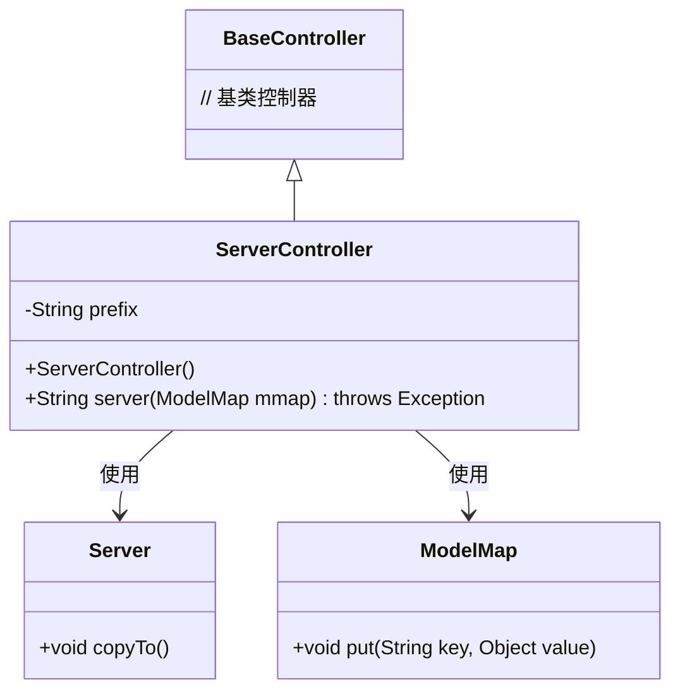
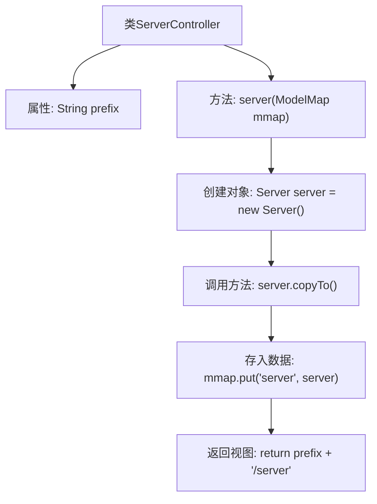

# 基础信息

|      |      |
|------|------|
| 名称 | ServerController |
| 编码语言 | .java |
| 代码路径 | RuoYi-main/ruoyi-admin/src/main/java/com/ruoyi/web/controller/monitor/ServerController.java |
| 包名 | com.ruoyi.web.controller.monitor |
| 依赖项 | ['org.apache.shiro.authz.annotation.RequiresPermissions', 'org.springframework.stereotype.Controller', 'org.springframework.ui.ModelMap', 'org.springframework.web.bind.annotation.GetMapping', 'org.springframework.web.bind.annotation.RequestMapping', 'com.ruoyi.common.core.controller.BaseController', 'com.ruoyi.framework.web.domain.Server'] |
| 概述说明 | 监控服务器控制器处理信息并返回视图路径。 |

# 说明

监控服务器控制器负责处理与服务器相关的信息，并根据处理结果返回相应的视图路径。该控制器的主要功能是接收服务器数据，进行必要的处理和分析，最终确定并返回用户界面或展示页面的路径，以便用户能够查看服务器状态或相关信息。这一过程确保了服务器数据的有效管理和展示，提升了系统的可监控性和用户体验。

# 类列表 Class Summary

| 名称   | 类型  | 说明 |
|-------|------|-------------|
| ServerController | class | 监控服务器控制器处理服务器信息并返回视图路径。 |

## 类 ServerController

|      |      |
|------|------|
| 访问范围 | @Controller;@RequestMapping("/monitor/server");public |
| 类型 | class |
| 名称 | ServerController |
| 说明 | 监控服务器控制器处理服务器信息并返回视图路径。 |

### UML类图

这段代码定义了一个名为 `ServerController` 的控制器类，它继承自 `BaseController`。`ServerController` 包含一个私有属性 `prefix` 和一个公有方法 `server`，该方法接收一个 `ModelMap` 对象作为参数，并返回一个字符串。在 `server` 方法中，创建了一个 `Server` 对象，并调用了其 `copyTo` 方法，然后将 `Server` 对象放入 `ModelMap` 中。`ServerController` 类依赖于 `Server` 和 `ModelMap` 类来完成其功能。

### 内部方法调用关系图

这段代码定义了一个名为 `ServerController` 的控制器类，用于处理与服务器监控相关的请求。类中包含一个属性 `prefix` 和一个方法 `server`。在 `server` 方法中，首先创建了一个 `Server` 对象，并调用了其 `copyTo` 方法，然后将该对象存入 `ModelMap` 中，最后返回一个视图路径。该控制器通过 `@GetMapping` 注解处理 `/monitor/server` 路径的 GET 请求，并需要相应的权限才能访问。

### 字段列表 Field List

| 名称  | 类型  | 说明 |
|-------|-------|------|
| prefix = "monitor/server" | String | 监控服务器路径前缀为"monitor/server"。 |

### 方法列表 Method List

| 名称  | 类型  | 说明 |
|-------|-------|------|
| server | String | 监控服务器视图方法，返回服务器信息页面。 |

