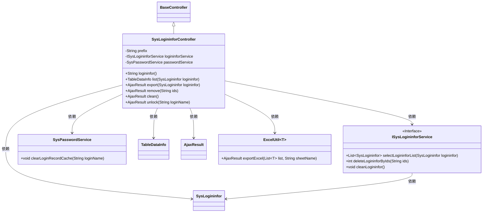

# 基础信息

|      |      |
|------|------|
| 名称 | SysLogininforController |
| 编码语言 | .java |
| 代码路径 | RuoYi-main/ruoyi-admin/src/main/java/com/ruoyi/web/controller/monitor/SysLogininforController.java |
| 包名 | com.ruoyi.web.controller.monitor |
| 依赖项 | ['java.util.List', 'com.ruoyi.framework.shiro.service.SysPasswordService', 'org.apache.shiro.authz.annotation.RequiresPermissions', 'org.springframework.beans.factory.annotation.Autowired', 'org.springframework.stereotype.Controller', 'org.springframework.web.bind.annotation.GetMapping', 'org.springframework.web.bind.annotation.PostMapping', 'org.springframework.web.bind.annotation.RequestMapping', 'org.springframework.web.bind.annotation.ResponseBody', 'com.ruoyi.common.annotation.Log', 'com.ruoyi.common.core.controller.BaseController', 'com.ruoyi.common.core.domain.AjaxResult', 'com.ruoyi.common.core.page.TableDataInfo', 'com.ruoyi.common.enums.BusinessType', 'com.ruoyi.common.utils.poi.ExcelUtil', 'com.ruoyi.system.domain.SysLogininfor', 'com.ruoyi.system.service.ISysLogininforService'] |
| 概述说明 | SysLogininforController类管理登录日志操作，含查看、列表、导出、删除、清理及解锁功能。 |

# 说明

SysLogininforController类负责管理与登录日志相关的操作，提供查看、列表展示、导出、删除、清理以及解锁账户等功能，全面处理用户登录信息的记录和管理。

# 类列表 Class Summary

| 名称   | 类型  | 说明 |
|-------|------|-------------|
| SysLogininforController | class | SysLogininforController类处理登录日志相关操作，包括查看、列表、导出、删除、清理和解锁账户功能。 |

## 类 SysLogininforController

|      |      |
|------|------|
| 访问范围 | @Controller;@RequestMapping("/monitor/logininfor");public |
| 类型 | class |
| 名称 | SysLogininforController |
| 说明 | SysLogininforController类处理登录日志相关操作，包括查看、列表、导出、删除、清理和解锁账户功能。 |

### UML类图

这段代码描述了一个Spring MVC控制器 `SysLogininforController`，它继承自 `BaseController`，并依赖于 `ISysLogininforService` 和 `SysPasswordService` 两个服务类。控制器提供了多个处理HTTP请求的方法，包括获取登录信息列表、导出登录日志、删除登录日志、清理登录日志以及解锁账户等功能。代码中还使用了权限控制、日志记录和Excel导出工具类 `ExcelUtil`。类图展示了这些类之间的关系和依赖。

### 内部方法调用关系图

```mermaid
graph TD
    A["类SysLogininforController"]
    B["属性: String prefix"]
    C["属性: ISysLogininforService logininforService"]
    D["属性: SysPasswordService passwordService"]
    E["方法: String logininfor()"]
    F["方法: TableDataInfo list(SysLogininfor logininfor)"]
    G["方法: AjaxResult export(SysLogininfor logininfor)"]
    H["方法: AjaxResult remove(String ids)"]
    I["方法: AjaxResult clean()"]
    J["方法: AjaxResult unlock(String loginName)"]
    K["调用: startPage()"]
    L["调用: logininforService.selectLogininforList(logininfor)"]
    M["调用: getDataTable(list)"]
    N["调用: new ExcelUtil<SysLogininfor>(SysLogininfor.class)"]
    O["调用: util.exportExcel(list, '登录日志')"]
    P["调用: logininforService.deleteLogininforByIds(ids)"]
    Q["调用: toAjax(result)"]
    R["调用: logininforService.cleanLogininfor()"]
    S["调用: success()"]
    T["调用: passwordService.clearLoginRecordCache(loginName)"]
    U["调用: success()"]

    A --> B
    A --> C
    A --> D
    A --> E
    A --> F
    A --> G
    A --> H
    A --> I
    A --> J
    F --> K
    F --> L
    F --> M
    G --> L
    G --> N
    G --> O
    H --> P
    H --> Q
    I --> R
    I --> S
    J --> T
    J --> U
```

这段代码是一个Spring MVC控制器类`SysLogininforController`，用于处理与登录日志相关的请求。它包含多个方法，分别用于展示登录日志页面、获取登录日志列表、导出登录日志、删除登录日志、清空登录日志以及解锁账户。每个方法都通过`@PostMapping`或`@GetMapping`注解映射到特定的URL路径，并通过`@ResponseBody`注解返回JSON格式的响应。代码中还使用了`@RequiresPermissions`注解来确保只有具有相应权限的用户才能访问这些方法。

### 字段列表 Field List

| 名称  | 类型  | 说明 |
|-------|-------|------|
| logininforService | ISysLogininforService | 自动注入登录信息服务接口实例。 |
| passwordService | SysPasswordService | 自动注入SysPasswordService实例。 |
| prefix = "monitor/logininfor" | String | 变量prefix初始化为"monitor/logininfor"。 |

### 方法列表 Method List

| 名称  | 类型  | 说明 |
|-------|-------|------|
| list | TableDataInfo | 监控登录信息列表接口，分页查询并返回数据。 |
| logininfor | String | 需要权限监控登录信息，返回登录信息页面。 |
| export | AjaxResult | 导出登录日志数据为Excel文件。 |
| unlock | AjaxResult | 账户解锁功能，清除登录记录缓存，返回成功结果。 |
| remove | AjaxResult | 需要权限删除登录日志，调用服务删除指定ID的日志并返回结果。 |
| clean | AjaxResult | 删除登录日志需权限，调用服务清理并返回成功。 |

