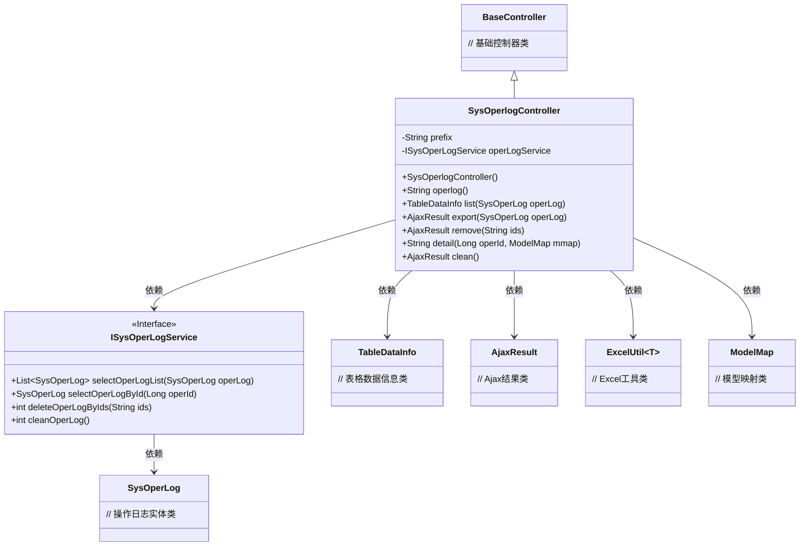

# 基础信息

|      |      |
|------|------|
| 名称 | SysOperlogController |
| 编码语言 | .java |
| 代码路径 | RuoYi-main/ruoyi-admin/src/main/java/com/ruoyi/web/controller/monitor/SysOperlogController.java |
| 包名 | com.ruoyi.web.controller.monitor |
| 依赖项 | ['java.util.List', 'org.apache.shiro.authz.annotation.RequiresPermissions', 'org.springframework.beans.factory.annotation.Autowired', 'org.springframework.stereotype.Controller', 'org.springframework.ui.ModelMap', 'org.springframework.web.bind.annotation.GetMapping', 'org.springframework.web.bind.annotation.PathVariable', 'org.springframework.web.bind.annotation.PostMapping', 'org.springframework.web.bind.annotation.RequestMapping', 'org.springframework.web.bind.annotation.ResponseBody', 'com.ruoyi.common.annotation.Log', 'com.ruoyi.common.core.controller.BaseController', 'com.ruoyi.common.core.domain.AjaxResult', 'com.ruoyi.common.core.page.TableDataInfo', 'com.ruoyi.common.enums.BusinessType', 'com.ruoyi.common.utils.poi.ExcelUtil', 'com.ruoyi.system.domain.SysOperLog', 'com.ruoyi.system.service.ISysOperLogService'] |
| 概述说明 | SysOperlogController负责操作日志的查看、列表、导出、删除、详情和清理功能。 |

# 说明

SysOperlogController是一个负责处理系统操作日志的控制器，提供了查看、列表、导出、删除、详情和清理等功能。通过这些功能，用户可以方便地管理和维护系统操作日志，确保日志数据的完整性和可追溯性。具体功能包括查看单个日志的详细信息，列出所有日志记录，将日志数据导出为文件，删除不需要的日志条目，以及清理过时或冗余的日志数据，以优化系统性能和存储空间。

# 类列表 Class Summary

| 名称   | 类型  | 说明 |
|-------|------|-------------|
| SysOperlogController | class | SysOperlogController处理操作日志的查看、列表、导出、删除、详情和清理功能。 |

## 类 SysOperlogController

|      |      |
|------|------|
| 访问范围 | @Controller;@RequestMapping("/monitor/operlog");public |
| 类型 | class |
| 名称 | SysOperlogController |
| 说明 | SysOperlogController处理操作日志的查看、列表、导出、删除、详情和清理功能。 |

### UML类图

### 描述
`SysOperlogController` 是一个基于 Spring MVC 的控制器类，继承自 `BaseController`，用于处理操作日志的相关请求。它依赖于 `ISysOperLogService` 接口来执行具体的业务逻辑，如查询、删除、导出和清理操作日志。控制器中的方法通过注解（如 `@GetMapping`、`@PostMapping`）映射到不同的 HTTP 请求，并返回相应的视图或数据。`TableDataInfo` 和 `AjaxResult` 分别用于封装表格数据和 Ajax 响应结果，而 `ExcelUtil` 则用于导出 Excel 文件。

### 内部方法调用关系图

```mermaid
graph TD
    A["类SysOperlogController"]
    B["属性: String prefix"]
    C["属性: ISysOperLogService operLogService"]
    D["方法: operlog()"]
    E["方法: list(SysOperLog operLog)"]
    F["方法: export(SysOperLog operLog)"]
    G["方法: remove(String ids)"]
    H["方法: detail(Long operId, ModelMap mmap)"]
    I["方法: clean()"]

    A --> B
    A --> C
    A --> D
    A --> E
    A --> F
    A --> G
    A --> H
    A --> I

    D --> D1["返回: prefix + '/operlog'"]
    E --> E1["调用: startPage()"]
    E --> E2["调用: operLogService.selectOperLogList(operLog)"]
    E --> E3["返回: getDataTable(list)"]
    F --> F1["调用: operLogService.selectOperLogList(operLog)"]
    F --> F2["创建: ExcelUtil<SysOperLog> util"]
    F --> F3["返回: util.exportExcel(list, '操作日志')"]
    G --> G1["调用: operLogService.deleteOperLogByIds(ids)"]
    G --> G2["返回: toAjax(result)"]
    H --> H1["调用: operLogService.selectOperLogById(operId)"]
    H --> H2["返回: prefix + '/detail'"]
    I --> I1["调用: operLogService.cleanOperLog()"]
    I --> I2["返回: success()"]
```

该流程图展示了`SysOperlogController`类的结构及其方法调用关系。类中包含多个方法，分别用于处理操作日志的查看、列表、导出、删除、详情和清理操作。每个方法内部调用了相应的服务层方法，并返回处理结果。流程图清晰地展示了每个方法的执行步骤及其依赖关系。

### 字段列表 Field List

| 名称  | 类型  | 说明 |
|-------|-------|------|
| prefix = "monitor/operlog" | String | 私有字符串变量prefix赋值为"monitor/operlog"。 |
| operLogService | ISysOperLogService | 自动注入操作日志服务实例。 |

### 方法列表 Method List

| 名称  | 类型  | 说明 |
|-------|-------|------|
| remove | AjaxResult | 删除操作日志，需权限并返回结果。 |
| export | AjaxResult | 导出操作日志数据为Excel文件。 |
| operlog | String | 需要权限“monitor:operlog:view”，返回操作日志页面路径。 |
| list | TableDataInfo | 监控操作日志列表接口，分页查询并返回数据。 |
| clean | AjaxResult | 清理操作日志的接口，需监控权限，调用服务后返回成功。 |
| detail | String | 监控操作日志详情接口，根据ID查询并返回日志信息。 |

