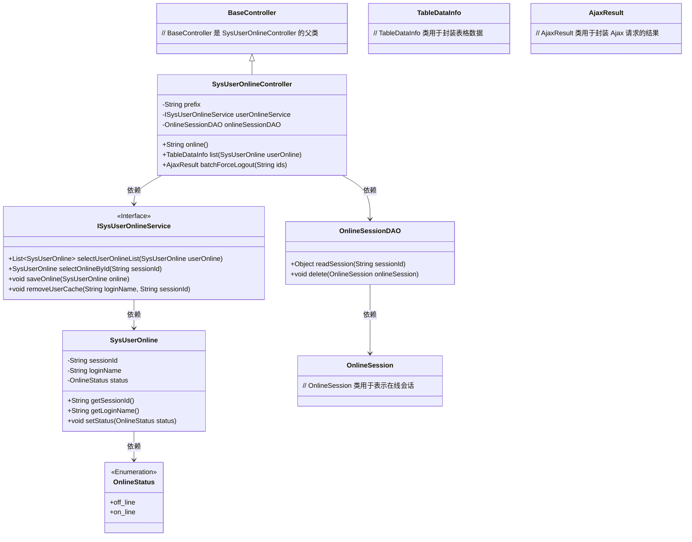

# 基础信息

|      |      |
|------|------|
| 名称 | SysUserOnlineController |
| 编码语言 | .java |
| 代码路径 | RuoYi-main/ruoyi-admin/src/main/java/com/ruoyi/web/controller/monitor/SysUserOnlineController.java |
| 包名 | com.ruoyi.web.controller.monitor |
| 依赖项 | ['java.util.List', 'org.apache.shiro.authz.annotation.Logical', 'org.apache.shiro.authz.annotation.RequiresPermissions', 'org.springframework.beans.factory.annotation.Autowired', 'org.springframework.stereotype.Controller', 'org.springframework.web.bind.annotation.GetMapping', 'org.springframework.web.bind.annotation.PostMapping', 'org.springframework.web.bind.annotation.RequestMapping', 'org.springframework.web.bind.annotation.ResponseBody', 'com.ruoyi.common.annotation.Log', 'com.ruoyi.common.core.controller.BaseController', 'com.ruoyi.common.core.domain.AjaxResult', 'com.ruoyi.common.core.page.TableDataInfo', 'com.ruoyi.common.core.text.Convert', 'com.ruoyi.common.enums.BusinessType', 'com.ruoyi.common.enums.OnlineStatus', 'com.ruoyi.common.utils.ShiroUtils', 'com.ruoyi.framework.shiro.session.OnlineSession', 'com.ruoyi.framework.shiro.session.OnlineSessionDAO', 'com.ruoyi.system.domain.SysUserOnline', 'com.ruoyi.system.service.ISysUserOnlineService'] |
| 概述说明 | 监控用户控制器，支持查看、列表及批量强制下线功能。 |

# 说明

该控制器专门用于监控在线用户，具备查看当前在线用户信息的功能，支持生成在线用户列表，并提供批量强制下线操作，确保管理员能够有效管理用户会话状态，维护系统安全和资源合理分配。

# 类列表 Class Summary

| 名称   | 类型  | 说明 |
|-------|------|-------------|
| SysUserOnlineController | class | 监控在线用户的控制器，提供查看、列表和批量强制下线功能。 |

## 类 SysUserOnlineController

|      |      |
|------|------|
| 访问范围 | @Controller;@RequestMapping("/monitor/online");public |
| 类型 | class |
| 名称 | SysUserOnlineController |
| 说明 | 监控在线用户的控制器，提供查看、列表和批量强制下线功能。 |

### UML类图

**描述：**  
`SysUserOnlineController` 是一个 Spring MVC 控制器，继承自 `BaseController`，负责处理与在线用户监控相关的请求。它依赖于 `ISysUserOnlineService` 和 `OnlineSessionDAO` 两个服务接口，分别用于管理在线用户数据和会话信息。控制器提供了三个主要方法：`online()` 用于返回监控页面，`list()` 用于获取在线用户列表，`batchForceLogout()` 用于批量强制用户下线。`SysUserOnline` 类表示在线用户的信息，`OnlineSession` 类表示用户的在线会话，`OnlineStatus` 是一个枚举类，表示用户的在线状态。

### 内部方法调用关系图

```mermaid
graph TD
    A["类SysUserOnlineController"]
    B["属性: String prefix"]
    C["属性: ISysUserOnlineService userOnlineService"]
    D["属性: OnlineSessionDAO onlineSessionDAO"]
    E["方法: String online()"]
    F["方法: TableDataInfo list(SysUserOnline userOnline)"]
    G["方法: AjaxResult batchForceLogout(String ids)"]
    H["startPage()"]
    I["userOnlineService.selectUserOnlineList(userOnline)"]
    J["getDataTable(list)"]
    K["Convert.toStrArray(ids)"]
    L["userOnlineService.selectOnlineById(sessionId)"]
    M["onlineSessionDAO.readSession(online.getSessionId())"]
    N["ShiroUtils.getSessionId()"]
    O["onlineSessionDAO.delete(onlineSession)"]
    P["online.setStatus(OnlineStatus.off_line)"]
    Q["userOnlineService.saveOnline(online)"]
    R["userOnlineService.removeUserCache(online.getLoginName(), sessionId)"]
    S["error('用户已下线')"]
    T["error('当前登录用户无法强退')"]
    U["success()"]

    A --> B
    A --> C
    A --> D
    A --> E
    A --> F
    A --> G
    F --> H
    F --> I
    F --> J
    G --> K
    G --> L
    G --> M
    G --> N
    G --> O
    G --> P
    G --> Q
    G --> R
    G --> S
    G --> T
    G --> U
```

这段代码是一个Spring MVC控制器类，用于管理在线用户。它包含三个主要方法：`online()`用于返回在线用户监控页面，`list()`用于获取在线用户列表，`batchForceLogout()`用于批量强制下线用户。`batchForceLogout()`方法会遍历传入的会话ID，检查用户是否在线，如果是当前登录用户则无法强制下线，否则删除会话并更新用户状态。代码通过`userOnlineService`和`onlineSessionDAO`与数据库和会话管理进行交互。

### 字段列表 Field List

| 名称  | 类型  | 说明 |
|-------|-------|------|
| onlineSessionDAO | OnlineSessionDAO | 自动注入在线会话数据访问对象。 |
| userOnlineService | ISysUserOnlineService | 自动注入用户在线服务实例。 |
| prefix = "monitor/online" | String | 变量prefix被赋值为"monitor/online"。 |

### 方法列表 Method List

| 名称  | 类型  | 说明 |
|-------|-------|------|
| batchForceLogout | AjaxResult | 批量强制下线在线用户，检查用户状态并更新数据库。 |
| online | String | 该代码使用权限注解并定义GET请求方法，返回指定页面路径。 |
| list | TableDataInfo | 权限控制方法，分页查询在线用户列表并返回数据。 |

