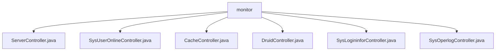

# 基础信息

|      |      |
|------|------|
| 名称 | monitor |
| 编码语言 | .java |
| 代码路径 | RuoYi-main/ruoyi-admin/src/main/java/com/ruoyi/web/controller/monitor |
| 包名 | RuoYi-main.ruoyi-admin.src.main.java.com.ruoyi.web.controller.monitor |
| 概述说明 | 监控服务器控制器处理服务器数据，返回视图路径。在线用户控制器管理用户会话。缓存控制器监控和清理缓存。Druid控制器处理特定路径请求。登录日志控制器管理登录信息。操作日志控制器管理系统操作日志。 |

# 说明

## 概述
该代码模块是一个监控管理模块，主要用于监控和管理系统的各种状态和日志信息。模块包含多个控制器，分别负责处理服务器监控、在线用户管理、缓存监控、Druid数据源监控、登录日志管理以及系统操作日志管理。通过这些控制器，系统能够有效地监控和管理服务器状态、用户会话、缓存数据、数据源状态以及各类日志信息，确保系统的稳定性、安全性和性能。

## 主要业务场景
1. **服务器监控**：通过`ServerController`，系统能够接收和处理服务器数据，生成相应的视图路径，以便用户查看服务器状态和相关信息。
2. **在线用户管理**：`SysUserOnlineController`提供了查看当前在线用户信息的功能，支持生成在线用户列表，并提供批量强制下线操作，确保管理员能够有效管理用户会话状态。
3. **缓存监控**：`CacheController`负责监控缓存状态，提供获取缓存名称、键、值以及清理缓存的功能，确保缓存数据的有效性和一致性。
4. **Druid数据源监控**：`DruidController`处理与Druid数据源相关的请求，确保只有具备`monitor:data:view`权限的用户可以访问相关功能。
5. **登录日志管理**：`SysLogininforController`负责管理与登录日志相关的操作，包括查看、列表展示、导出、删除、清理以及解锁账户等功能，全面处理用户登录信息的记录和管理。
6. **系统操作日志管理**：`SysOperlogController`提供查看、列表、导出、删除、详情和清理等功能，方便用户管理和维护系统操作日志，确保日志数据的完整性和可追溯性。

通过这些功能，该模块为系统管理员提供了全面的监控和管理工具，帮助维护系统的稳定性、安全性和性能。

### 包内部结构视图

该流程图展示了`monitor`目录下的文件结构。`monitor`作为根节点，包含了六个控制器文件：`ServerController.java`、`SysUserOnlineController.java`、`CacheController.java`、`DruidController.java`、`SysLogininforController.java`和`SysOperlogController.java`。这些文件均位于同一层级，反映了项目中对监控功能的详细划分。

# 文件列表 File List

| 名称   | 类型  | 说明 |
|-------|------|-------------|
| [SysLogininforController.java](SysLogininforController.md) | file | SysLogininforController类管理登录日志操作，含查看、列表、导出、删除、清理及解锁功能。 |
| [DruidController.java](DruidController.md) | file | DruidController继承BaseController，处理/druid请求，需monitor:data:view权限。 |
| [ServerController.java](ServerController.md) | file | 监控服务器控制器处理信息并返回视图路径。 |
| [CacheController.java](CacheController.md) | file | CacheController负责缓存监控，支持获取缓存名、键、值及清理缓存。 |
| [SysUserOnlineController.java](SysUserOnlineController.md) | file | 监控用户控制器，支持查看、列表及批量强制下线功能。 |
| [SysOperlogController.java](SysOperlogController.md) | file | SysOperlogController负责操作日志的查看、列表、导出、删除、详情和清理功能。 |

