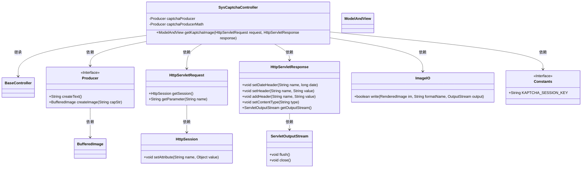
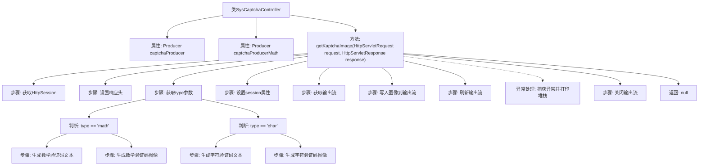

# 基础信息

|      |      |
|------|------|
| 名称 | SysCaptchaController |
| 编码语言 | .java |
| 代码路径 | RuoYi-main/ruoyi-admin/src/main/java/com/ruoyi/web/controller/system/SysCaptchaController.java |
| 包名 | com.ruoyi.web.controller.system |
| 依赖项 | ['java.awt.image.BufferedImage', 'java.io.IOException', 'javax.annotation.Resource', 'javax.imageio.ImageIO', 'javax.servlet.ServletOutputStream', 'javax.servlet.http.HttpServletRequest', 'javax.servlet.http.HttpServletResponse', 'javax.servlet.http.HttpSession', 'org.springframework.stereotype.Controller', 'org.springframework.web.bind.annotation.GetMapping', 'org.springframework.web.bind.annotation.RequestMapping', 'org.springframework.web.servlet.ModelAndView', 'com.google.code.kaptcha.Constants', 'com.google.code.kaptcha.Producer', 'com.ruoyi.common.core.controller.BaseController'] |
| 概述说明 | 控制器生成数学或字符验证码，并设置会话属性。 |

# 说明

控制器生成验证码，支持数学和字符两种类型，并将生成的验证码设置为会话属性，以便后续验证使用。

# 类列表 Class Summary

| 名称   | 类型  | 说明 |
|-------|------|-------------|
| SysCaptchaController | class | 控制器生成验证码，支持数学和字符类型，并设置会话属性。 |

## 类 SysCaptchaController

|      |      |
|------|------|
| 访问范围 | @Controller;@RequestMapping("/captcha");public |
| 类型 | class |
| 名称 | SysCaptchaController |
| 说明 | 控制器生成验证码，支持数学和字符类型，并设置会话属性。 |

### UML类图

### 描述
`SysCaptchaController` 是一个继承自 `BaseController` 的控制器类，负责生成验证码图像。它依赖于 `Producer` 接口来生成验证码文本和图像，并通过 `HttpServletRequest` 和 `HttpServletResponse` 处理HTTP请求和响应。验证码图像通过 `ImageIO` 写入输出流，最终返回 `ModelAndView`。该控制器还使用了 `Constants` 接口中的常量来存储会话属性。

### 内部方法调用关系图

这段代码是一个Spring MVC控制器，用于生成验证码图像。根据请求参数的不同，它可以生成数学验证码或字符验证码。代码首先设置响应头以防止缓存，然后根据请求参数生成相应的验证码文本和图像，并将验证码存储在session中。最后，将生成的图像写入响应输出流并返回null。异常处理和资源清理也在代码中得到妥善处理。

### 字段列表 Field List

| 名称  | 类型  | 说明 |
|-------|-------|------|
| captchaProducer | Producer | captchaProducer资源注入私有Producer实例。 |
| captchaProducerMath | Producer | 使用Math验证码生成器实例。 |

### 方法列表 Method List

| 名称  | 类型  | 说明 |
|-------|-------|------|
| getKaptchaImage | ModelAndView | 该方法生成验证码图像，根据类型返回数学或字符验证码，并设置响应头防止缓存。 |

