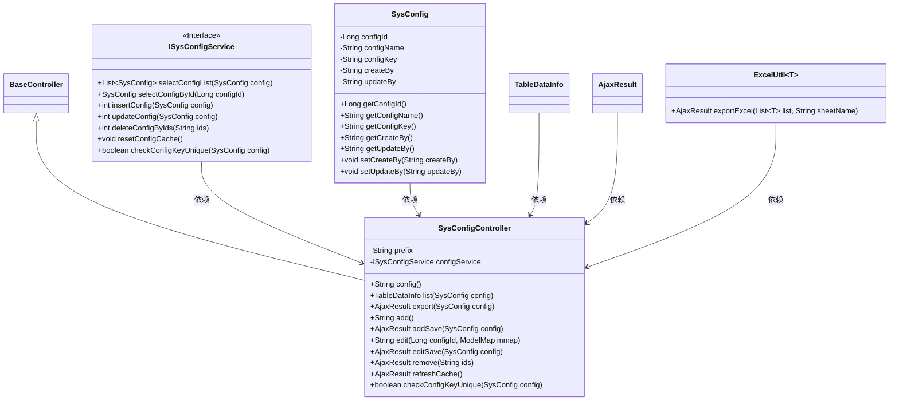

# 基础信息

|      |      |
|------|------|
| 名称 | SysConfigController |
| 编码语言 | .java |
| 代码路径 | RuoYi-main/ruoyi-admin/src/main/java/com/ruoyi/web/controller/system/SysConfigController.java |
| 包名 | com.ruoyi.web.controller.system |
| 依赖项 | ['java.util.List', 'org.apache.shiro.authz.annotation.RequiresPermissions', 'org.springframework.beans.factory.annotation.Autowired', 'org.springframework.stereotype.Controller', 'org.springframework.ui.ModelMap', 'org.springframework.validation.annotation.Validated', 'org.springframework.web.bind.annotation.GetMapping', 'org.springframework.web.bind.annotation.PathVariable', 'org.springframework.web.bind.annotation.PostMapping', 'org.springframework.web.bind.annotation.RequestMapping', 'org.springframework.web.bind.annotation.ResponseBody', 'com.ruoyi.common.annotation.Log', 'com.ruoyi.common.core.controller.BaseController', 'com.ruoyi.common.core.domain.AjaxResult', 'com.ruoyi.common.core.page.TableDataInfo', 'com.ruoyi.common.enums.BusinessType', 'com.ruoyi.common.utils.poi.ExcelUtil', 'com.ruoyi.system.domain.SysConfig', 'com.ruoyi.system.service.ISysConfigService'] |
| 概述说明 | 系统配置控制器支持参数管理、导出、缓存刷新及键名校验。 |

# 说明

系统配置控制器具备多项核心功能，包括参数的增删改查操作，支持参数导出，提供缓存刷新机制，并包含键名校验功能，确保系统配置的高效管理和数据一致性。

# 类列表 Class Summary

| 名称   | 类型  | 说明 |
|-------|------|-------------|
| SysConfigController | class | 系统配置控制器，提供参数增删改查、导出、缓存刷新及键名校验功能。 |

## 类 SysConfigController

|      |      |
|------|------|
| 访问范围 | @Controller;@RequestMapping("/system/config");public |
| 类型 | class |
| 名称 | SysConfigController |
| 说明 | 系统配置控制器，提供参数增删改查、导出、缓存刷新及键名校验功能。 |

### UML类图

该代码是一个基于Spring MVC的控制器类，用于管理系统配置。`SysConfigController`继承自`BaseController`，并依赖于`ISysConfigService`接口来处理业务逻辑。控制器提供了多种HTTP请求处理方法，如查询配置列表、导出数据、新增、修改、删除配置等。`SysConfig`类用于表示配置项，`TableDataInfo`和`AjaxResult`用于封装返回数据，`ExcelUtil`用于导出Excel文件。

### 内部方法调用关系图

```mermaid
graph TD
    A["类SysConfigController"]
    B["属性: String prefix"]
    C["属性: ISysConfigService configService"]
    D["方法: config()"]
    E["方法: list(SysConfig config)"]
    F["方法: export(SysConfig config)"]
    G["方法: add()"]
    H["方法: addSave(SysConfig config)"]
    I["方法: edit(Long configId, ModelMap mmap)"]
    J["方法: editSave(SysConfig config)"]
    K["方法: remove(String ids)"]
    L["方法: refreshCache()"]
    M["方法: checkConfigKeyUnique(SysConfig config)"]

    A --> B
    A --> C
    A --> D
    A --> E
    A --> F
    A --> G
    A --> H
    A --> I
    A --> J
    A --> K
    A --> L
    A --> M

    D --> D1["返回: prefix + '/config'"]
    E --> E1["调用: startPage()"]
    E1 --> E2["调用: configService.selectConfigList(config)"]
    E2 --> E3["返回: getDataTable(list)"]
    F --> F1["调用: configService.selectConfigList(config)"]
    F1 --> F2["创建: ExcelUtil<SysConfig> util"]
    F2 --> F3["返回: util.exportExcel(list, '参数数据')"]
    G --> G1["返回: prefix + '/add'"]
    H --> H1["调用: configService.checkConfigKeyUnique(config)"]
    H1 --> H2["返回: error('新增参数' + config.getConfigName() + '失败，参数键名已存在')"]
    H1 --> H3["调用: config.setCreateBy(getLoginName())"]
    H3 --> H4["返回: toAjax(configService.insertConfig(config))"]
    I --> I1["调用: configService.selectConfigById(configId)"]
    I1 --> I2["返回: prefix + '/edit'"]
    J --> J1["调用: configService.checkConfigKeyUnique(config)"]
    J1 --> J2["返回: error('修改参数' + config.getConfigName() + '失败，参数键名已存在')"]
    J1 --> J3["调用: config.setUpdateBy(getLoginName())"]
    J3 --> J4["返回: toAjax(configService.updateConfig(config))"]
    K --> K1["调用: configService.deleteConfigByIds(ids)"]
    K1 --> K2["返回: success()"]
    L --> L1["调用: configService.resetConfigCache()"]
    L1 --> L2["返回: success()"]
    M --> M1["返回: configService.checkConfigKeyUnique(config)"]
```

该流程图展示了`SysConfigController`类的结构及其方法调用关系。`SysConfigController`是一个Spring MVC控制器，负责处理与系统配置相关的请求。它包含多个方法，分别用于配置页面展示、查询配置列表、导出配置数据、新增、修改、删除配置、刷新缓存以及校验配置键名的唯一性。每个方法通过调用`configService`中的服务方法来完成具体业务逻辑，并返回相应的结果。

### 字段列表 Field List

| 名称  | 类型  | 说明 |
|-------|-------|------|
| configService | ISysConfigService | 自动注入系统配置服务实例。 |
| prefix = "system/config" | String | 私有字符串变量prefix赋值为"system/config"。 |

### 方法列表 Method List

| 名称  | 类型  | 说明 |
|-------|-------|------|
| export | AjaxResult | 导出系统参数数据至Excel文件。 |
| config | String | 需要权限查看系统配置，返回配置页面路径。 |
| checkConfigKeyUnique | boolean | 检查配置键唯一性的API接口。 |
| editSave | AjaxResult | 系统配置编辑接口，检查参数键名唯一性后更新配置。 |
| list | TableDataInfo | 系统配置列表接口，需权限，分页查询并返回数据。 |
| remove | AjaxResult | 删除系统参数，需权限验证，记录日志，返回操作结果。 |
| edit | String | 系统配置编辑接口，通过配置ID获取配置信息并返回编辑页面。 |
| add | String | 需要权限"system:config:add"，处理GET请求"/add"，返回路径前缀加"/add"。 |
| refreshCache | AjaxResult | 系统配置缓存刷新接口，需权限，记录日志，调用服务重置缓存。 |
| addSave | AjaxResult | 新增系统参数，检查键名唯一性，成功后保存并返回结果。 |

