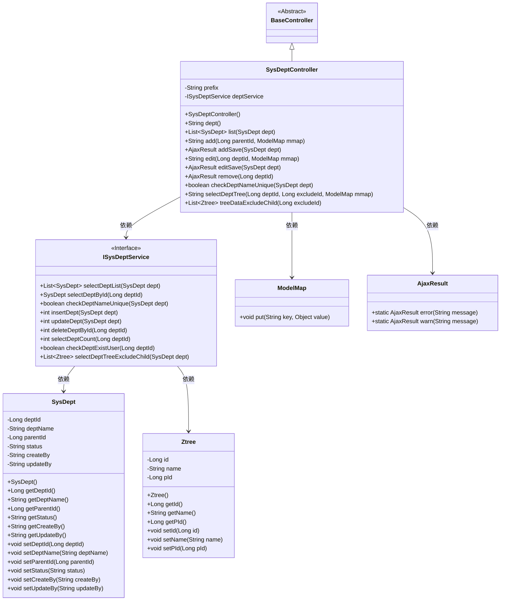

# 基础信息

|      |      |
|------|------|
| 名称 | SysDeptController |
| 编码语言 | .java |
| 代码路径 | RuoYi-main/ruoyi-admin/src/main/java/com/ruoyi/web/controller/system/SysDeptController.java |
| 包名 | com.ruoyi.web.controller.system |
| 依赖项 | ['java.util.List', 'org.apache.shiro.authz.annotation.RequiresPermissions', 'org.springframework.beans.factory.annotation.Autowired', 'org.springframework.stereotype.Controller', 'org.springframework.ui.ModelMap', 'org.springframework.validation.annotation.Validated', 'org.springframework.web.bind.annotation.GetMapping', 'org.springframework.web.bind.annotation.PathVariable', 'org.springframework.web.bind.annotation.PostMapping', 'org.springframework.web.bind.annotation.RequestMapping', 'org.springframework.web.bind.annotation.ResponseBody', 'com.ruoyi.common.annotation.Log', 'com.ruoyi.common.constant.UserConstants', 'com.ruoyi.common.core.controller.BaseController', 'com.ruoyi.common.core.domain.AjaxResult', 'com.ruoyi.common.core.domain.Ztree', 'com.ruoyi.common.core.domain.entity.SysDept', 'com.ruoyi.common.enums.BusinessType', 'com.ruoyi.common.utils.StringUtils', 'com.ruoyi.system.service.ISysDeptService'] |
| 概述说明 | 系统部门控制器实现部门管理功能，支持增删改查、校验、权限和数据范围检查。 |

# 说明

系统部门控制器是一个功能全面的模块，主要用于管理部门的增删改查操作，并具备校验功能以确保数据的准确性和完整性。该控制器支持权限控制，确保不同用户只能访问和操作其权限范围内的数据。同时，它还提供了数据范围检查功能，进一步保障数据的安全性和合规性。通过这些功能，系统部门控制器能够高效地管理部门信息，满足企业或组织的管理需求。

# 类列表 Class Summary

| 名称   | 类型  | 说明 |
|-------|------|-------------|
| SysDeptController | class | 系统部门控制器，提供部门增删改查及校验功能，支持权限控制和数据范围检查。 |

## 类 SysDeptController

|      |      |
|------|------|
| 访问范围 | @Controller;@RequestMapping("/system/dept");public |
| 类型 | class |
| 名称 | SysDeptController |
| 说明 | 系统部门控制器，提供部门增删改查及校验功能，支持权限控制和数据范围检查。 |

### UML类图

### 描述
`SysDeptController` 是一个基于Spring MVC的控制器类，继承自 `BaseController`，负责处理与部门相关的HTTP请求。它依赖于 `ISysDeptService` 接口来执行具体的业务逻辑，如部门的新增、修改、删除等操作。控制器通过 `ModelMap` 传递数据到视图层，并使用 `AjaxResult` 返回操作结果。`SysDept` 和 `Ztree` 是数据模型类，分别表示部门和部门树结构。

### 内部方法调用关系图

```mermaid
graph TD
    A["类SysDeptController"]
    B["属性: String prefix"]
    C["属性: ISysDeptService deptService"]
    D["方法: String dept()"]
    E["方法: List<SysDept> list(SysDept dept)"]
    F["方法: String add(Long parentId, ModelMap mmap)"]
    G["方法: AjaxResult addSave(SysDept dept)"]
    H["方法: String edit(Long deptId, ModelMap mmap)"]
    I["方法: AjaxResult editSave(SysDept dept)"]
    J["方法: AjaxResult remove(Long deptId)"]
    K["方法: boolean checkDeptNameUnique(SysDept dept)"]
    L["方法: String selectDeptTree(Long deptId, Long excludeId, ModelMap mmap)"]
    M["方法: List<Ztree> treeDataExcludeChild(Long excludeId)"]

    A --> B
    A --> C
    A --> D
    A --> E
    A --> F
    A --> G
    A --> H
    A --> I
    A --> J
    A --> K
    A --> L
    A --> M
```

这段代码是一个Spring MVC控制器类，用于处理部门管理的相关请求。它包含多个方法，分别用于展示部门列表、新增部门、修改部门、删除部门、校验部门名称、选择部门树以及加载部门列表树。每个方法都通过不同的HTTP请求类型（如GET、POST）和路径映射来处理特定的业务逻辑。代码中使用了权限控制、日志记录和数据校验等功能，确保系统的安全性和数据的完整性。

### 字段列表 Field List

| 名称  | 类型  | 说明 |
|-------|-------|------|
| deptService | ISysDeptService | 自动注入部门服务接口实例。 |
| prefix = "system/dept" | String | 私有字符串变量prefix赋值为"system/dept"。 |

### 方法列表 Method List

| 名称  | 类型  | 说明 |
|-------|-------|------|
| checkDeptNameUnique | boolean | 通过POST请求检查部门名称是否唯一。 |
| treeDataExcludeChild | List<Ztree> | 获取部门树数据，排除指定ID的子节点。 |
| dept | String | 该方法需要系统部门查看权限，返回部门页面路径。 |
| remove | AjaxResult | 删除部门前检查下级部门和用户，确认无数据后执行删除操作。 |
| selectDeptTree | String | 获取部门树信息，支持排除指定部门ID。 |
| list | List<SysDept> | 需要权限查询部门列表，返回部门数据。 |
| addSave | AjaxResult | 新增部门接口，检查名称唯一性，成功后插入部门数据。 |
| edit | String | 需要权限，根据部门ID编辑部门信息，检查数据范围，设置父部门名称。 |
| editSave | AjaxResult | 更新部门信息，检查数据权限、名称唯一性及上级部门合法性，处理子部门状态后保存。 |
| add | String | 管理员权限下，根据父部门ID添加部门并返回视图。 |

