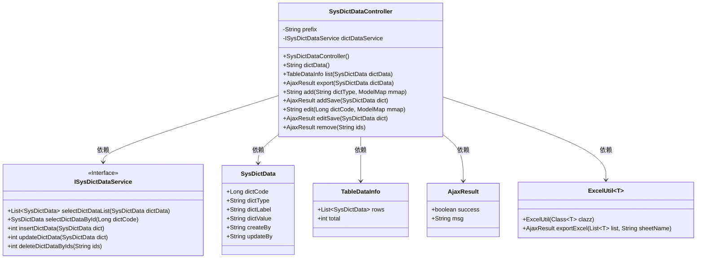
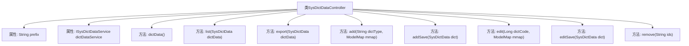

# 基础信息

|      |      |
|------|------|
| 名称 | SysDictDataController |
| 编码语言 | .java |
| 代码路径 | RuoYi-main/ruoyi-admin/src/main/java/com/ruoyi/web/controller/system/SysDictDataController.java |
| 包名 | com.ruoyi.web.controller.system |
| 依赖项 | ['java.util.List', 'org.apache.shiro.authz.annotation.RequiresPermissions', 'org.springframework.beans.factory.annotation.Autowired', 'org.springframework.stereotype.Controller', 'org.springframework.ui.ModelMap', 'org.springframework.validation.annotation.Validated', 'org.springframework.web.bind.annotation.GetMapping', 'org.springframework.web.bind.annotation.PathVariable', 'org.springframework.web.bind.annotation.PostMapping', 'org.springframework.web.bind.annotation.RequestMapping', 'org.springframework.web.bind.annotation.ResponseBody', 'com.ruoyi.common.annotation.Log', 'com.ruoyi.common.core.controller.BaseController', 'com.ruoyi.common.core.domain.AjaxResult', 'com.ruoyi.common.core.domain.entity.SysDictData', 'com.ruoyi.common.core.page.TableDataInfo', 'com.ruoyi.common.enums.BusinessType', 'com.ruoyi.common.utils.poi.ExcelUtil', 'com.ruoyi.system.service.ISysDictDataService'] |
| 概述说明 | SysDictDataController负责字典数据的查询、导出、新增、修改和删除操作。 |

# 说明

SysDictDataController是一个用于处理字典数据的控制器，主要负责执行与字典数据相关的多种操作。这些操作包括查询字典数据，以便获取所需的信息；导出字典数据，以便进行数据备份或迁移；新增字典数据，以便扩展字典内容；修改现有字典数据，以确保数据的准确性和及时更新；以及删除不再需要的字典数据，以维护数据的整洁和高效管理。通过这些功能，SysDictDataController能够全面管理字典数据，支持系统的正常运行和数据的有效维护。

# 类列表 Class Summary

| 名称   | 类型  | 说明 |
|-------|------|-------------|
| SysDictDataController | class | SysDictDataController处理字典数据操作，包括查询、导出、新增、修改和删除。 |

## 类 SysDictDataController

|      |      |
|------|------|
| 访问范围 | @Controller;@RequestMapping("/system/dict/data");public |
| 类型 | class |
| 名称 | SysDictDataController |
| 说明 | SysDictDataController处理字典数据操作，包括查询、导出、新增、修改和删除。 |

### UML类图

这段代码定义了一个名为 `SysDictDataController` 的控制器类，用于处理与字典数据相关的HTTP请求。控制器依赖于 `ISysDictDataService` 接口来执行字典数据的增删改查操作，并返回相应的视图或数据。`SysDictData` 类表示字典数据的实体，`TableDataInfo` 和 `AjaxResult` 类用于封装返回的数据和结果。`ExcelUtil` 类用于导出字典数据到Excel文件。控制器通过不同的HTTP方法（如 `GET`、`POST`）来处理请求，并根据权限和业务类型执行相应的操作。

### 内部方法调用关系图

这段代码定义了一个名为`SysDictDataController`的控制器类，用于处理与字典数据相关的HTTP请求。类中包含多个方法，分别用于获取字典数据列表、导出数据、新增、修改和删除字典数据。每个方法都通过不同的HTTP请求类型（如`GET`、`POST`）和路径映射来处理特定的业务逻辑。此外，部分方法还通过注解进行权限控制和日志记录，确保操作的安全性和可追溯性。

### 字段列表 Field List

| 名称  | 类型  | 说明 |
|-------|-------|------|
| dictDataService | ISysDictDataService | 自动注入系统字典数据服务实例。 |
| prefix = "system/dict/data" | String | 私有字符串变量prefix赋值为"system/dict/data"。 |

### 方法列表 Method List

| 名称  | 类型  | 说明 |
|-------|-------|------|
| list | TableDataInfo | Post请求获取字典数据列表，需权限，返回分页数据。 |
| edit | String | 系统字典编辑接口，通过字典代码获取数据并返回编辑页面。 |
| export | AjaxResult | 导出字典数据接口，需权限，返回Excel文件。 |
| editSave | AjaxResult | 字典数据更新接口，需权限验证，保存更新并返回结果。 |
| add | String | 通过权限检查，获取路径参数并返回添加页面。 |
| addSave | AjaxResult | 新增字典数据接口，需权限验证，保存数据并返回结果。 |
| remove | AjaxResult | 删除字典数据的接口，需权限验证，接收ID参数并返回成功结果。 |
| dictData | String | 该代码片段定义了一个GET请求方法，需要系统字典查看权限，返回指定前缀路径。 |

