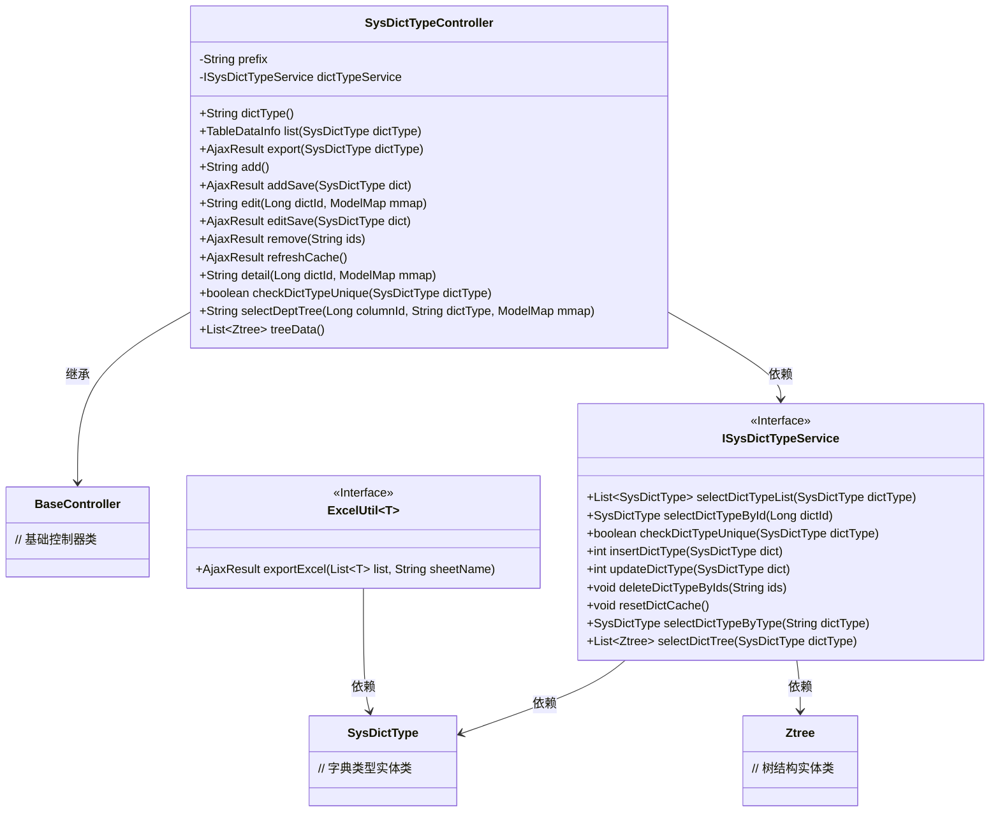

# 基础信息

|      |      |
|------|------|
| 名称 | SysDictTypeController |
| 编码语言 | .java |
| 代码路径 | RuoYi-main/ruoyi-admin/src/main/java/com/ruoyi/web/controller/system/SysDictTypeController.java |
| 包名 | com.ruoyi.web.controller.system |
| 依赖项 | ['java.util.List', 'org.apache.shiro.authz.annotation.RequiresPermissions', 'org.springframework.beans.factory.annotation.Autowired', 'org.springframework.stereotype.Controller', 'org.springframework.ui.ModelMap', 'org.springframework.validation.annotation.Validated', 'org.springframework.web.bind.annotation.GetMapping', 'org.springframework.web.bind.annotation.PathVariable', 'org.springframework.web.bind.annotation.PostMapping', 'org.springframework.web.bind.annotation.RequestMapping', 'org.springframework.web.bind.annotation.ResponseBody', 'com.ruoyi.common.annotation.Log', 'com.ruoyi.common.core.controller.BaseController', 'com.ruoyi.common.core.domain.AjaxResult', 'com.ruoyi.common.core.domain.Ztree', 'com.ruoyi.common.core.domain.entity.SysDictType', 'com.ruoyi.common.core.page.TableDataInfo', 'com.ruoyi.common.enums.BusinessType', 'com.ruoyi.common.utils.poi.ExcelUtil', 'com.ruoyi.system.service.ISysDictTypeService'] |
| 概述说明 | SysDictTypeController负责字典类型的增删改查、导出、缓存刷新及树结构加载。 |

# 说明

SysDictTypeController是一个用于处理字典类型操作的控制器，主要功能包括增加、删除、修改和查询字典类型数据。此外，它还支持字典类型数据的导出操作，能够将数据以文件形式输出。该控制器还具备缓存刷新功能，可以确保字典类型数据的实时性和准确性。同时，SysDictTypeController还支持树结构加载，能够以树形结构展示字典类型数据，便于用户进行层级管理和查看。这些功能共同构成了一个全面的字典类型管理系统。

# 类列表 Class Summary

| 名称   | 类型  | 说明 |
|-------|------|-------------|
| SysDictTypeController | class | SysDictTypeController处理字典类型操作，包括增删改查、导出、缓存刷新及树结构加载。 |

## 类 SysDictTypeController

|      |      |
|------|------|
| 访问范围 | @Controller;@RequestMapping("/system/dict");public |
| 类型 | class |
| 名称 | SysDictTypeController |
| 说明 | SysDictTypeController处理字典类型操作，包括增删改查、导出、缓存刷新及树结构加载。 |

### UML类图

### 描述
`SysDictTypeController` 是一个处理字典类型相关请求的控制器类，继承自 `BaseController`，并依赖于 `ISysDictTypeService` 接口来执行具体的业务逻辑。该类提供了多种方法，包括查询、新增、修改、删除字典类型等操作，还支持导出字典类型数据到Excel文件。`ISysDictTypeService` 接口定义了与字典类型相关的服务方法，`SysDictType` 和 `Ztree` 是实体类，分别表示字典类型和树结构数据。`ExcelUtil` 是一个泛型接口，用于导出Excel文件。

### 内部方法调用关系图

```mermaid
graph TD
    A["类SysDictTypeController"]
    B["属性: String prefix"]
    C["属性: ISysDictTypeService dictTypeService"]
    D["方法: dictType()"]
    E["方法: list(SysDictType dictType)"]
    F["方法: export(SysDictType dictType)"]
    G["方法: add()"]
    H["方法: addSave(@Validated SysDictType dict)"]
    I["方法: edit(@PathVariable Long dictId, ModelMap mmap)"]
    J["方法: editSave(@Validated SysDictType dict)"]
    K["方法: remove(String ids)"]
    L["方法: refreshCache()"]
    M["方法: detail(@PathVariable Long dictId, ModelMap mmap)"]
    N["方法: checkDictTypeUnique(SysDictType dictType)"]
    O["方法: selectDeptTree(@PathVariable Long columnId, @PathVariable String dictType, ModelMap mmap)"]
    P["方法: treeData()"]

    A --> B
    A --> C
    A --> D
    A --> E
    A --> F
    A --> G
    A --> H
    A --> I
    A --> J
    A --> K
    A --> L
    A --> M
    A --> N
    A --> O
    A --> P
```

**描述：**
`SysDictTypeController` 是一个基于Spring框架的控制器类，用于处理与字典类型相关的请求。它包含多个方法，分别用于处理不同类型的HTTP请求（如GET、POST），并执行相应的业务逻辑，如查询、新增、修改、删除字典类型等。每个方法都通过`@RequiresPermissions`注解进行权限控制，确保只有具有相应权限的用户才能访问。此外，部分方法还通过`@Log`注解记录操作日志，便于后续审计和追踪。

### 字段列表 Field List

| 名称  | 类型  | 说明 |
|-------|-------|------|
| prefix = "system/dict/type" | String | 系统字典类型路径前缀为"system/dict/type"。 |
| dictTypeService | ISysDictTypeService | 使用@Autowired自动注入ISysDictTypeService实例。 |

### 方法列表 Method List

| 名称  | 类型  | 说明 |
|-------|-------|------|
| checkDictTypeUnique | boolean | 检查字典类型唯一性的API接口。 |
| treeData | List<Ztree> | 获取字典树数据并返回Ztree列表。 |
| addSave | AjaxResult | 新增字典类型接口，检查唯一性后保存并返回结果。 |
| export | AjaxResult | 系统字典类型导出功能，需权限验证，返回Excel文件。 |
| edit | String | 系统权限要求，通过ID获取字典类型并返回编辑页面。 |
| list | TableDataInfo | 系统字典列表查询接口，需权限，分页返回数据。 |
| dictType | String | 系统权限要求查看字典，GET请求返回字典类型页面路径。 |
| detail | String | 通过权限检查，获取指定字典ID的详情并返回数据页面。 |
| selectDeptTree | String | 通过GET请求获取字典树，传递列ID和字典类型，返回视图路径。 |
| remove | AjaxResult | 删除字典类型接口，需权限，接收ID参数，调用服务删除并返回成功。 |
| editSave | AjaxResult | 更新字典类型，检查唯一性后保存修改。 |
| add | String | 需要权限"system:dict:add"，GET请求/add返回添加页面路径。 |
| refreshCache | AjaxResult | 系统字典缓存刷新接口，需权限，调用服务重置缓存并返回成功。 |

