# 基础信息

|      |      |
|------|------|
| 名称 | SysIndexController |
| 编码语言 | .java |
| 代码路径 | RuoYi-main/ruoyi-admin/src/main/java/com/ruoyi/web/controller/system/SysIndexController.java |
| 包名 | com.ruoyi.web.controller.system |
| 依赖项 | ['java.util.Date', 'java.util.List', 'javax.servlet.http.Cookie', 'javax.servlet.http.HttpServletResponse', 'org.springframework.beans.factory.annotation.Autowired', 'org.springframework.stereotype.Controller', 'org.springframework.ui.ModelMap', 'org.springframework.web.bind.annotation.GetMapping', 'org.springframework.web.bind.annotation.PathVariable', 'org.springframework.web.bind.annotation.PostMapping', 'org.springframework.web.bind.annotation.ResponseBody', 'com.ruoyi.common.config.RuoYiConfig', 'com.ruoyi.common.constant.ShiroConstants', 'com.ruoyi.common.core.controller.BaseController', 'com.ruoyi.common.core.domain.AjaxResult', 'com.ruoyi.common.core.domain.entity.SysMenu', 'com.ruoyi.common.core.domain.entity.SysUser', 'com.ruoyi.common.core.text.Convert', 'com.ruoyi.common.utils.CookieUtils', 'com.ruoyi.common.utils.DateUtils', 'com.ruoyi.common.utils.ServletUtils', 'com.ruoyi.common.utils.StringUtils', 'com.ruoyi.framework.shiro.service.SysPasswordService', 'com.ruoyi.system.service.ISysConfigService', 'com.ruoyi.system.service.ISysMenuService'] |
| 概述说明 | SysIndexController负责系统首页、锁屏、解锁、主题切换、菜单切换及系统介绍等功能，涉及用户信息、菜单、配置和密码管理。 |

# 说明

SysIndexController负责管理系统首页、锁屏、解锁、主题切换、菜单切换及系统介绍等核心功能。该控制器涉及用户信息管理、菜单配置、系统设置及密码管理，确保系统操作的流畅性和安全性，为用户提供全面的功能支持。

# 类列表 Class Summary

| 名称   | 类型  | 说明 |
|-------|------|-------------|
| SysIndexController | class | SysIndexController处理系统首页、锁屏、解锁、主题切换、菜单切换及系统介绍等功能，涉及用户信息、菜单、配置和密码管理。 |

## 类 SysIndexController

|      |      |
|------|------|
| 访问范围 | @Controller;public |
| 类型 | class |
| 名称 | SysIndexController |
| 说明 | SysIndexController处理系统首页、锁屏、解锁、主题切换、菜单切换及系统介绍等功能，涉及用户信息、菜单、配置和密码管理。 |

### UML类图

```mermaid
classDiagram
    class SysIndexController {
        -ISysMenuService menuService
        -ISysConfigService configService
        -SysPasswordService passwordService
        +String index(ModelMap mmap)
        +String lockscreen(ModelMap mmap)
        +AjaxResult unlockscreen(String password)
        +String switchSkin()
        +void menuStyle(String style, HttpServletResponse response)
        +String main(ModelMap mmap)
        +String contentMainClass(Boolean footer, Boolean tagsView)
        +boolean initPasswordIsModify(Date pwdUpdateDate)
        +boolean passwordIsExpiration(Date pwdUpdateDate)
    }

    class ISysMenuService {
        <<Interface>>
        +List~SysMenu~ selectMenusByUser(SysUser user)
    }

    class ISysConfigService {
        <<Interface>>
        +String selectConfigByKey(String key)
    }

    class SysPasswordService {
        +boolean matches(SysUser user, String password)
    }

    class SysUser {
        -String name
        -Date pwdUpdateDate
        +String getName()
        +Date getPwdUpdateDate()
    }

    class SysMenu {
        -String name
        +String getName()
    }

    class AjaxResult {
        +static AjaxResult error(String message)
        +static AjaxResult success()
    }

    class ServletUtils {
        +static HttpSession getSession()
        +static HttpServletRequest getRequest()
        +static boolean checkAgentIsMobile(String userAgent)
    }

    class CookieUtils {
        +static void setCookie(HttpServletResponse response, String name, String value)
    }

    class RuoYiConfig {
        +static String getCopyrightYear()
        +static boolean isDemoEnabled()
        +static String getVersion()
    }

    class DateUtils {
        +static Date getNowDate()
        +static int differentDaysByMillisecond(Date date1, Date date2)
    }

    class Convert {
        +static Boolean toBool(String value, Boolean defaultValue)
        +static Integer toInt(String value)
    }

    class StringUtils {
        +static boolean isNotEmpty(String str)
        +static boolean isNull(Object obj)
        +static final String EMPTY
    }

    SysIndexController --> ISysMenuService : 依赖
    SysIndexController --> ISysConfigService : 依赖
    SysIndexController --> SysPasswordService : 依赖
    SysIndexController --> SysUser : 依赖
    SysIndexController --> AjaxResult : 依赖
    SysIndexController --> ServletUtils : 依赖
    SysIndexController --> CookieUtils : 依赖
    SysIndexController --> RuoYiConfig : 依赖
    SysIndexController --> DateUtils : 依赖
    SysIndexController --> Convert : 依赖
    SysIndexController --> StringUtils : 依赖
    ISysMenuService --> SysMenu : 依赖
    ISysConfigService --> String : 依赖
    SysPasswordService --> SysUser : 依赖
```

### 描述
`SysIndexController` 是一个控制器类，负责处理系统首页、锁屏、解锁、主题切换、菜单切换等请求。它依赖于多个服务类，如 `ISysMenuService`、`ISysConfigService` 和 `SysPasswordService`，用于获取菜单、配置信息和密码验证。此外，它还使用了多个工具类，如 `ServletUtils`、`CookieUtils` 和 `DateUtils`，来处理会话、Cookie 和日期操作。该控制器通过 `ModelMap` 将数据传递给视图，并返回相应的视图名称。

### 内部方法调用关系图

```mermaid
graph TD
    A["SysIndexController"]
    B["属性: ISysMenuService menuService"]
    C["属性: ISysConfigService configService"]
    D["属性: SysPasswordService passwordService"]
    E["方法: String index(ModelMap mmap)"]
    F["方法: String lockscreen(ModelMap mmap)"]
    G["方法: AjaxResult unlockscreen(String password)"]
    H["方法: String switchSkin()"]
    I["方法: void menuStyle(String style, HttpServletResponse response)"]
    J["方法: String main(ModelMap mmap)"]
    K["方法: String contentMainClass(Boolean footer, Boolean tagsView)"]
    L["方法: boolean initPasswordIsModify(Date pwdUpdateDate)"]
    M["方法: boolean passwordIsExpiration(Date pwdUpdateDate)"]

    A --> B
    A --> C
    A --> D
    A --> E
    A --> F
    A --> G
    A --> H
    A --> I
    A --> J
    A --> K
    A --> L
    A --> M
```

这段代码是一个Spring MVC控制器类`SysIndexController`，负责处理系统首页、锁定屏幕、解锁屏幕、切换主题、切换菜单、系统介绍等功能的请求。类中包含了多个方法，分别处理不同的HTTP请求，并通过依赖注入的方式使用`ISysMenuService`、`ISysConfigService`和`SysPasswordService`等服务类来获取数据或执行逻辑。每个方法通过`ModelMap`对象将数据传递给视图层，并返回相应的视图名称或Ajax结果。

### 字段列表 Field List

| 名称  | 类型  | 说明 |
|-------|-------|------|
| menuService | ISysMenuService | 自动注入菜单服务实例。 |
| configService | ISysConfigService | 自动注入系统配置服务实例。 |
| passwordService | SysPasswordService | 自动注入SysPasswordService密码服务实例。 |

### 方法列表 Method List

| 名称  | 类型  | 说明 |
|-------|-------|------|
| menuStyle | void | 通过GET请求设置菜单样式并存入Cookie。 |
| main | String | 该方法通过GET请求获取系统版本并返回主页面。 |
| initPasswordIsModify | boolean | 检查初始密码是否需修改，依据配置和密码更新日期。 |
| passwordIsExpiration | boolean | 检查密码是否过期，基于上次更新日期和配置的有效天数。 |
| unlockscreen | AjaxResult | 解锁屏幕接口，验证用户密码，成功移除锁屏状态，失败返回错误信息。 |
| contentMainClass | String | 根据条件返回不同类名，用于控制页脚和标签视图的显示。 |
| index | String | 获取用户信息并加载菜单，设置页面主题、皮肤、页脚等配置，返回相应视图。 |
| lockscreen | String | 获取锁屏页面，设置用户信息并标记为锁屏状态。 |
| switchSkin | String | Get请求映射到/system/switchSkin，返回字符串"skin"。 |

