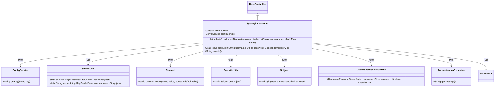

# 基础信息

|      |      |
|------|------|
| 名称 | SysLoginController |
| 编码语言 | .java |
| 代码路径 | RuoYi-main/ruoyi-admin/src/main/java/com/ruoyi/web/controller/system/SysLoginController.java |
| 包名 | com.ruoyi.web.controller.system |
| 依赖项 | ['javax.servlet.http.HttpServletRequest', 'javax.servlet.http.HttpServletResponse', 'org.apache.shiro.SecurityUtils', 'org.apache.shiro.authc.AuthenticationException', 'org.apache.shiro.authc.UsernamePasswordToken', 'org.apache.shiro.subject.Subject', 'org.springframework.beans.factory.annotation.Autowired', 'org.springframework.beans.factory.annotation.Value', 'org.springframework.stereotype.Controller', 'org.springframework.ui.ModelMap', 'org.springframework.web.bind.annotation.GetMapping', 'org.springframework.web.bind.annotation.PostMapping', 'org.springframework.web.bind.annotation.ResponseBody', 'com.ruoyi.common.core.controller.BaseController', 'com.ruoyi.common.core.domain.AjaxResult', 'com.ruoyi.common.core.text.Convert', 'com.ruoyi.common.utils.ServletUtils', 'com.ruoyi.common.utils.StringUtils', 'com.ruoyi.framework.web.service.ConfigService'] |
| 概述说明 | SysLoginController负责登录、记住我、用户注册，返回JSON或页面。 |

# 说明

SysLoginController负责处理用户登录功能，支持“记住我”选项和用户注册功能。该控制器能够根据请求类型返回JSON格式数据或直接渲染页面，提供灵活的用户交互体验。

# 类列表 Class Summary

| 名称   | 类型  | 说明 |
|-------|------|-------------|
| SysLoginController | class | SysLoginController处理登录功能，支持记住我、用户注册，返回JSON或页面。 |


## 类 SysLoginController

|      |      |
|------|------|
| 访问范围 | @Controller;public |
| 类型 | class |
| 名称 | SysLoginController |
| 说明 | SysLoginController处理登录功能，支持记住我、用户注册，返回JSON或页面。 |


### UML类图



### 描述
`SysLoginController` 是一个基于 Spring 的控制器，继承自 `BaseController`，用于处理用户登录相关的请求。它通过 `ConfigService` 获取系统配置，使用 `ServletUtils` 处理 Ajax 请求，并通过 `SecurityUtils` 和 `Subject` 进行用户认证。控制器提供了登录、Ajax 登录和未授权页面的处理方法，并根据系统配置决定是否开启“记住我”功能和用户注册功能。


### 内部方法调用关系图

```mermaid
graph TD
    A["类SysLoginController"]
    B["属性: boolean rememberMe"]
    C["属性: ConfigService configService"]
    D["方法: login(HttpServletRequest request, HttpServletResponse response, ModelMap mmap)"]
    E["方法: ajaxLogin(String username, String password, Boolean rememberMe)"]
    F["方法: unauth()"]
    G["条件: ServletUtils.isAjaxRequest(request)"]
    H["返回: ServletUtils.renderString(response, '{\"code\":\"1\",\"msg\":\"未登录或登录超时。请重新登录\"}')"]
    I["操作: mmap.put('isRemembered', rememberMe)"]
    J["操作: mmap.put('isAllowRegister', Convert.toBool(configService.getKey('sys.account.registerUser'), false))"]
    K["返回: 'login'"]
    L["创建: UsernamePasswordToken token = new UsernamePasswordToken(username, password, rememberMe)"]
    M["获取: Subject subject = SecurityUtils.getSubject()"]
    N["操作: subject.login(token)"]
    O["返回: success()"]
    P["捕获: AuthenticationException e"]
    Q["操作: msg = '用户或密码错误'"]
    R["条件: StringUtils.isNotEmpty(e.getMessage())"]
    S["操作: msg = e.getMessage()"]
    T["返回: error(msg)"]
    U["返回: 'error/unauth'"]

    A --> B
    A --> C
    A --> D
    A --> E
    A --> F
    D --> G
    G -->|是| H
    G -->|否| I
    I --> J
    J --> K
    E --> L
    L --> M
    M --> N
    N --> O
    N --> P
    P --> Q
    Q --> R
    R -->|是| S
    S --> T
    R -->|否| T
    F --> U
```

这段代码是一个Spring MVC控制器类，用于处理用户登录相关的请求。它包含三个主要方法：`login`、`ajaxLogin`和`unauth`。`login`方法根据请求类型返回不同的响应，`ajaxLogin`方法处理Ajax登录请求并进行身份验证，`unauth`方法返回未授权页面。代码中还使用了配置服务和安全工具类来实现功能。

### 字段列表 Field List

| 名称  | 类型  | 说明 |
|-------|-------|------|
| configService | ConfigService | 使用@Autowired自动注入ConfigService实例。 |
| rememberMe | boolean | Shiro配置中记住我功能默认关闭。 |

### 方法列表 Method List

| 名称  | 类型  | 说明 |
|-------|-------|------|
| login | String | 登录接口处理Ajax请求和页面渲染，返回未登录提示或登录页面。 |
| unauth | String | 获取未授权页面路径，返回错误页面。 |
| ajaxLogin | AjaxResult | 登录接口处理用户认证，成功返回成功信息，失败返回错误信息。 |


