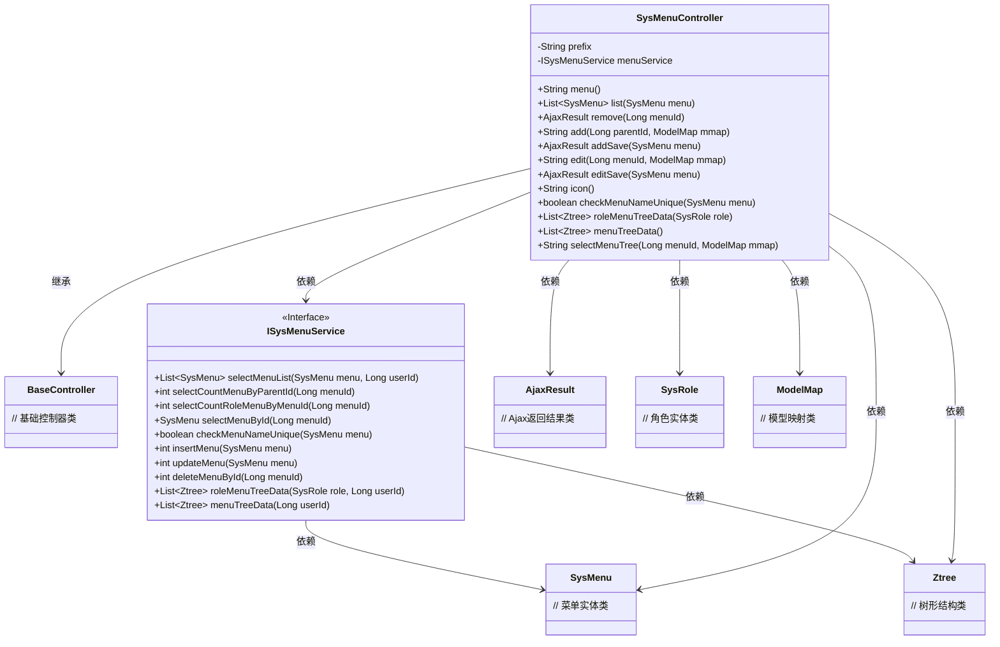

# 基础信息

|      |      |
|------|------|
| 名称 | SysMenuController |
| 编码语言 | .java |
| 代码路径 | RuoYi-main/ruoyi-admin/src/main/java/com/ruoyi/web/controller/system/SysMenuController.java |
| 包名 | com.ruoyi.web.controller.system |
| 依赖项 | ['java.util.List', 'org.apache.shiro.authz.annotation.RequiresPermissions', 'org.springframework.beans.factory.annotation.Autowired', 'org.springframework.stereotype.Controller', 'org.springframework.ui.ModelMap', 'org.springframework.validation.annotation.Validated', 'org.springframework.web.bind.annotation.GetMapping', 'org.springframework.web.bind.annotation.PathVariable', 'org.springframework.web.bind.annotation.PostMapping', 'org.springframework.web.bind.annotation.RequestMapping', 'org.springframework.web.bind.annotation.ResponseBody', 'com.ruoyi.common.annotation.Log', 'com.ruoyi.common.core.controller.BaseController', 'com.ruoyi.common.core.domain.AjaxResult', 'com.ruoyi.common.core.domain.Ztree', 'com.ruoyi.common.core.domain.entity.SysMenu', 'com.ruoyi.common.core.domain.entity.SysRole', 'com.ruoyi.common.enums.BusinessType', 'com.ruoyi.common.utils.ShiroUtils', 'com.ruoyi.framework.shiro.util.AuthorizationUtils', 'com.ruoyi.system.service.ISysMenuService'] |
| 概述说明 | SysMenuController实现菜单管理，支持增删改查、权限控制和树形展示。 |

# 说明

SysMenuController负责实现菜单管理功能，涵盖了菜单的增删改查操作，支持权限控制，并提供树形结构展示。该控制器确保用户能够高效管理菜单项，同时通过权限控制保障系统安全，树形结构展示则优化了菜单的层级可视化体验。

# 类列表 Class Summary

| 名称   | 类型  | 说明 |
|-------|------|-------------|
| SysMenuController | class | SysMenuController实现菜单管理功能，包括增删改查、权限控制和树形结构展示。 |

## 类 SysMenuController

|      |      |
|------|------|
| 访问范围 | @Controller;@RequestMapping("/system/menu");public |
| 类型 | class |
| 名称 | SysMenuController |
| 说明 | SysMenuController实现菜单管理功能，包括增删改查、权限控制和树形结构展示。 |

### UML类图

这段代码定义了一个名为 `SysMenuController` 的控制器类，用于管理系统菜单。它继承自 `BaseController`，并依赖于 `ISysMenuService` 接口来处理业务逻辑。控制器类包含了多个方法，用于处理菜单的增删改查、校验菜单名称、加载菜单树等操作。每个方法都通过注解与特定的HTTP请求方法（如 `@GetMapping`、`@PostMapping`）绑定，并返回相应的视图或数据。`ISysMenuService` 接口定义了与菜单相关的各种操作，如查询菜单列表、插入菜单、更新菜单等。`SysMenu`、`AjaxResult`、`Ztree`、`SysRole` 和 `ModelMap` 分别是菜单实体类、Ajax返回结果类、树形结构类、角色实体类和模型映射类。

### 内部方法调用关系图

```mermaid
graph TD
    A["类SysMenuController"]
    B["属性: String prefix"]
    C["属性: ISysMenuService menuService"]
    D["方法: menu()"]
    E["方法: list(SysMenu menu)"]
    F["方法: remove(Long menuId)"]
    G["方法: add(Long parentId, ModelMap mmap)"]
    H["方法: addSave(SysMenu menu)"]
    I["方法: edit(Long menuId, ModelMap mmap)"]
    J["方法: editSave(SysMenu menu)"]
    K["方法: icon()"]
    L["方法: checkMenuNameUnique(SysMenu menu)"]
    M["方法: roleMenuTreeData(SysRole role)"]
    N["方法: menuTreeData()"]
    O["方法: selectMenuTree(Long menuId, ModelMap mmap)"]

    A --> B
    A --> C
    A --> D
    A --> E
    A --> F
    A --> G
    A --> H
    A --> I
    A --> J
    A --> K
    A --> L
    A --> M
    A --> N
    A --> O
```

这段代码是一个Spring MVC控制器类，负责处理与系统菜单相关的HTTP请求。它包含多个方法，分别用于显示菜单、获取菜单列表、删除菜单、新增菜单、修改菜单、选择菜单图标、校验菜单名称、加载角色菜单列表树、加载所有菜单列表树以及选择菜单树。每个方法都通过不同的HTTP请求类型（如GET、POST）和路径映射来处理特定的业务逻辑，并且部分方法还涉及到权限校验和日志记录。

### 字段列表 Field List

| 名称  | 类型  | 说明 |
|-------|-------|------|
| prefix = "system/menu" | String | 定义字符串变量prefix，初始值为"system/menu"。 |
| menuService | ISysMenuService | 使用@Autowired自动注入ISysMenuService实例。 |

### 方法列表 Method List

| 名称  | 类型  | 说明 |
|-------|-------|------|
| list | List<SysMenu> | 获取用户菜单列表并返回。 |
| selectMenuTree | String | 通过菜单ID获取菜单树并返回视图路径。 |
| add | String | 根据父ID添加系统菜单，返回添加页面。 |
| edit | String | 基于权限编辑菜单，获取菜单ID并返回编辑页面。 |
| editSave | AjaxResult | 更新菜单信息，检查名称唯一性，清除缓存，返回结果。 |
| menuTreeData | List<Ztree> | 获取用户菜单树数据的API接口。 |
| icon | String | Get请求映射"/icon"，返回路径前缀加"/icon"。 |
| checkMenuNameUnique | boolean | 检查菜单名称唯一性的API接口，调用menuService方法验证。 |
| addSave | AjaxResult | 新增菜单功能，检查名称唯一性，失败返回错误，成功插入并清除缓存。 |
| menu | String | 权限验证后返回菜单视图路径。 |
| remove | AjaxResult | 删除菜单前检查子菜单和角色分配，清除缓存后执行删除操作。 |
| roleMenuTreeData | List<Ztree> | 获取用户角色菜单树数据，返回Ztree列表。 |

