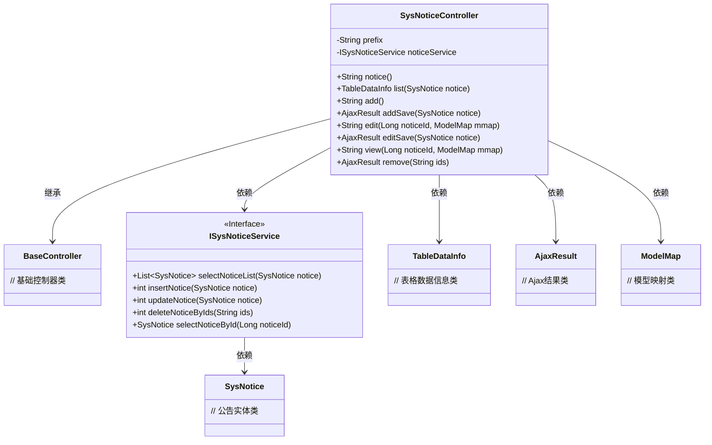
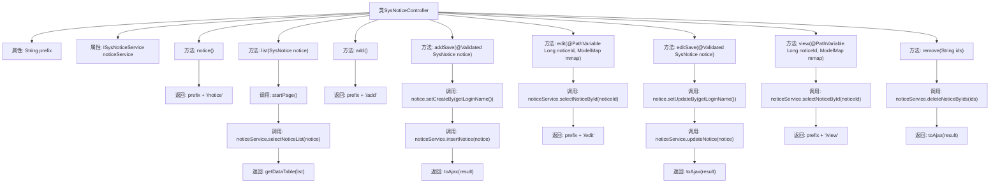

# 基础信息

|      |      |
|------|------|
| 名称 | SysNoticeController |
| 编码语言 | .java |
| 代码路径 | RuoYi-main/ruoyi-admin/src/main/java/com/ruoyi/web/controller/system/SysNoticeController.java |
| 包名 | com.ruoyi.web.controller.system |
| 依赖项 | ['java.util.List', 'org.apache.shiro.authz.annotation.RequiresPermissions', 'org.springframework.beans.factory.annotation.Autowired', 'org.springframework.stereotype.Controller', 'org.springframework.ui.ModelMap', 'org.springframework.validation.annotation.Validated', 'org.springframework.web.bind.annotation.GetMapping', 'org.springframework.web.bind.annotation.PathVariable', 'org.springframework.web.bind.annotation.PostMapping', 'org.springframework.web.bind.annotation.RequestMapping', 'org.springframework.web.bind.annotation.ResponseBody', 'com.ruoyi.common.annotation.Log', 'com.ruoyi.common.core.controller.BaseController', 'com.ruoyi.common.core.domain.AjaxResult', 'com.ruoyi.common.core.page.TableDataInfo', 'com.ruoyi.common.enums.BusinessType', 'com.ruoyi.system.domain.SysNotice', 'com.ruoyi.system.service.ISysNoticeService'] |
| 概述说明 | 系统公告控制器具备查询、新增、修改、删除公告功能。 |

# 说明

系统公告控制器是一个功能模块，主要用于管理公告信息。它具备查询公告的功能，允许用户检索现有的公告内容。同时，控制器支持新增公告，用户可以通过该功能发布新的公告信息。此外，系统还提供了修改公告的功能，用户可以对已发布的公告进行编辑和更新。最后，控制器还包含删除公告的功能，用户可以根据需要移除不再使用的公告。通过这些功能，系统公告控制器实现了对公告信息的全面管理。

# 类列表 Class Summary

| 名称   | 类型  | 说明 |
|-------|------|-------------|
| SysNoticeController | class | 系统公告控制器，包含查询、新增、修改、删除公告功能。 |

## 类 SysNoticeController

|      |      |
|------|------|
| 访问范围 | @Controller;@RequestMapping("/system/notice");public |
| 类型 | class |
| 名称 | SysNoticeController |
| 说明 | 系统公告控制器，包含查询、新增、修改、删除公告功能。 |

### UML类图

### 描述
`SysNoticeController` 是一个基于 Spring MVC 的控制器类，继承自 `BaseController`，负责处理与公告相关的请求。它依赖于 `ISysNoticeService` 接口来执行公告的增删改查操作，并返回 `TableDataInfo` 和 `AjaxResult` 类型的结果。控制器通过 `ModelMap` 将数据传递到视图层，实现了公告的列表展示、新增、修改、查看和删除功能。

### 内部方法调用关系图

该流程图展示了`SysNoticeController`类的主要方法及其调用关系。每个方法通过`noticeService`与数据库交互，执行查询、新增、修改、删除等操作，并返回相应的视图或数据结果。流程图中清晰地展示了方法的调用顺序和返回结果，帮助理解控制器的业务逻辑。

### 字段列表 Field List

| 名称  | 类型  | 说明 |
|-------|-------|------|
| prefix = "system/notice" | String | 定义私有字符串变量prefix，值为"system/notice"。 |
| noticeService | ISysNoticeService | 自动注入系统通知服务实例。 |

### 方法列表 Method List

| 名称  | 类型  | 说明 |
|-------|-------|------|
| add | String | 系统权限要求添加通知，通过GET请求访问/add路径，返回添加页面。 |
| editSave | AjaxResult | 通知公告编辑接口，需权限验证，记录日志，返回更新结果。 |
| list | TableDataInfo | 查询系统通知列表，分页返回数据。 |
| remove | AjaxResult | 删除通知公告接口，需权限，返回操作结果。 |
| notice | String | 该方法需要系统通知查看权限，返回通知页面路径。 |
| view | String | 查询公告详情并返回视图页面。 |
| edit | String | 系统权限控制下，通过ID获取通知并跳转编辑页面。 |
| addSave | AjaxResult | 系统通知公告新增接口，需权限验证，记录日志，返回操作结果。 |

