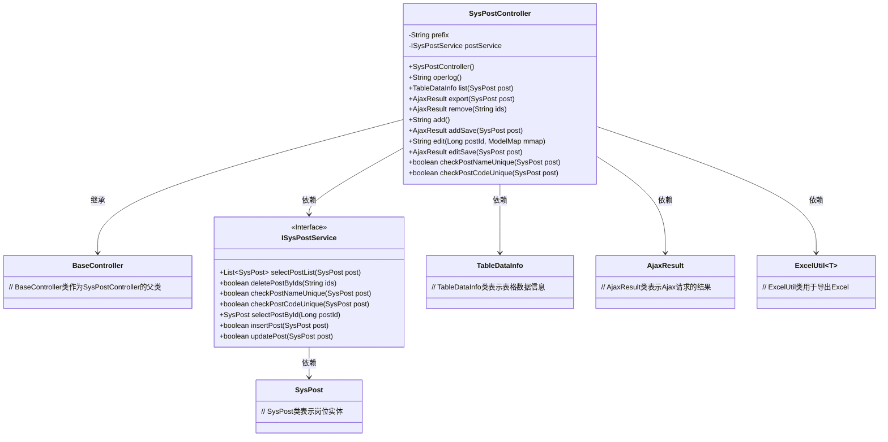

# 基础信息

|      |      |
|------|------|
| 名称 | SysPostController |
| 编码语言 | .java |
| 代码路径 | RuoYi-main/ruoyi-admin/src/main/java/com/ruoyi/web/controller/system/SysPostController.java |
| 包名 | com.ruoyi.web.controller.system |
| 依赖项 | ['java.util.List', 'org.apache.shiro.authz.annotation.RequiresPermissions', 'org.springframework.beans.factory.annotation.Autowired', 'org.springframework.stereotype.Controller', 'org.springframework.ui.ModelMap', 'org.springframework.validation.annotation.Validated', 'org.springframework.web.bind.annotation.GetMapping', 'org.springframework.web.bind.annotation.PathVariable', 'org.springframework.web.bind.annotation.PostMapping', 'org.springframework.web.bind.annotation.RequestMapping', 'org.springframework.web.bind.annotation.ResponseBody', 'com.ruoyi.common.annotation.Log', 'com.ruoyi.common.core.controller.BaseController', 'com.ruoyi.common.core.domain.AjaxResult', 'com.ruoyi.common.core.page.TableDataInfo', 'com.ruoyi.common.enums.BusinessType', 'com.ruoyi.common.utils.poi.ExcelUtil', 'com.ruoyi.system.domain.SysPost', 'com.ruoyi.system.service.ISysPostService'] |
| 概述说明 | SysPostController负责岗位管理的查看、列表、导出、删除、新增、修改及名称编码校验。 |

# 说明

SysPostController负责岗位管理的全面功能，包括查看岗位信息、获取岗位列表、导出岗位数据、删除岗位、新增岗位以及修改岗位信息。此外，该控制器还具备校验岗位名称和编码的功能，确保岗位信息的准确性和唯一性。

# 类列表 Class Summary

| 名称   | 类型  | 说明 |
|-------|------|-------------|
| SysPostController | class | SysPostController处理岗位管理，包含查看、列表、导出、删除、新增、修改及校验岗位名称和编码功能。 |

## 类 SysPostController

|      |      |
|------|------|
| 访问范围 | @Controller;@RequestMapping("/system/post");public |
| 类型 | class |
| 名称 | SysPostController |
| 说明 | SysPostController处理岗位管理，包含查看、列表、导出、删除、新增、修改及校验岗位名称和编码功能。 |

### UML类图

### 描述
`SysPostController` 是一个Spring MVC控制器，继承自 `BaseController`，用于处理与岗位管理相关的HTTP请求。它依赖于 `ISysPostService` 接口来执行业务逻辑，如查询、新增、修改和删除岗位。控制器通过 `TableDataInfo` 和 `AjaxResult` 类返回数据，并使用 `ExcelUtil` 类导出Excel文件。`SysPost` 类表示岗位实体，控制器中的方法通过 `ISysPostService` 接口与 `SysPost` 实体进行交互。

### 内部方法调用关系图

```mermaid
graph TD
    A["类SysPostController"]
    B["属性: String prefix"]
    C["属性: ISysPostService postService"]
    D["方法: operlog()"]
    E["方法: list(SysPost post)"]
    F["方法: export(SysPost post)"]
    G["方法: remove(String ids)"]
    H["方法: add()"]
    I["方法: addSave(@Validated SysPost post)"]
    J["方法: edit(@PathVariable('postId') Long postId, ModelMap mmap)"]
    K["方法: editSave(@Validated SysPost post)"]
    L["方法: checkPostNameUnique(SysPost post)"]
    M["方法: checkPostCodeUnique(SysPost post)"]

    A --> B
    A --> C
    A --> D
    A --> E
    A --> F
    A --> G
    A --> H
    A --> I
    A --> J
    A --> K
    A --> L
    A --> M

    E --> N["startPage()"]
    E --> O["postService.selectPostList(post)"]
    E --> P["getDataTable(list)"]

    F --> Q["postService.selectPostList(post)"]
    F --> R["ExcelUtil<SysPost> util = new ExcelUtil<SysPost>(SysPost.class)"]
    F --> S["util.exportExcel(list, '岗位数据')"]

    G --> T["postService.deletePostByIds(ids)"]
    G --> U["toAjax(result)"]

    I --> V["postService.checkPostNameUnique(post)"]
    I --> W["error('新增岗位失败，岗位名称已存在')"]
    I --> X["postService.checkPostCodeUnique(post)"]
    I --> Y["error('新增岗位失败，岗位编码已存在')"]
    I --> Z["post.setCreateBy(getLoginName())"]
    I --> AA["postService.insertPost(post)"]
    I --> AB["toAjax(result)"]

    J --> AC["postService.selectPostById(postId)"]
    J --> AD["mmap.put('post', post)"]

    K --> AE["postService.checkPostNameUnique(post)"]
    K --> AF["error('修改岗位失败，岗位名称已存在')"]
    K --> AG["postService.checkPostCodeUnique(post)"]
    K --> AH["error('修改岗位失败，岗位编码已存在')"]
    K --> AI["post.setUpdateBy(getLoginName())"]
    K --> AJ["postService.updatePost(post)"]
    K --> AK["toAjax(result)"]

    L --> AL["postService.checkPostNameUnique(post)"]

    M --> AM["postService.checkPostCodeUnique(post)"]
```

这段代码是一个基于Spring MVC的控制器类`SysPostController`，主要用于处理与岗位管理相关的HTTP请求。控制器类中定义了多个方法，分别用于处理岗位的查看、列表展示、导出、删除、新增、修改、校验等操作。每个方法都通过`postService`调用相应的服务层方法来完成业务逻辑，并通过`@ResponseBody`注解将结果返回给客户端。代码中还包括了权限校验和日志记录的功能，确保操作的安全性和可追溯性。

### 字段列表 Field List

| 名称  | 类型  | 说明 |
|-------|-------|------|
| prefix = "system/post" | String | 私有字符串变量prefix赋值为"system/post"。 |
| postService | ISysPostService | 自动注入ISysPostService实例到postService变量。 |

### 方法列表 Method List

| 名称  | 类型  | 说明 |
|-------|-------|------|
| checkPostNameUnique | boolean | 检查岗位名称唯一性的接口方法。 |
| remove | AjaxResult | 岗位管理删除接口，需权限，返回删除结果。 |
| editSave | AjaxResult | 岗位编辑接口，检查名称和编码唯一性，更新岗位信息。 |
| checkPostCodeUnique | boolean | 检查岗位编码唯一性的API接口。 |
| list | TableDataInfo | 系统权限检查后，分页查询岗位列表并返回数据。 |
| export | AjaxResult | 岗位管理模块实现导出功能，通过权限校验后返回岗位数据Excel文件。 |
| edit | String | 需要权限访问编辑页面，根据ID获取文章并返回编辑视图。 |
| add | String | 需要权限"system:post:add"的GET请求"/add"返回prefix+"/add"。 |
| addSave | AjaxResult | 新增岗位需权限验证，检查岗位名和编码唯一性，成功后记录并返回结果。 |
| operlog | String | 需要权限"system:post:view"，GET请求返回"/post"页面。 |

