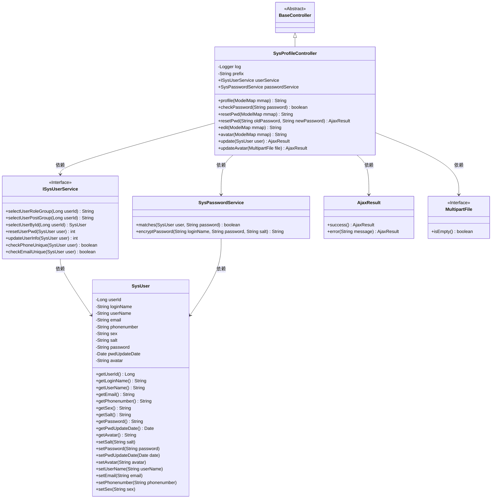

# 基础信息

|      |      |
|------|------|
| 名称 | SysProfileController |
| 编码语言 | .java |
| 代码路径 | RuoYi-main/ruoyi-admin/src/main/java/com/ruoyi/web/controller/system/SysProfileController.java |
| 包名 | com.ruoyi.web.controller.system |
| 依赖项 | ['org.slf4j.Logger', 'org.slf4j.LoggerFactory', 'org.springframework.beans.factory.annotation.Autowired', 'org.springframework.stereotype.Controller', 'org.springframework.ui.ModelMap', 'org.springframework.web.bind.annotation.GetMapping', 'org.springframework.web.bind.annotation.PostMapping', 'org.springframework.web.bind.annotation.RequestMapping', 'org.springframework.web.bind.annotation.RequestParam', 'org.springframework.web.bind.annotation.ResponseBody', 'org.springframework.web.multipart.MultipartFile', 'com.ruoyi.common.annotation.Log', 'com.ruoyi.common.config.RuoYiConfig', 'com.ruoyi.common.core.controller.BaseController', 'com.ruoyi.common.core.domain.AjaxResult', 'com.ruoyi.common.core.domain.entity.SysUser', 'com.ruoyi.common.enums.BusinessType', 'com.ruoyi.common.utils.DateUtils', 'com.ruoyi.common.utils.ShiroUtils', 'com.ruoyi.common.utils.StringUtils', 'com.ruoyi.common.utils.file.FileUploadUtils', 'com.ruoyi.common.utils.file.MimeTypeUtils', 'com.ruoyi.framework.shiro.service.SysPasswordService', 'com.ruoyi.system.service.ISysUserService'] |
| 概述说明 | 系统用户信息管理控制器，支持密码重置、信息修改、头像更新。 |

# 说明

系统用户个人信息管理控制器是一个用于处理用户个人信息的核心模块，主要功能包括密码重置、用户信息修改以及头像更新。该控制器确保用户能够安全、便捷地管理自己的账户信息，提供了一系列操作接口，以支持用户在不同场景下对个人信息进行维护和更新。通过这些功能，用户可以随时更改密码、更新个人资料以及更换头像，从而保持账户信息的最新状态。

# 类列表 Class Summary

| 名称   | 类型  | 说明 |
|-------|------|-------------|
| SysProfileController | class | 系统用户个人信息管理控制器，包含密码重置、信息修改、头像更新等功能。 |

## 类 SysProfileController

|      |      |
|------|------|
| 访问范围 | @Controller;@RequestMapping("/system/user/profile");public |
| 类型 | class |
| 名称 | SysProfileController |
| 说明 | 系统用户个人信息管理控制器，包含密码重置、信息修改、头像更新等功能。 |

### UML类图

### 描述
`SysProfileController` 是一个基于 Spring MVC 的控制器，负责处理用户个人信息的请求。它继承自 `BaseController`，并依赖于 `ISysUserService` 和 `SysPasswordService` 来处理用户数据和密码验证。控制器提供了多个方法，如获取用户信息、检查密码、重置密码、修改用户信息、更新头像等。`ISysUserService` 是一个接口，定义了与用户相关的操作方法，而 `SysPasswordService` 则负责密码的验证和加密。`SysUser` 类表示用户实体，包含了用户的各种属性。`AjaxResult` 用于返回操作结果，`MultipartFile` 用于处理文件上传。

### 内部方法调用关系图

```mermaid
graph TD
    A["类SysProfileController"]
    B["属性: Logger log"]
    C["属性: String prefix"]
    D["属性: ISysUserService userService"]
    E["属性: SysPasswordService passwordService"]
    F["方法: profile(ModelMap mmap)"]
    G["方法: checkPassword(String password)"]
    H["方法: resetPwd(ModelMap mmap)"]
    I["方法: resetPwd(String oldPassword, String newPassword)"]
    J["方法: edit(ModelMap mmap)"]
    K["方法: avatar(ModelMap mmap)"]
    L["方法: update(SysUser user)"]
    M["方法: updateAvatar(MultipartFile file)"]

    A --> B
    A --> C
    A --> D
    A --> E
    A --> F
    A --> G
    A --> H
    A --> I
    A --> J
    A --> K
    A --> L
    A --> M

    F --> F1["获取用户: getSysUser()"]
    F --> F2["添加用户信息: mmap.put('user', user)"]
    F --> F3["添加角色组: mmap.put('roleGroup', userService.selectUserRoleGroup(user.getUserId()))"]
    F --> F4["添加岗位组: mmap.put('postGroup', userService.selectUserPostGroup(user.getUserId()))"]
    F --> F5["返回视图: prefix + '/profile'"]

    G --> G1["获取用户: getSysUser()"]
    G --> G2["验证密码: passwordService.matches(user, password)"]

    H --> H1["获取用户: getSysUser()"]
    H --> H2["添加用户信息: mmap.put('user', userService.selectUserById(user.getUserId()))"]
    H --> H3["返回视图: prefix + '/resetPwd'"]

    I --> I1["获取用户: getSysUser()"]
    I --> I2["验证旧密码: passwordService.matches(user, oldPassword)"]
    I --> I3["验证新密码: passwordService.matches(user, newPassword)"]
    I --> I4["生成新盐: user.setSalt(ShiroUtils.randomSalt())"]
    I --> I5["加密新密码: user.setPassword(passwordService.encryptPassword(user.getLoginName(), newPassword, user.getSalt()))"]
    I --> I6["更新密码日期: user.setPwdUpdateDate(DateUtils.getNowDate())"]
    I --> I7["重置密码: userService.resetUserPwd(user)"]
    I --> I8["更新用户信息: setSysUser(userService.selectUserById(user.getUserId()))"]
    I --> I9["返回结果: success()或error()"]

    J --> J1["获取用户: getSysUser()"]
    J --> J2["添加用户信息: mmap.put('user', userService.selectUserById(user.getUserId()))"]
    J --> J3["返回视图: prefix + '/edit'"]

    K --> K1["获取用户: getSysUser()"]
    K --> K2["添加用户信息: mmap.put('user', userService.selectUserById(user.getUserId()))"]
    K --> K3["返回视图: prefix + '/avatar'"]

    L --> L1["获取当前用户: getSysUser()"]
    L --> L2["更新用户信息: currentUser.setUserName(user.getUserName())"]
    L --> L3["更新用户信息: currentUser.setEmail(user.getEmail())"]
    L --> L4["更新用户信息: currentUser.setPhonenumber(user.getPhonenumber())"]
    L --> L5["更新用户信息: currentUser.setSex(user.getSex())"]
    L --> L6["检查手机号唯一性: userService.checkPhoneUnique(currentUser)"]
    L --> L7["检查邮箱唯一性: userService.checkEmailUnique(currentUser)"]
    L --> L8["更新用户信息: userService.updateUserInfo(currentUser)"]
    L --> L9["更新用户信息: setSysUser(userService.selectUserById(currentUser.getUserId()))"]
    L --> L10["返回结果: success()或error()"]

    M --> M1["获取当前用户: getSysUser()"]
    M --> M2["上传头像: FileUploadUtils.upload(RuoYiConfig.getAvatarPath(), file, MimeTypeUtils.IMAGE_EXTENSION)"]
    M --> M3["更新用户头像: currentUser.setAvatar(avatar)"]
    M --> M4["更新用户信息: userService.updateUserInfo(currentUser)"]
    M --> M5["更新用户信息: setSysUser(userService.selectUserById(currentUser.getUserId()))"]
    M --> M6["返回结果: success()或error()"]
```

该流程图描述了`SysProfileController`类的主要方法和其内部调用关系。该类主要用于处理用户个人信息的管理，包括查看、修改个人信息、重置密码、修改头像等操作。每个方法都涉及获取当前用户、调用服务层进行数据处理，并返回相应的视图或结果。

### 字段列表 Field List

| 名称  | 类型  | 说明 |
|-------|-------|------|
| passwordService | SysPasswordService | 自动注入SysPasswordService实例。 |
| prefix = "system/user/profile" | String | 定义私有字符串变量prefix，值为"system/user/profile"。 |
| userService | ISysUserService | 自动注入用户服务接口实例。 |
| log = LoggerFactory.getLogger(SysProfileController.class) | Logger | SysProfileController类中定义了一个私有的静态日志记录器。 |

### 方法列表 Method List

| 名称  | 类型  | 说明 |
|-------|-------|------|
| checkPassword | boolean | 检查密码是否匹配用户。 |
| profile | String | 获取用户信息并返回个人资料页面。 |
| edit | String | Get请求映射到/edit路径，获取当前用户信息并返回编辑页面。 |
| resetPwd | String | GET请求处理用户密码重置页面，返回重置页面视图。 |
| avatar | String | GET请求处理用户头像信息，返回用户头像页面。 |
| update | AjaxResult | 更新用户信息，检查手机和邮箱唯一性，成功则返回成功信息。 |
| updateAvatar | AjaxResult | 更新用户头像，处理文件上传并返回操作结果。 |
| resetPwd | AjaxResult | 重置密码接口，验证旧密码，确保新密码不同，更新密码及盐值，返回操作结果。 |

