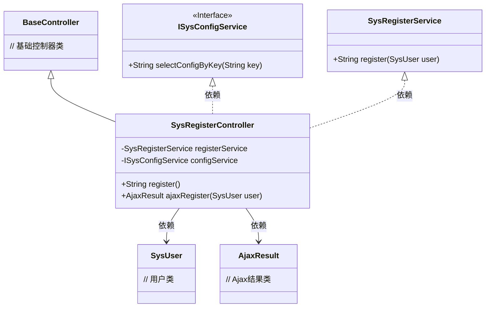
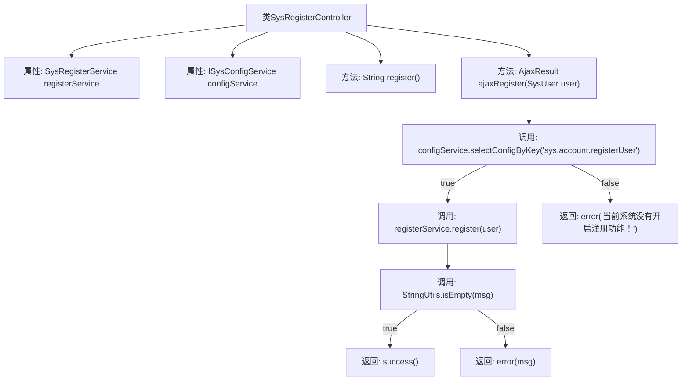

# 基础信息

|      |      |
|------|------|
| 名称 | SysRegisterController |
| 编码语言 | .java |
| 代码路径 | RuoYi-main/ruoyi-admin/src/main/java/com/ruoyi/web/controller/system/SysRegisterController.java |
| 包名 | com.ruoyi.web.controller.system |
| 依赖项 | ['org.springframework.beans.factory.annotation.Autowired', 'org.springframework.stereotype.Controller', 'org.springframework.web.bind.annotation.GetMapping', 'org.springframework.web.bind.annotation.PostMapping', 'org.springframework.web.bind.annotation.ResponseBody', 'com.ruoyi.common.core.controller.BaseController', 'com.ruoyi.common.core.domain.AjaxResult', 'com.ruoyi.common.core.domain.entity.SysUser', 'com.ruoyi.common.utils.StringUtils', 'com.ruoyi.framework.shiro.service.SysRegisterService', 'com.ruoyi.system.service.ISysConfigService'] |
| 概述说明 | SysRegisterController处理用户注册，包含GET和POST方法，验证注册功能状态。 |

# 说明

SysRegisterController负责处理用户注册流程，包含GET和POST两种方法。该控制器首先验证系统是否开启了注册功能，确保在功能开启的情况下处理用户注册请求。GET方法用于获取注册页面，而POST方法则用于提交注册信息并完成注册操作。通过这两种方法，SysRegisterController确保用户注册流程的完整性和功能性。

# 类列表 Class Summary

| 名称   | 类型  | 说明 |
|-------|------|-------------|
| SysRegisterController | class | SysRegisterController处理用户注册，包含GET和POST方法，验证注册功能是否开启。 |

## 类 SysRegisterController

|      |      |
|------|------|
| 访问范围 | @Controller;public |
| 类型 | class |
| 名称 | SysRegisterController |
| 说明 | SysRegisterController处理用户注册，包含GET和POST方法，验证注册功能是否开启。 |

### UML类图

这段代码描述了一个注册控制器 `SysRegisterController`，它继承自 `BaseController`，并依赖于 `SysRegisterService` 和 `ISysConfigService` 来处理用户注册请求。控制器提供了两个方法：`register()` 用于返回注册页面，`ajaxRegister()` 用于处理注册请求并返回 Ajax 结果。`ISysConfigService` 是一个接口，用于获取系统配置信息，`SysRegisterService` 负责具体的用户注册逻辑。代码通过检查系统配置来决定是否允许用户注册，并根据注册结果返回相应的消息。

### 内部方法调用关系图

这段代码是一个Spring MVC控制器类，用于处理用户注册请求。`SysRegisterController`类包含两个自动注入的服务类`SysRegisterService`和`ISysConfigService`，以及两个请求处理方法`register()`和`ajaxRegister(SysUser user)`。`ajaxRegister`方法首先检查系统是否允许注册，如果允许则调用`registerService.register(user)`进行注册，并根据返回的消息决定返回成功或错误结果。流程图展示了方法之间的调用关系和条件判断逻辑。

### 字段列表 Field List

| 名称  | 类型  | 说明 |
|-------|-------|------|
| configService | ISysConfigService | 自动注入系统配置服务实例。 |
| registerService | SysRegisterService | 自动注入系统注册服务实例。 |

### 方法列表 Method List

| 名称  | 类型  | 说明 |
|-------|-------|------|
| ajaxRegister | AjaxResult | 系统检查注册功能是否开启，若未开启返回错误信息，否则执行注册并返回结果。 |
| register | String | 定义GET请求路径/register，返回视图register。 |

