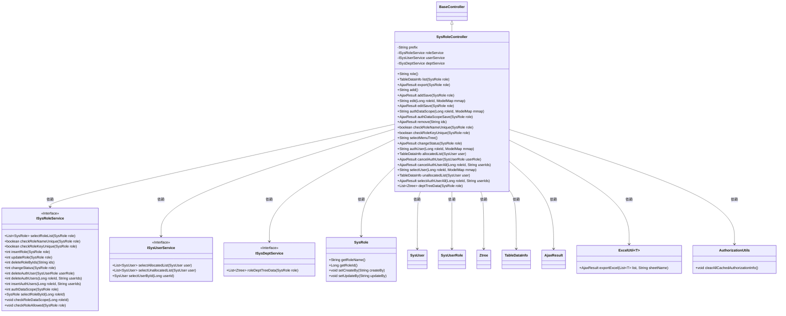

# 基础信息

|      |      |
|------|------|
| 名称 | SysRoleController |
| 编码语言 | .java |
| 代码路径 | RuoYi-main/ruoyi-admin/src/main/java/com/ruoyi/web/controller/system/SysRoleController.java |
| 包名 | com.ruoyi.web.controller.system |
| 依赖项 | ['java.util.List', 'org.apache.shiro.authz.annotation.RequiresPermissions', 'org.springframework.beans.factory.annotation.Autowired', 'org.springframework.stereotype.Controller', 'org.springframework.ui.ModelMap', 'org.springframework.validation.annotation.Validated', 'org.springframework.web.bind.annotation.GetMapping', 'org.springframework.web.bind.annotation.PathVariable', 'org.springframework.web.bind.annotation.PostMapping', 'org.springframework.web.bind.annotation.RequestMapping', 'org.springframework.web.bind.annotation.ResponseBody', 'com.ruoyi.common.annotation.Log', 'com.ruoyi.common.core.controller.BaseController', 'com.ruoyi.common.core.domain.AjaxResult', 'com.ruoyi.common.core.domain.Ztree', 'com.ruoyi.common.core.domain.entity.SysRole', 'com.ruoyi.common.core.domain.entity.SysUser', 'com.ruoyi.common.core.page.TableDataInfo', 'com.ruoyi.common.enums.BusinessType', 'com.ruoyi.common.utils.poi.ExcelUtil', 'com.ruoyi.framework.shiro.util.AuthorizationUtils', 'com.ruoyi.system.domain.SysUserRole', 'com.ruoyi.system.service.ISysDeptService', 'com.ruoyi.system.service.ISysRoleService', 'com.ruoyi.system.service.ISysUserService'] |
| 概述说明 | SysRoleController负责角色管理的增删改查、权限分配、状态修改、用户授权及数据权限操作。 |

# 说明

SysRoleController负责处理角色管理的各项操作，包括角色的增加、删除、修改和查询。此外，它还涉及权限的分配、角色状态的修改、用户授权以及数据权限的管理。通过这些功能，SysRoleController确保系统角色的有效管理和权限的合理分配。

# 类列表 Class Summary

| 名称   | 类型  | 说明 |
|-------|------|-------------|
| SysRoleController | class | SysRoleController处理角色管理，包括增删改查、权限分配、状态修改、用户授权及数据权限操作。 |

## 类 SysRoleController

|      |      |
|------|------|
| 访问范围 | @Controller;@RequestMapping("/system/role");public |
| 类型 | class |
| 名称 | SysRoleController |
| 说明 | SysRoleController处理角色管理，包括增删改查、权限分配、状态修改、用户授权及数据权限操作。 |

### UML类图

这段代码定义了一个`SysRoleController`类，它继承自`BaseController`，并依赖多个服务接口（如`ISysRoleService`、`ISysUserService`、`ISysDeptService`）来处理与角色相关的操作。`SysRoleController`类包含了多个方法，用于处理角色的增删改查、权限校验、数据导出等操作。每个方法都通过调用相应的服务接口来完成具体的业务逻辑。

### 内部方法调用关系图

```mermaid
graph TD
    A["类SysRoleController"]
    B["属性: String prefix"]
    C["属性: ISysRoleService roleService"]
    D["属性: ISysUserService userService"]
    E["属性: ISysDeptService deptService"]
    F["方法: String role()"]
    G["方法: TableDataInfo list(SysRole role)"]
    H["方法: AjaxResult export(SysRole role)"]
    I["方法: String add()"]
    J["方法: AjaxResult addSave(@Validated SysRole role)"]
    K["方法: String edit(@PathVariable Long roleId, ModelMap mmap)"]
    L["方法: AjaxResult editSave(@Validated SysRole role)"]
    M["方法: String authDataScope(@PathVariable Long roleId, ModelMap mmap)"]
    N["方法: AjaxResult authDataScopeSave(SysRole role)"]
    O["方法: AjaxResult remove(String ids)"]
    P["方法: boolean checkRoleNameUnique(SysRole role)"]
    Q["方法: boolean checkRoleKeyUnique(SysRole role)"]
    R["方法: String selectMenuTree()"]
    S["方法: AjaxResult changeStatus(SysRole role)"]
    T["方法: String authUser(@PathVariable Long roleId, ModelMap mmap)"]
    U["方法: TableDataInfo allocatedList(SysUser user)"]
    V["方法: AjaxResult cancelAuthUser(SysUserRole userRole)"]
    W["方法: AjaxResult cancelAuthUserAll(Long roleId, String userIds)"]
    X["方法: String selectUser(@PathVariable Long roleId, ModelMap mmap)"]
    Y["方法: TableDataInfo unallocatedList(SysUser user)"]
    Z["方法: AjaxResult selectAuthUserAll(Long roleId, String userIds)"]
    AA["方法: List<Ztree> deptTreeData(SysRole role)"]

    A --> B
    A --> C
    A --> D
    A --> E
    A --> F
    A --> G
    A --> H
    A --> I
    A --> J
    A --> K
    A --> L
    A --> M
    A --> N
    A --> O
    A --> P
    A --> Q
    A --> R
    A --> S
    A --> T
    A --> U
    A --> V
    A --> W
    A --> X
    A --> Y
    A --> Z
    A --> AA
```

这段代码是一个Spring MVC控制器类`SysRoleController`，用于处理与角色管理相关的请求。它包含了多个方法，分别用于角色列表查询、角色导出、角色新增、角色修改、角色删除等操作。每个方法都通过不同的HTTP请求方法（如`@GetMapping`、`@PostMapping`）和权限注解（如`@RequiresPermissions`）来控制访问权限。类中还注入了多个服务类（如`ISysRoleService`、`ISysUserService`、`ISysDeptService`）来处理具体的业务逻辑。

### 字段列表 Field List

| 名称  | 类型  | 说明 |
|-------|-------|------|
| prefix = "system/role" | String | 定义私有字符串变量prefix，值为"system/role"。 |
| userService | ISysUserService | 自动注入用户服务实例。 |
| deptService | ISysDeptService | 自动注入部门服务实例。 |
| roleService | ISysRoleService | 自动注入角色服务接口实例。 |

### 方法列表 Method List

| 名称  | 类型  | 说明 |
|-------|-------|------|
| role | String | 系统权限检查后返回角色页面路径。 |
| deptTreeData | List<Ztree> | 获取角色部门树数据，返回Ztree列表。 |
| authDataScope | String | 通过角色ID获取数据权限并返回数据范围视图。 |
| export | AjaxResult | 导出角色数据，需权限验证，返回Excel文件。 |
| changeStatus | AjaxResult | 角色管理接口：修改角色状态，需权限验证。 |
| checkRoleKeyUnique | boolean | 检查角色键是否唯一的API接口。 |
| unallocatedList | TableDataInfo | 系统角色权限下，获取未分配用户列表的接口。 |
| selectUser | String | 权限验证后，通过角色ID获取用户信息并返回视图。 |
| list | TableDataInfo | 系统角色列表接口，需权限，分页查询并返回角色数据。 |
| selectMenuTree | String | 定义GET请求处理，返回指定路径的视图。 |
| edit | String | 需要权限编辑角色，根据ID获取角色信息并返回编辑页面。 |
| authDataScopeSave | AjaxResult | 角色管理接口，校验权限后更新数据范围，返回操作结果。 |
| authUser | String | 系统权限要求，获取角色ID并返回授权用户页面。 |
| cancelAuthUser | AjaxResult | 取消用户角色授权接口，需系统角色编辑权限。 |
| editSave | AjaxResult | 处理角色编辑请求，校验角色名称和权限唯一性，更新角色信息并清除缓存。 |
| addSave | AjaxResult | 新增角色接口，校验角色名和权限唯一性，成功后插入角色并清除缓存。 |
| selectAuthUserAll | AjaxResult | 系统角色管理接口，需权限，记录日志，处理用户授权。 |
| remove | AjaxResult | 系统角色删除接口，需权限，记录日志，返回删除结果。 |
| checkRoleNameUnique | boolean | 检查角色名称是否唯一的API接口。 |
| allocatedList | TableDataInfo | 系统角色列表权限下，通过POST请求获取分配用户列表并返回表格数据。 |
| cancelAuthUserAll | AjaxResult | 取消角色所有用户授权接口，需编辑权限并记录日志。 |
| add | String | 需要权限“system:role:add”的GET请求映射到“/add”路径，返回前缀加“/add”的字符串。 |

