# 基础信息

|      |      |
|------|------|
| 名称 | SysUserController |
| 编码语言 | .java |
| 代码路径 | RuoYi-main/ruoyi-admin/src/main/java/com/ruoyi/web/controller/system/SysUserController.java |
| 包名 | com.ruoyi.web.controller.system |
| 依赖项 | ['java.util.List', 'java.util.stream.Collectors', 'org.apache.commons.lang3.ArrayUtils', 'org.apache.shiro.authz.annotation.RequiresPermissions', 'org.springframework.beans.factory.annotation.Autowired', 'org.springframework.stereotype.Controller', 'org.springframework.ui.ModelMap', 'org.springframework.validation.annotation.Validated', 'org.springframework.web.bind.annotation.GetMapping', 'org.springframework.web.bind.annotation.PathVariable', 'org.springframework.web.bind.annotation.PostMapping', 'org.springframework.web.bind.annotation.RequestMapping', 'org.springframework.web.bind.annotation.ResponseBody', 'org.springframework.web.multipart.MultipartFile', 'com.ruoyi.common.annotation.Log', 'com.ruoyi.common.core.controller.BaseController', 'com.ruoyi.common.core.domain.AjaxResult', 'com.ruoyi.common.core.domain.Ztree', 'com.ruoyi.common.core.domain.entity.SysDept', 'com.ruoyi.common.core.domain.entity.SysRole', 'com.ruoyi.common.core.domain.entity.SysUser', 'com.ruoyi.common.core.page.TableDataInfo', 'com.ruoyi.common.core.text.Convert', 'com.ruoyi.common.enums.BusinessType', 'com.ruoyi.common.utils.DateUtils', 'com.ruoyi.common.utils.ShiroUtils', 'com.ruoyi.common.utils.StringUtils', 'com.ruoyi.common.utils.poi.ExcelUtil', 'com.ruoyi.framework.shiro.service.SysPasswordService', 'com.ruoyi.framework.shiro.util.AuthorizationUtils', 'com.ruoyi.system.service.ISysDeptService', 'com.ruoyi.system.service.ISysPostService', 'com.ruoyi.system.service.ISysRoleService', 'com.ruoyi.system.service.ISysUserService'] |
| 概述说明 | 系统用户管理控制器，支持用户增删改查、导入导出及权限校验。 |

# 说明

系统用户管理控制器是一个综合性功能模块，主要用于管理用户信息。它支持用户的新增、删除、修改和查询操作，确保用户数据的完整性和实时更新。此外，该控制器还提供用户数据的导入和导出功能，便于批量处理和数据迁移。权限校验功能则确保只有授权用户才能执行特定操作，保障系统的安全性和合规性。整体设计旨在提升用户管理效率，同时维护系统的稳定性和安全性。

# 类列表 Class Summary

| 名称   | 类型  | 说明 |
|-------|------|-------------|
| SysUserController | class | 系统用户管理控制器，包含用户增删改查、导入导出、权限校验等功能。 |

## 类 SysUserController

|      |      |
|------|------|
| 访问范围 | @Controller;@RequestMapping("/system/user");public |
| 类型 | class |
| 名称 | SysUserController |
| 说明 | 系统用户管理控制器，包含用户增删改查、导入导出、权限校验等功能。 |

### UML类图

```mermaid
classDiagram
    class BaseController {
        <<Abstract>>
    }

    class SysUserController {
        -String prefix
        +SysUserController()
        +String user()
        +TableDataInfo list(SysUser user)
        +AjaxResult export(SysUser user)
        +AjaxResult importData(MultipartFile file, boolean updateSupport)
        +AjaxResult importTemplate()
        +String add(ModelMap mmap)
        +AjaxResult addSave(SysUser user)
        +String edit(Long userId, ModelMap mmap)
        +String view(Long userId, ModelMap mmap)
        +AjaxResult editSave(SysUser user)
        +String resetPwd(Long userId, ModelMap mmap)
        +AjaxResult resetPwdSave(SysUser user)
        +String authRole(Long userId, ModelMap mmap)
        +AjaxResult insertAuthRole(Long userId, Long[] roleIds)
        +AjaxResult remove(String ids)
        +boolean checkLoginNameUnique(SysUser user)
        +boolean checkPhoneUnique(SysUser user)
        +boolean checkEmailUnique(SysUser user)
        +AjaxResult changeStatus(SysUser user)
        +List~Ztree~ deptTreeData()
        +String selectDeptTree(Long deptId, ModelMap mmap)
    }

    class ISysUserService {
        <<Interface>>
        +List~SysUser~ selectUserList(SysUser user)
        +String importUser(List~SysUser~ userList, boolean updateSupport, String loginName)
        +boolean checkLoginNameUnique(SysUser user)
        +boolean checkPhoneUnique(SysUser user)
        +boolean checkEmailUnique(SysUser user)
        +int insertUser(SysUser user)
        +int updateUser(SysUser user)
        +int resetUserPwd(SysUser user)
        +int deleteUserByIds(String ids)
        +int changeStatus(SysUser user)
    }

    class ISysRoleService {
        <<Interface>>
        +List~SysRole~ selectRoleAll()
        +List~SysRole~ selectRolesByUserId(Long userId)
        +void checkRoleDataScope(Long[] roleIds)
    }

    class ISysDeptService {
        <<Interface>>
        +void checkDeptDataScope(Long deptId)
        +List~Ztree~ selectDeptTree(SysDept dept)
        +SysDept selectDeptById(Long deptId)
    }

    class ISysPostService {
        <<Interface>>
        +List~SysPost~ selectPostAll()
        +List~SysPost~ selectPostsByUserId(Long userId)
    }

    class SysPasswordService {
        +String encryptPassword(String loginName, String password, String salt)
    }

    class ExcelUtil~T~ {
        +ExcelUtil(Class~T~ clazz)
        +AjaxResult exportExcel(List~T~ list, String sheetName)
        +List~T~ importExcel(InputStream inputStream)
        +AjaxResult importTemplateExcel(String sheetName)
    }

    class AuthorizationUtils {
        +void clearAllCachedAuthorizationInfo()
    }

    class ShiroUtils {
        +String randomSalt()
        +Long getUserId()
    }

    class DateUtils {
        +Date getNowDate()
    }

    class StringUtils {
        +boolean isNotEmpty(String str)
    }

    class ArrayUtils {
        +boolean contains(long[] array, long value)
    }

    class Convert {
        +long[] toLongArray(String str)
    }

    SysUserController --> ISysUserService : 依赖
    SysUserController --> ISysRoleService : 依赖
    SysUserController --> ISysDeptService : 依赖
    SysUserController --> ISysPostService : 依赖
    SysUserController --> SysPasswordService : 依赖
    SysUserController --> ExcelUtil~SysUser~ : 依赖
    SysUserController --> AuthorizationUtils : 依赖
    SysUserController --> ShiroUtils : 依赖
    SysUserController --> DateUtils : 依赖
    SysUserController --> StringUtils : 依赖
    SysUserController --> ArrayUtils : 依赖
    SysUserController --> Convert : 依赖
    SysUserController --|> BaseController : 继承
```

这段代码定义了一个名为 `SysUserController` 的控制器类，用于处理与用户管理相关的HTTP请求。该类继承自 `BaseController`，并依赖多个服务接口（如 `ISysUserService`、`ISysRoleService` 等）来处理用户数据的增删改查、角色管理、部门管理等操作。控制器通过注解与HTTP请求进行映射，提供用户列表查询、用户导入导出、用户状态修改等功能。代码中还使用了工具类如 `ExcelUtil` 来处理Excel文件的导入导出，以及 `AuthorizationUtils` 来清除授权缓存。

### 内部方法调用关系图

```mermaid
graph TD
    A["类SysUserController"]
    B["属性: String prefix"]
    C["属性: ISysUserService userService"]
    D["属性: ISysRoleService roleService"]
    E["属性: ISysDeptService deptService"]
    F["属性: ISysPostService postService"]
    G["属性: SysPasswordService passwordService"]
    H["方法: user()"]
    I["方法: list(SysUser user)"]
    J["方法: export(SysUser user)"]
    K["方法: importData(MultipartFile file, boolean updateSupport)"]
    L["方法: importTemplate()"]
    M["方法: add(ModelMap mmap)"]
    N["方法: addSave(@Validated SysUser user)"]
    O["方法: edit(@PathVariable('userId') Long userId, ModelMap mmap)"]
    P["方法: view(@PathVariable('userId') Long userId, ModelMap mmap)"]
    Q["方法: editSave(@Validated SysUser user)"]
    R["方法: resetPwd(@PathVariable('userId') Long userId, ModelMap mmap)"]
    S["方法: resetPwdSave(SysUser user)"]
    T["方法: authRole(@PathVariable('userId') Long userId, ModelMap mmap)"]
    U["方法: insertAuthRole(Long userId, Long[] roleIds)"]
    V["方法: remove(String ids)"]
    W["方法: checkLoginNameUnique(SysUser user)"]
    X["方法: checkPhoneUnique(SysUser user)"]
    Y["方法: checkEmailUnique(SysUser user)"]
    Z["方法: changeStatus(SysUser user)"]
    AA["方法: deptTreeData()"]
    AB["方法: selectDeptTree(@PathVariable('deptId') Long deptId, ModelMap mmap)"]

    A --> B
    A --> C
    A --> D
    A --> E
    A --> F
    A --> G
    A --> H
    A --> I
    A --> J
    A --> K
    A --> L
    A --> M
    A --> N
    A --> O
    A --> P
    A --> Q
    A --> R
    A --> S
    A --> T
    A --> U
    A --> V
    A --> W
    A --> X
    A --> Y
    A --> Z
    A --> AA
    A --> AB
```

这段代码定义了一个名为 `SysUserController` 的控制器类，用于处理与用户管理相关的HTTP请求。该类通过多个注解（如 `@GetMapping`、`@PostMapping` 等）定义了不同的请求处理方法，涵盖了用户列表查询、用户数据导出与导入、用户新增与修改、密码重置、用户授权角色等功能。每个方法都通过调用相应的服务类（如 `userService`、`roleService` 等）来完成具体的业务逻辑。流程图展示了类中所有属性和方法的调用关系，帮助理解代码的结构和功能。

### 字段列表 Field List

| 名称  | 类型  | 说明 |
|-------|-------|------|
| roleService | ISysRoleService | 自动注入角色服务实例。 |
| userService | ISysUserService | 自动注入用户服务实例。 |
| passwordService | SysPasswordService | 自动注入SysPasswordService实例。 |
| postService | ISysPostService | 自动注入系统岗位服务实例。 |
| deptService | ISysDeptService | 自动注入部门服务接口实例。 |
| prefix = "system/user" | String | 代码定义了一个私有字符串变量prefix，初始值为"system/user"。 |

### 方法列表 Method List

| 名称  | 类型  | 说明 |
|-------|-------|------|
| checkEmailUnique | boolean | 后端接口用于检查邮箱唯一性。 |
| checkLoginNameUnique | boolean | 检查登录名唯一性的接口方法。 |
| user | String | 需要权限查看用户信息，返回用户页面路径。 |
| authRole | String | 根据用户ID获取角色列表并返回授权页面。 |
| view | String | 通过用户ID查看用户信息，包括角色和岗位组。 |
| remove | AjaxResult | 删除用户接口，需权限，不能删除当前用户。 |
| resetPwd | String | 权限校验后，通过用户ID重置密码并返回视图。 |
| checkPhoneUnique | boolean | 接口检查手机号是否唯一，返回布尔值。 |
| export | AjaxResult | 用户管理模块提供导出功能，需权限并返回用户数据Excel文件。 |
| add | String | 该方法通过GET请求处理用户添加页面，返回角色和职位数据。 |
| changeStatus | AjaxResult | 用户管理模块更新用户状态接口，需权限验证并检查用户数据范围。 |
| selectDeptTree | String | 需要权限"system:user:list"，通过部门ID获取部门树信息并返回视图。 |
| resetPwdSave | AjaxResult | 重置密码功能需权限验证，更新用户密码并返回操作结果。 |
| addSave | AjaxResult | 新增用户接口，检查登录名、手机号、邮箱唯一性，加密密码后插入用户数据。 |
| importData | AjaxResult | 用户管理模块中，通过权限验证后，支持导入Excel文件更新用户数据。 |
| importTemplate | AjaxResult | 获取用户数据导入模板的API，需系统用户查看权限。 |
| insertAuthRole | AjaxResult | 插入用户角色权限，检查数据范围，清除缓存。 |
| editSave | AjaxResult | 系统用户编辑接口，校验用户权限和数据范围，确保登录名、手机号和邮箱唯一性，更新用户信息并清除缓存。 |
| edit | String | 系统权限要求用户编辑，获取用户信息、角色和岗位，返回编辑页面。 |
| list | TableDataInfo | 系统用户列表接口，需权限，分页查询用户数据。 |
| deptTreeData | List<Ztree> | 获取部门树数据，需系统用户列表权限。 |

