# 基础信息

|      |      |
|------|------|
| 名称 | system |
| 编码语言 | .java |
| 代码路径 | RuoYi-main/ruoyi-admin/src/main/java/com/ruoyi/web/controller/system |
| 包名 | RuoYi-main.ruoyi-admin.src.main.java.com.ruoyi.web.controller.system |
| 概述说明 | SysDictTypeController管理字典类型，支持增删改查、导出和树结构展示。SysDeptController管理部门信息，具备校验和权限控制。SysRegisterController处理用户注册，验证系统功能。SysConfigController管理参数，支持导出和缓存刷新。SysNoticeController管理公告，支持增删改查。SysMenuController管理菜单，支持权限控制和树形展示。SysProfileController管理用户个人信息，支持密码重置和信息更新。SysDictDataController管理字典数据，支持增删改查和导出。SysPostController管理岗位，支持增删改查和校验。SysIndexController管理首页功能，涉及用户信息和菜单配置。SysRoleController管理角色，支持权限分配和状态修改。SysLoginController处理登录，支持“记住我”和注册。SysCaptchaController生成验证码，支持数学和字符类型。SysUserController管理用户信息，支持增删改查和导入导出。 |

# 说明

## 概述

该代码模块是一个基于Java的Web应用程序，主要用于管理系统中的各种核心功能。模块包含多个控制器，每个控制器负责处理特定类型的业务逻辑，涵盖了用户管理、角色管理、权限控制、字典管理、部门管理、岗位管理、系统配置、公告管理、菜单管理、个人信息管理、登录注册、验证码生成等多个方面。这些控制器共同构成了一个全面的后台管理系统，支持企业或组织的高效运营和数据管理。

## 主要业务场景

1. **用户管理**：系统用户管理控制器（`SysUserController`）负责用户的新增、删除、修改、查询、导入和导出操作，确保用户数据的完整性和安全性。
2. **角色与权限管理**：系统角色控制器（`SysRoleController`）处理角色的增删改查、权限分配、角色状态修改、用户授权和数据权限管理，确保系统权限的合理分配。
3. **字典管理**：字典类型控制器（`SysDictTypeController`）和字典数据控制器（`SysDictDataController`）共同管理字典类型和字典数据，支持增删改查、导出和缓存刷新，确保字典数据的实时性和准确性。
4. **部门管理**：系统部门控制器（`SysDeptController`）管理部门的增删改查操作，支持权限控制和数据范围检查，保障部门信息的安全性和合规性。
5. **岗位管理**：系统岗位控制器（`SysPostController`）处理岗位信息的查看、列表获取、导出、删除、新增和修改，确保岗位信息的准确性和唯一性。
6. **系统配置**：系统配置控制器（`SysConfigController`）管理系统参数的增删改查、导出和缓存刷新，确保系统配置的高效管理和数据一致性。
7. **公告管理**：系统公告控制器（`SysNoticeController`）管理公告信息的查询、新增、修改和删除，支持公告信息的全面管理。
8. **菜单管理**：系统菜单控制器（`SysMenuController`）管理菜单的增删改查操作，支持权限控制和树形结构展示，优化菜单的层级可视化体验。
9. **个人信息管理**：系统用户个人信息管理控制器（`SysProfileController`）处理用户的密码重置、信息修改和头像更新，确保用户个人信息的安全和便捷管理。
10. **登录与注册**：系统登录控制器（`SysLoginController`）和注册控制器（`SysRegisterController`）分别处理用户的登录和注册流程，支持“记住我”选项和注册功能，提供灵活的用户交互体验。
11. **验证码生成**：验证码控制器（`SysCaptchaController`）生成数学和字符类型的验证码，确保系统的安全性。
12. **首页与系统管理**：系统首页控制器（`SysIndexController`）管理首页、锁屏、解锁、主题切换、菜单切换及系统介绍等核心功能，确保系统操作的流畅性和安全性。

通过这些控制器，该模块能够全面支持企业或组织的后台管理需求，确保系统的高效运行和数据的安全性。

### 包内部结构视图

```mermaid
graph TD
    system --> SysDictTypeController.java
    system --> SysDeptController.java
    system --> SysRegisterController.java
    system --> SysConfigController.java
    system --> SysNoticeController.java
    system --> SysMenuController.java
    system --> SysProfileController.java
    system --> SysDictDataController.java
    system --> SysPostController.java
    system --> SysIndexController.java
    system --> SysRoleController.java
    system --> SysLoginController.java
    system --> SysCaptchaController.java
    system --> SysUserController.java
```

该流程图展示了`system`目录下的多个控制器文件，这些文件分别处理不同的系统功能，如字典类型、部门管理、注册、配置、通知、菜单、用户信息等。每个控制器文件都直接隶属于`system`目录，体现了清晰的功能模块划分和层级关系。

# 文件列表 File List

| 名称   | 类型  | 说明 |
|-------|------|-------------|
| [SysProfileController.java](SysProfileController.md) | file | 系统用户信息管理控制器，支持密码重置、信息修改、头像更新。 |
| [SysConfigController.java](SysConfigController.md) | file | 系统配置控制器支持参数管理、导出、缓存刷新及键名校验。 |
| [SysCaptchaController.java](SysCaptchaController.md) | file | 控制器生成数学或字符验证码，并设置会话属性。 |
| [SysLoginController.java](SysLoginController.md) | file | SysLoginController负责登录、记住我、用户注册，返回JSON或页面。 |
| [SysUserController.java](SysUserController.md) | file | 系统用户管理控制器，支持用户增删改查、导入导出及权限校验。 |
| [SysRoleController.java](SysRoleController.md) | file | SysRoleController负责角色管理的增删改查、权限分配、状态修改、用户授权及数据权限操作。 |
| [SysIndexController.java](SysIndexController.md) | file | SysIndexController负责系统首页、锁屏、解锁、主题切换、菜单切换及系统介绍等功能，涉及用户信息、菜单、配置和密码管理。 |
| [SysPostController.java](SysPostController.md) | file | SysPostController负责岗位管理的查看、列表、导出、删除、新增、修改及名称编码校验。 |
| [SysDictDataController.java](SysDictDataController.md) | file | SysDictDataController负责字典数据的查询、导出、新增、修改和删除操作。 |
| [SysMenuController.java](SysMenuController.md) | file | SysMenuController实现菜单管理，支持增删改查、权限控制和树形展示。 |
| [SysNoticeController.java](SysNoticeController.md) | file | 系统公告控制器具备查询、新增、修改、删除公告功能。 |
| [SysRegisterController.java](SysRegisterController.md) | file | SysRegisterController处理用户注册，包含GET和POST方法，验证注册功能状态。 |
| [SysDeptController.java](SysDeptController.md) | file | 系统部门控制器实现部门管理功能，支持增删改查、校验、权限和数据范围检查。 |
| [SysDictTypeController.java](SysDictTypeController.md) | file | SysDictTypeController负责字典类型的增删改查、导出、缓存刷新及树结构加载。 |

