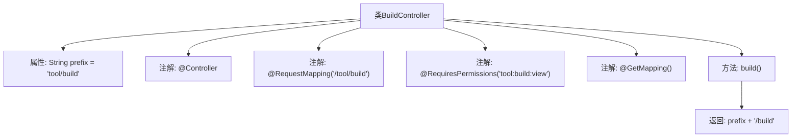

# 基础信息

|      |      |
|------|------|
| 名称 | BuildController |
| 编码语言 | .java |
| 代码路径 | RuoYi-main/ruoyi-admin/src/main/java/com/ruoyi/web/controller/tool/BuildController.java |
| 包名 | com.ruoyi.web.controller.tool |
| 依赖项 | ['org.apache.shiro.authz.annotation.RequiresPermissions', 'org.springframework.stereotype.Controller', 'org.springframework.web.bind.annotation.GetMapping', 'org.springframework.web.bind.annotation.RequestMapping', 'com.ruoyi.common.core.controller.BaseController'] |
| 概述说明 | 控制器类处理工具构建请求，路径为/tool/build，需权限访问。 |

# 说明

控制器类中的工具构建请求处理功能，映射路径为/tool/build，该路径需要特定权限才能访问。该功能用于处理与工具构建相关的请求，确保只有授权用户能够执行相关操作。

# 类列表 Class Summary

| 名称   | 类型  | 说明 |
|-------|------|-------------|
| BuildController | class | 控制器类处理工具构建请求，映射路径为/tool/build，需权限访问。 |


## 类 BuildController

|      |      |
|------|------|
| 访问范围 | @Controller;@RequestMapping("/tool/build");public |
| 类型 | class |
| 名称 | BuildController |
| 说明 | 控制器类处理工具构建请求，映射路径为/tool/build，需权限访问。 |


### UML类图

```mermaid
classDiagram
    class BaseController {
        // 基类控制器，提供通用功能
    }

    class BuildController {
        -String prefix
        +BuildController()
        +String build()
    }

    class <<Interface>> RequiresPermissions {
        // 权限校验接口
    }

    BuildController --> BaseController : 继承
    BuildController --> RequiresPermissions : 依赖 : 权限校验
```

这段代码定义了一个`BuildController`类，它继承自`BaseController`，并使用了`RequiresPermissions`接口进行权限校验。`BuildController`类中包含一个私有成员`prefix`和一个公有方法`build()`，该方法返回一个字符串路径。通过`@RequiresPermissions`注解，`build()`方法在执行前会进行权限校验，确保只有具备相应权限的用户才能访问。


### 内部方法调用关系图



这段代码定义了一个名为 `BuildController` 的控制器类，继承自 `BaseController`。该类使用 `@Controller` 注解标识为控制器，并通过 `@RequestMapping` 注解映射到 `/tool/build` 路径。类中包含一个私有属性 `prefix`，其值为 `'tool/build'`。`build()` 方法使用 `@RequiresPermissions` 注解进行权限控制，并通过 `@GetMapping` 注解处理 GET 请求，返回 `prefix + '/build'` 的字符串。

### 字段列表 Field List

| 名称  | 类型  | 说明 |
|-------|-------|------|
| prefix = "tool/build" | String | 私有字符串变量prefix赋值为"tool/build"。 |

### 方法列表 Method List

| 名称  | 类型  | 说明 |
|-------|-------|------|
| build | String | 该方法需权限"tool:build:view"，返回前缀加"/build"的字符串。 |


