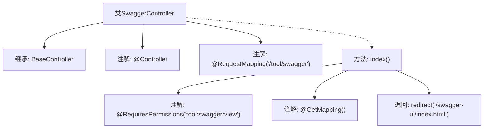

# 基础信息

|      |      |
|------|------|
| 名称 | SwaggerController |
| 编码语言 | .java |
| 代码路径 | RuoYi-main/ruoyi-admin/src/main/java/com/ruoyi/web/controller/tool/SwaggerController.java |
| 包名 | com.ruoyi.web.controller.tool |
| 依赖项 | ['org.apache.shiro.authz.annotation.RequiresPermissions', 'org.springframework.stereotype.Controller', 'org.springframework.web.bind.annotation.GetMapping', 'org.springframework.web.bind.annotation.RequestMapping', 'com.ruoyi.common.core.controller.BaseController'] |
| 概述说明 | SwaggerController处理/swagger请求，重定向至swagger-ui页面。 |

# 说明

SwaggerController负责处理应用程序中与/swagger路径相关的请求。当用户访问该路径时，控制器会将请求重定向至swagger-ui页面，以便用户能够方便地查看和交互式地测试API文档。这一机制确保了开发者能够通过统一的入口访问API文档，提升了开发效率和用户体验。

# 类列表 Class Summary

| 名称   | 类型  | 说明 |
|-------|------|-------------|
| SwaggerController | class | SwaggerController处理/swagger路径请求，重定向至swagger-ui页面。 |


## 类 SwaggerController

|      |      |
|------|------|
| 访问范围 | @Controller;@RequestMapping("/tool/swagger");public |
| 类型 | class |
| 名称 | SwaggerController |
| 说明 | SwaggerController处理/swagger路径请求，重定向至swagger-ui页面。 |


### UML类图

```mermaid
classDiagram
    class BaseController {
        // BaseController 类，提供基础控制器功能
    }

    class SwaggerController {
        <<Controller>>
        +String index()
    }

    BaseController <|-- SwaggerController : 继承
    SwaggerController --> "/tool/swagger" : 映射路径
    SwaggerController --> "tool:swagger:view" : 权限要求
    SwaggerController --> "/swagger-ui/index.html" : 重定向
```

这段代码定义了一个 `SwaggerController` 类，它继承自 `BaseController`，并处理与 Swagger UI 相关的请求。`SwaggerController` 使用 `@Controller` 注解标记为控制器，并通过 `@RequestMapping` 映射到 `/tool/swagger` 路径。`index` 方法使用 `@RequiresPermissions` 注解确保用户具有 `tool:swagger:view` 权限，并通过 `@GetMapping` 处理 GET 请求，最终重定向到 `/swagger-ui/index.html` 页面。


### 内部方法调用关系图



该流程图描述了`SwaggerController`类的结构及其方法调用关系。`SwaggerController`继承自`BaseController`，并使用`@Controller`和`@RequestMapping`注解标记为控制器类。`index()`方法通过`@RequiresPermissions`和`@GetMapping`注解进行权限控制和路由映射，最终返回一个重定向到`/swagger-ui/index.html`的字符串。

### 字段列表 Field List

| 名称  | 类型  | 说明 |
|-------|-------|------|

### 方法列表 Method List

| 名称  | 类型  | 说明 |
|-------|-------|------|
| index | String | 需要权限访问Swagger视图，重定向到Swagger UI页面。 |


