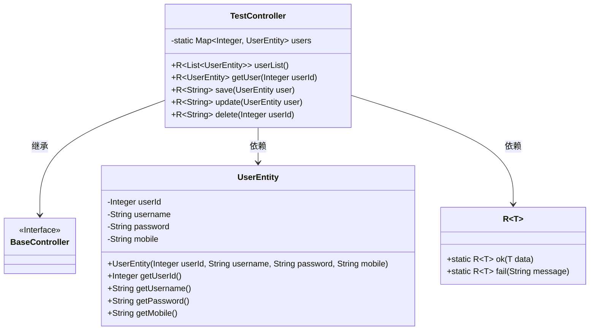
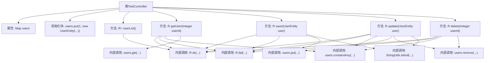
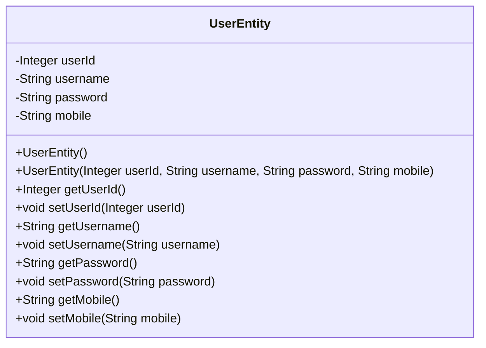

# 基础信息

|      |      |
|------|------|
| 名称 | TestController |
| 编码语言 | .java |
| 代码路径 | RuoYi-main/ruoyi-admin/src/main/java/com/ruoyi/web/controller/tool/TestController.java |
| 包名 | com.ruoyi.web.controller.tool |
| 依赖项 | ['java.util.ArrayList', 'java.util.LinkedHashMap', 'java.util.List', 'java.util.Map', 'org.springframework.web.bind.annotation.DeleteMapping', 'org.springframework.web.bind.annotation.GetMapping', 'org.springframework.web.bind.annotation.PathVariable', 'org.springframework.web.bind.annotation.PostMapping', 'org.springframework.web.bind.annotation.PutMapping', 'org.springframework.web.bind.annotation.RequestBody', 'org.springframework.web.bind.annotation.RequestMapping', 'org.springframework.web.bind.annotation.RestController', 'com.ruoyi.common.core.controller.BaseController', 'com.ruoyi.common.core.domain.R', 'com.ruoyi.common.utils.StringUtils', 'io.swagger.annotations.Api', 'io.swagger.annotations.ApiImplicitParam', 'io.swagger.annotations.ApiImplicitParams', 'io.swagger.annotations.ApiModel', 'io.swagger.annotations.ApiModelProperty', 'io.swagger.annotations.ApiOperation'] |
| 概述说明 | 用户管理API提供增删改查功能，用户实体包含ID、名称、密码和手机号字段。 |

# 说明

用户信息管理API提供了获取用户列表、查看用户详细信息、新增用户、更新用户信息和删除用户的功能。用户实体类包含ID、名称、密码和手机号等字段，并提供了相应的操作方法。这些功能和方法共同构成了一个完整的用户信息管理系统，支持对用户数据的全面管理。

# 类列表 Class Summary

| 名称   | 类型  | 说明 |
|-------|------|-------------|
| TestController | class | 用户信息管理API，支持获取列表、详细、新增、更新和删除用户功能。 |
| UserEntity | class | 用户实体类，包含ID、名称、密码和手机号字段及其操作方法。 |

## 类 TestController

|      |      |
|------|------|
| 访问范围 | @Api("用户信息管理");@RestController;@RequestMapping("/test/user");public |
| 类型 | class |
| 名称 | TestController |
| 说明 | 用户信息管理API，支持获取列表、详细、新增、更新和删除用户功能。 |

### UML类图

类图描述：
`TestController` 是一个用于管理用户信息的控制器，继承自 `BaseController`，并依赖于 `UserEntity` 和泛型类 `R~T~`。`TestController` 提供了获取用户列表、获取用户详细信息、新增用户、更新用户和删除用户的功能。`UserEntity` 类表示用户实体，包含用户的基本信息。`R~T~` 是一个泛型类，用于封装操作结果，提供了成功和失败的静态方法。

### 内部方法调用关系图

这段代码是一个基于Spring Boot的RESTful API控制器，用于管理用户信息。它提供了获取用户列表、获取用户详细信息、新增用户、更新用户和删除用户的功能。代码中使用了`Map`来存储用户信息，并通过不同的HTTP方法（GET、POST、PUT、DELETE）来处理相应的请求。每个方法都返回一个`R`对象，表示操作成功或失败。代码还使用了`StringUtils.isNull`来检查用户对象或用户ID是否为空，确保数据的有效性。

### 字段列表 Field List

| 名称  | 类型  | 说明 |
|-------|-------|------|
| users = new LinkedHashMap<Integer, UserEntity>() | Map<Integer, UserEntity> | 定义静态Map存储用户实体，键为整数，值为用户实体对象。 |

### 方法列表 Method List

| 名称  | 类型  | 说明 |
|-------|-------|------|
| userList | R<List<UserEntity>> | 获取用户列表的API接口，返回用户实体列表。 |
| getUser | R<UserEntity> | 通过用户ID获取用户详细信息，存在则返回，否则提示用户不存在。 |
| update | R<String> | 更新用户信息，验证用户ID和存在性，更新成功返回成功状态。 |
| delete | R<String> | 删除指定ID的用户信息，成功返回OK，失败提示用户不存在。 |
| save | R<String> | 新增用户接口，需提供用户ID、名称、密码和手机号，ID不能为空。 |

## 类 UserEntity

|      |      |
|------|------|
| 访问范围 | @ApiModel(value = "UserEntity", description = "用户实体") |
| 类型 | class |
| 名称 | UserEntity |
| 说明 | 用户实体类，包含ID、名称、密码和手机号字段及其操作方法。 |

### UML类图

这段代码定义了一个名为 `UserEntity` 的类，用于表示用户实体。该类包含四个私有属性：`userId`、`username`、`password` 和 `mobile`，分别表示用户的ID、名称、密码和手机号。类中提供了两个构造函数，一个无参构造函数和一个带参构造函数，用于初始化对象。此外，类中还为每个属性提供了对应的 `getter` 和 `setter` 方法，用于访问和修改这些属性的值。该类主要用于在应用程序中封装用户的基本信息。

### 内部方法调用关系图

```mermaid
graph TD
    A["类UserEntity"]
    B["属性: Integer userId"]
    C["属性: String username"]
    D["属性: String password"]
    E["属性: String mobile"]
    F["构造方法: UserEntity()"]
    G["构造方法: UserEntity(Integer userId, String username, String password, String mobile)"]
    H["方法: Integer getUserId()"]
    I["方法: void setUserId(Integer userId)"]
    J["方法: String getUsername()"]
    K["方法: void setUsername(String username)"]
    L["方法: String getPassword()"]
    M["方法: void setPassword(String password)"]
    N["方法: String getMobile()"]
    O["方法: void setMobile(String mobile)"]

    A --> B
    A --> C
    A --> D
    A --> E
    A --> F
    A --> G
    A --> H
    A --> I
    A --> J
    A --> K
    A --> L
    A --> M
    A --> N
    A --> O
```

这段代码定义了一个名为`UserEntity`的类，用于表示用户实体。类中包含四个属性：`userId`、`username`、`password`和`mobile`，分别表示用户ID、用户名、密码和手机号。类提供了两个构造方法：一个无参构造方法和一个带参构造方法，用于初始化对象。此外，类还为每个属性提供了对应的`getter`和`setter`方法，用于获取和设置属性值。这段代码的主要作用是封装用户信息，并提供访问和修改这些信息的方法。

### 字段列表 Field List

| 名称  | 类型  | 说明 |
|-------|-------|------|
| username | String | 用户名称字段定义。 |
| userId | Integer | 用户ID字段，类型为整数。 |
| mobile | String | 用户手机号字段。 |
| password | String | 用户密码字段的私有字符串类型。 |

### 方法列表 Method List

| 名称  | 类型  | 说明 |
|-------|-------|------|
| getUsername | String | 获取用户名的公共方法。 |
| getMobile | String | 获取手机号的方法。 |
| getPassword | String | 获取密码的Java方法，返回字符串类型。 |
| getUserId | Integer | 获取用户ID的方法，返回整数类型的用户ID。 |
| setPassword | void | 设置密码方法，将传入的字符串赋值给成员变量。 |
| setUserId | void | 设置用户ID的方法，接受整数参数。 |
| setMobile | void | 该方法用于设置移动电话号码。 |
| setUsername | void | 设置用户名的Java方法。 |

