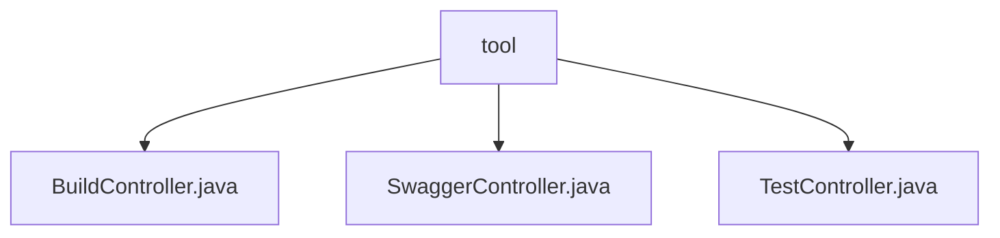

# 基础信息

|      |      |
|------|------|
| 名称 | tool |
| 编码语言 | .java |
| 代码路径 | RuoYi-main/ruoyi-admin/src/main/java/com/ruoyi/web/controller/tool |
| 包名 | RuoYi-main.ruoyi-admin.src.main.java.com.ruoyi.web.controller.tool |
| 概述说明 | 控制器类处理工具构建、Swagger重定向及用户信息管理功能。 |

# 说明

## 概述

该代码模块是一个基于RuoYi框架的后端管理系统，主要包含工具构建、Swagger API文档访问以及用户信息管理等功能。模块通过多个控制器类实现了不同的业务场景，确保系统功能的安全性和易用性。其中，工具构建功能需要特定权限才能访问，Swagger API文档访问提供了统一的入口，用户信息管理则支持对用户数据的全面操作。

## 主要业务场景

1. **工具构建**  
   - **路径**: `/tool/build`  
   - **功能**: 处理与工具构建相关的请求，确保只有授权用户能够执行相关操作。  
   - **权限**: 需要特定权限才能访问。  
   - **控制器类**: `BuildController.java`  

2. **Swagger API文档访问**  
   - **路径**: `/swagger`  
   - **功能**: 将请求重定向至Swagger UI页面，方便开发者查看和交互式测试API文档。  
   - **目的**: 提升开发效率和用户体验。  
   - **控制器类**: `SwaggerController.java`  

3. **用户信息管理**  
   - **功能**: 提供获取用户列表、查看用户详细信息、新增用户、更新用户信息和删除用户的功能。  
   - **用户实体字段**: ID、名称、密码、手机号等。  
   - **目的**: 支持对用户数据的全面管理。  
   - **控制器类**: `TestController.java`  

通过以上功能，该模块实现了对工具构建、API文档访问和用户信息管理的全面支持，确保了系统的安全性和易用性。

### 包内部结构视图

该流程图展示了`tool`目录下的三个控制器文件：`BuildController.java`、`SwaggerController.java`和`TestController.java`。这些文件均位于`tool`目录下，表示它们是该目录的直接子文件，用于处理不同的功能模块。

# 文件列表 File List

| 名称   | 类型  | 说明 |
|-------|------|-------------|
| [SwaggerController.java](SwaggerController.md) | file | SwaggerController处理/swagger请求，重定向至swagger-ui页面。 |
| [TestController.java](TestController.md) | file | 用户管理API提供增删改查功能，用户实体包含ID、名称、密码和手机号字段。 |
| [BuildController.java](BuildController.md) | file | 控制器类处理工具构建请求，路径为/tool/build，需权限访问。 |

