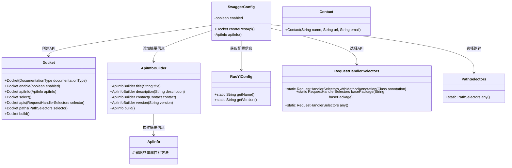
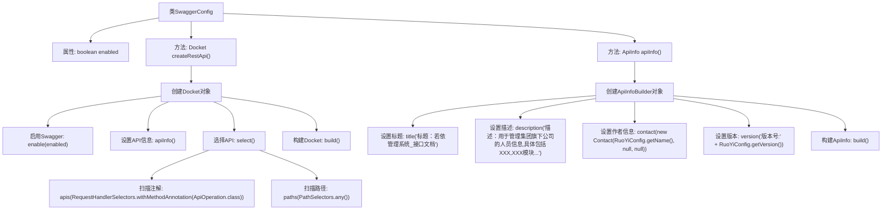

# 基础信息

|      |      |
|------|------|
| 名称 | SwaggerConfig |
| 编码语言 | .java |
| 代码路径 | RuoYi-main/ruoyi-admin/src/main/java/com/ruoyi/web/core/config/SwaggerConfig.java |
| 包名 | com.ruoyi.web.core.config |
| 依赖项 | ['org.springframework.beans.factory.annotation.Value', 'org.springframework.context.annotation.Bean', 'org.springframework.context.annotation.Configuration', 'com.ruoyi.common.config.RuoYiConfig', 'io.swagger.annotations.ApiOperation', 'springfox.documentation.builders.ApiInfoBuilder', 'springfox.documentation.builders.PathSelectors', 'springfox.documentation.builders.RequestHandlerSelectors', 'springfox.documentation.service.ApiInfo', 'springfox.documentation.service.Contact', 'springfox.documentation.spi.DocumentationType', 'springfox.documentation.spring.web.plugins.Docket'] |
| 概述说明 | Swagger配置类支持启用状态配置，通过扫描注解生成API文档。 |

# 说明

Swagger配置类用于生成API文档，支持通过扫描注解接口自动生成文档内容。该配置类的启用状态可以根据需要进行灵活配置，确保在不同环境下能够方便地启用或禁用Swagger功能。通过这种方式，开发者可以快速生成并维护API文档，提升开发效率和文档的准确性。

# 类列表 Class Summary

| 名称   | 类型  | 说明 |
|-------|------|-------------|
| SwaggerConfig | class | Swagger配置类，启用状态可配置，扫描注解接口生成API文档。 |

## 类 SwaggerConfig

|      |      |
|------|------|
| 访问范围 | @Configuration;public |
| 类型 | class |
| 名称 | SwaggerConfig |
| 说明 | Swagger配置类，启用状态可配置，扫描注解接口生成API文档。 |

### UML类图

这段代码定义了一个名为 `SwaggerConfig` 的配置类，用于配置 Swagger 文档的生成。`SwaggerConfig` 类通过 `createRestApi` 方法创建一个 `Docket` 对象，该对象用于配置 Swagger 文档的基本信息、扫描的接口路径等。`apiInfo` 方法则用于生成 API 的摘要信息，包括标题、描述、作者信息和版本号。`SwaggerConfig` 类依赖于 `Docket`、`ApiInfoBuilder`、`RuoYiConfig`、`RequestHandlerSelectors` 和 `PathSelectors` 等类来完成其功能。

### 内部方法调用关系图

这段代码定义了一个名为`SwaggerConfig`的配置类，用于配置Swagger API文档的生成。类中包含一个布尔类型的属性`enabled`，用于控制Swagger的启用状态。`createRestApi`方法用于创建并配置`Docket`对象，该对象定义了哪些API接口将被Swagger展示，并设置了API的基本信息。`apiInfo`方法则用于构建API的摘要信息，包括标题、描述、作者信息和版本号。通过这两个方法的调用，Swagger能够生成详细的API文档。

### 字段列表 Field List

| 名称  | 类型  | 说明 |
|-------|-------|------|
| enabled | boolean | Swagger启用状态配置项。 |

### 方法列表 Method List

| 名称  | 类型  | 说明 |
|-------|-------|------|
| createRestApi | Docket | 创建Swagger API文档，启用状态可配置，自定义展示信息，扫描带注解接口。 |
| apiInfo | ApiInfo | 生成API文档，标题为若依管理系统，描述管理集团人员信息，包含作者和版本信息。 |

