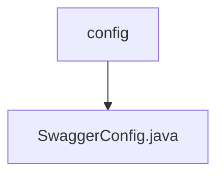

# 基础信息

|      |      |
|------|------|
| 名称 | config |
| 编码语言 | .java |
| 代码路径 | RuoYi-main/ruoyi-admin/src/main/java/com/ruoyi/web/core/config |
| 包名 | RuoYi-main.ruoyi-admin.src.main.java.com.ruoyi.web.core.config |
| 概述说明 | Swagger配置类支持启用状态配置，通过扫描注解生成API文档。 |

# 说明

Swagger配置类用于生成API文档，支持通过扫描注解接口自动生成文档内容。该配置类的启用状态可以根据需要进行灵活配置，确保在不同环境下能够方便地启用或禁用Swagger功能。通过这种方式，开发者可以快速生成并维护API文档，提升开发效率和文档的准确性。

### 包内部结构视图

该流程图展示了路径的层级关系，`config`文件夹下包含`SwaggerConfig.java`文件。通过这种结构，可以清晰地看到文件在项目中的位置及其所属的父级目录。

# 文件列表 File List

| 名称   | 类型  | 说明 |
|-------|------|-------------|
| [SwaggerConfig.java](SwaggerConfig.md) | file | Swagger配置类支持启用状态配置，通过扫描注解生成API文档。 |

