# 基础信息

|      |      |
|------|------|
| 名称 | common |
| 编码语言 | .java |
| 代码路径 | RuoYi-main/ruoyi-common/src/main/java/com/ruoyi/common |
| 包名 | RuoYi-main.ruoyi-common.src.main.java.com.ruoyi.common |
| 概述说明 | 该模块提供JSON序列化、反序列化及数据操作功能，支持多种数据格式，简化JSON处理流程。 |

# 说明

## 概述
该代码模块是一个综合性的Java后台管理系统，主要围绕JSON数据处理、表格分页管理、权限控制、核心实体数据管理、文本处理、枚举定义、自定义注解、常量管理、安全性增强、动态数据源配置、异常处理以及工具类集合展开。模块设计注重灵活性、可扩展性和代码的可维护性，旨在简化开发流程，提升系统的安全性、一致性和性能。

## 主要业务场景
1. **JSON数据处理**：
   - 提供JSON数据的序列化与反序列化功能，支持从文件、流、字符串和字节数组中读取和写入JSON数据，适用于对象持久化和系统间数据传输。
   - 通过`JSONObject`类高效管理和操作JSON结构，支持动态修改和查询。

2. **表格数据分页管理**：
   - 通过`TableDataInfo`、`PageDomain`和`TableSupport`类提供高效的分页管理功能，适用于数据查询结果的展示和管理。

3. **权限控制**：
   - 通过`PermissionContextHolder`类管理权限上下文，确保权限信息在请求处理过程中有效传递和访问，提升系统安全性和一致性。

4. **核心实体数据管理**：
   - 管理系统的核心实体数据（如菜单、用户、角色、字典、部门），支持数据的导入导出、层级关系管理和状态控制。

5. **文本处理**：
   - 提供数据类型转换、字符集转换和字符串格式化功能，确保文本处理的准确性和一致性。

6. **枚举定义**：
   - 通过枚举类标准化系统中的常量值（如业务状态、数据源类型、脱敏规则、操作类型等），提高代码的可读性和可维护性。

7. **自定义注解**：
   - 支持匿名访问控制、敏感数据处理、数据源切换、Excel导出、日志记录、数据权限控制和重复提交控制等功能。

8. **常量管理**：
   - 集中管理字符集、语言、请求协议、状态标识、缓存配置、资源路径等常量，确保系统在不同环境下的一致性和稳定性。

9. **安全性增强**：
   - 通过`XssFilter`、`XssValidator`和`XssHttpServletRequestWrapper`类防止跨站脚本攻击（XSS），确保系统在处理用户输入时的安全性。

10. **动态数据源配置**：
    - 通过`ThreadLocal`机制管理动态数据源，支持多线程环境下的数据源切换。

11. **异常处理**：
    - 提供一系列自定义异常类，支持错误码、嵌套异常、错误提示和明细信息，确保系统在异常情况下的健壮性和可维护性。

12. **工具类集合**：
    - 提供缓存管理、IP地址处理、反射操作、日期处理、用户会话管理、Spring容器操作、敏感信息脱敏、精确运算、HTTP请求处理、字符串操作、Cookie管理、国际化支持、线程管理、Bean操作、唯一标识符生成、SQL安全性增强、分页处理、Excel文件处理、文件处理、请求参数转换、HTTP请求、字典缓存管理、异常处理、安全处理、日志记录以及HTML内容安全处理等功能，简化开发流程，提升代码的可维护性、安全性和效率。

### 包内部结构视图

```mermaid
graph TD
    common --> json
    common --> core
    common --> enums
    common --> annotation
    common --> constant
    common --> xss
    common --> config
    common --> exception
    common --> utils
    json --> JSON.java
    json --> JSONObject.java
    core --> context
    core --> page
    core --> controller
    core --> domain
    core --> text
    context --> PermissionContextHolder.java
    page --> TableDataInfo.java
    page --> PageDomain.java
    page --> TableSupport.java
    controller --> BaseController.java
    domain --> entity
    domain --> Ztree.java
    domain --> R.java
    domain --> BaseEntity.java
    domain --> AjaxResult.java
    domain --> CxSelect.java
    domain --> TreeEntity.java
    entity --> SysMenu.java
    entity --> SysUser.java
    entity --> SysRole.java
    entity --> SysDictType.java
    entity --> SysDictData.java
    entity --> SysDept.java
    text --> Convert.java
    text --> CharsetKit.java
    text --> StrFormatter.java
    enums --> BusinessStatus.java
    enums --> DataSourceType.java
    enums --> DesensitizedType.java
    enums --> BusinessType.java
    enums --> OperatorType.java
    enums --> OnlineStatus.java
    enums --> UserStatus.java
    annotation --> Anonymous.java
    annotation --> Sensitive.java
    annotation --> DataSource.java
    annotation --> Excel.java
    annotation --> Log.java
    annotation --> DataScope.java
    annotation --> Excels.java
    annotation --> RepeatSubmit.java
    constant --> Constants.java
    constant --> UserConstants.java
    constant --> GenConstants.java
    constant --> ScheduleConstants.java
    constant --> ShiroConstants.java
    constant --> PermissionConstants.java
    xss --> XssFilter.java
    xss --> XssValidator.java
    xss --> XssHttpServletRequestWrapper.java
    xss --> Xss.java
    config --> datasource
    config --> RuoYiConfig.java
    config --> serializer
    config --> ServerConfig.java
    config --> thread
    datasource --> DynamicDataSourceContextHolder.java
    serializer --> SensitiveJsonSerializer.java
    thread --> ThreadPoolConfig.java
    exception --> job
    exception --> ServiceException.java
    exception --> user
    exception --> GlobalException.java
    exception --> UtilException.java
    exception --> DemoModeException.java
    exception --> base
    exception --> file
    job --> TaskException.java
    user --> CaptchaException.java
    user --> UserNotExistsException.java
    user --> UserException.java
    user --> UserBlockedException.java
    user --> UserDeleteException.java
    user --> UserPasswordRetryLimitCountException.java
    user --> RoleBlockedException.java
    user --> UserPasswordNotMatchException.java
    user --> BlackListException.java
    user --> UserPasswordRetryLimitExceedException.java
    base --> BaseException.java
    file --> FileUploadException.java
    file --> FileSizeLimitExceededException.java
    file --> InvalidExtensionException.java
    file --> FileException.java
    file --> FileNameLengthLimitExceededException.java
    utils --> CacheUtils.java
    utils --> AddressUtils.java
    utils --> IpUtils.java
    utils --> reflect
    utils --> DateUtils.java
    utils --> ShiroUtils.java
    utils --> spring
    utils --> DesensitizedUtil.java
    utils --> Arith.java
    utils --> ServletUtils.java
    utils --> StringUtils.java
    utils --> CookieUtils.java
    utils --> MessageUtils.java
    utils --> Threads.java
    utils --> bean
    utils --> uuid
    utils --> sql
    utils --> PageUtils.java
    utils --> poi
    utils --> file
    utils --> MapDataUtil.java
    utils --> http
    utils --> DictUtils.java
    utils --> ExceptionUtil.java
    utils --> security
    utils --> LogUtils.java
    utils --> html
    reflect --> ReflectUtils.java
    spring --> SpringUtils.java
    bean --> BeanUtils.java
    bean --> BeanValidators.java
    uuid --> IdUtils.java
    uuid --> UUID.java
    uuid --> Seq.java
    sql --> SqlUtil.java
    poi --> ExcelHandlerAdapter.java
    poi --> ExcelUtil.java
    file --> MimeTypeUtils.java
    file --> FileTypeUtils.java
    file --> ImageUtils.java
    file --> FileUploadUtils.java
    file --> FileUtils.java
    http --> HttpUtils.java
    security --> CipherUtils.java
    security --> Md5Utils.java
    security --> PermissionUtils.java
    html --> HTMLFilter.java
    html --> EscapeUtil.java
```

该流程图展示了RuoYi项目中`ruoyi-common`模块的目录结构及其文件层级关系。`common`作为根节点，包含了多个子模块如`json`、`core`、`enums`等，每个子模块下又进一步细分为具体的文件或子目录。这种结构清晰地反映了项目的组织方式，便于开发者快速定位和理解各个模块的功能及其相互关系。

# 文件列表 File List

| 名称   | 类型  | 说明 |
|-------|------|-------------|
| [utils](utils/_module.md) | package | CacheUtils管理缓存，AddressUtils查IP位置，IpUtils处理IP，ReflectUtils反射操作，DateUtils日期处理，ShiroUtils用户操作，SpringUtils管理Bean，DesensitizedUtil脱敏，Arith精确运算，ServletUtils处理HTTP，StringUtils字符串操作，CookieUtils管理Cookie，MessageUtils国际化，Threads线程管理，BeanUtils属性操作，IdUtils生成UUID，SqlUtil增强SQL安全，PageUtils分页处理，ExcelUtil处理Excel，FileUtils文件操作，MapDataUtil请求转Map，HttpUtilsHTTP请求，DictUtils字典缓存，ExceptionUtil异常处理，CipherUtils秘钥生成，LogUtils记录日志，HTMLFilter过滤HTML。 |
| [exception](exception/_module.md) | package | 自定义异常类继承RuntimeException，处理用户、文件、全局等场景，提升系统健壮性和可维护性。 |
| [config](config/_module.md) | package | 动态数据源、RuoYi配置、JSON脱敏、服务地址、线程池设置。 |
| [xss](xss/_module.md) | package | XssFilter类过滤URL防XSS，XssValidator类检测HTML标签，XssHttpServletRequestWrapper类过滤请求参数空格。 |
| [core](core/_module.md) | package | PermissionContextHolder管理权限上下文，TableDataInfo等类管理分页数据，BaseController提供常用功能，SysMenu等类管理系统核心数据，Convert等类处理文本转换。 |
| [constant](constant/_module.md) | package | 定义了系统常量，涵盖字符集、语言、协议、缓存、任务调度、权限等，确保系统稳定性和一致性。 |
| [annotation](annotation/_module.md) | package | 提供的文件内容为空，无法进行总结描述。 |
| [enums](enums/_module.md) | package | 输入内容为空，无法生成总结描述。 |
| [json](json/_module.md) | package | JSON工具类支持多种数据格式的序列化与反序列化，简化数据处理流程。JSONObject类继承LinkedHashMap，提供全面的JSON操作支持。 |

