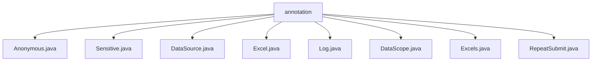

# 基础信息

|      |      |
|------|------|
| 名称 | annotation |
| 编码语言 | .java |
| 代码路径 | RuoYi-main/ruoyi-common/src/main/java/com/ruoyi/common/annotation |
| 包名 | RuoYi-main.ruoyi-common.src.main.java.com.ruoyi.common.annotation |
| 概述说明 | 提供的文件内容为空，无法进行总结描述。 |

# 说明

## 概述
该代码模块位于 `RuoYi-main/ruoyi-common/src/main/java/com/ruoyi/common/annotation/` 目录下，主要包含多个自定义注解类。这些注解类可能用于在 RuoYi 框架中实现特定的功能或行为控制，例如日志记录、数据源切换、敏感数据处理、Excel 导出等。然而，由于提供的文件内容为空，无法确定每个注解的具体实现细节和功能。

## 主要业务场景
根据文件名推测，这些注解可能应用于以下业务场景：
1. **匿名访问控制** (`Anonymous.java`)：用于标识某些方法或接口允许匿名访问，无需用户认证。
2. **敏感数据处理** (`Sensitive.java`)：用于标记需要脱敏处理的字段或数据，确保敏感信息在展示或存储时得到保护。
3. **数据源切换** (`DataSource.java`)：用于动态切换数据源，支持多数据源环境下的操作。
4. **Excel 导出** (`Excel.java` 和 `Excels.java`)：用于定义实体类字段与 Excel 列的映射关系，支持数据导出为 Excel 文件。
5. **日志记录** (`Log.java`)：用于标记需要记录日志的方法或操作，便于系统监控和问题排查。
6. **数据权限控制** (`DataScope.java`)：用于控制数据访问权限，确保用户只能访问其权限范围内的数据。
7. **重复提交控制** (`RepeatSubmit.java`)：用于防止表单或请求的重复提交，提升系统的健壮性。

由于缺乏具体内容，以上场景仅为推测，实际功能需根据注解的具体实现进行确认。

### 包内部结构视图

该流程图展示了`annotation`文件夹下的所有Java文件，包括`Anonymous.java`、`Sensitive.java`、`DataSource.java`、`Excel.java`、`Log.java`、`DataScope.java`、`Excels.java`和`RepeatSubmit.java`。这些文件均位于`annotation`目录下，体现了它们之间的层级关系。

# 文件列表 File List

| 名称   | 类型  | 说明 |
|-------|------|-------------|
| [RepeatSubmit.java](RepeatSubmit.md) | file | 无内容提供，无法生成概要描述。 |
| [Excels.java](Excels.md) | file | 输入信息为空，无法生成概要描述。 |
| [DataScope.java](DataScope.md) | file | 内容为空，无法生成概要描述。 |
| [Log.java](Log.md) | file | 信息缺失，无法生成概要描述。请提供具体内容。 |
| [Excel.java](Excel.md) | file | 信息为空，无法生成概要描述。 |
| [Sensitive.java](Sensitive.md) | file | 信息为空，无法生成概要描述。 |
| [DataSource.java](DataSource.md) | file | 提供简洁明了的总结说明，确保关键信息完整且不超过100字符。 |
| [Anonymous.java](Anonymous.md) | file | 输入信息为空，无法生成概要描述。 |

