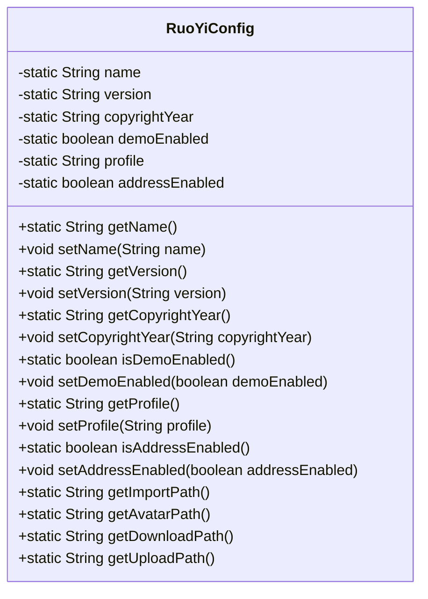

# 基础信息

|      |      |
|------|------|
| 名称 | RuoYiConfig |
| 编码语言 | .java |
| 代码路径 | RuoYi-main/ruoyi-common/src/main/java/com/ruoyi/common/config/RuoYiConfig.java |
| 包名 | com.ruoyi.common.config |
| 依赖项 | ['org.springframework.boot.context.properties.ConfigurationProperties', 'org.springframework.stereotype.Component'] |
| 概述说明 | RuoYiConfig类配置项目名称、版本、版权年份、上传路径并提供路径获取方法。 |

# 说明

RuoYiConfig类主要负责配置项目的核心属性，包括项目名称、版本、版权年份以及文件上传路径等关键信息。该类还提供了获取这些配置路径的方法，确保项目在运行过程中能够准确访问和调用这些配置数据，从而支持项目的正常运作和功能实现。

# 类列表 Class Summary

| 名称   | 类型  | 说明 |
|-------|------|-------------|
| RuoYiConfig | class | RuoYiConfig类用于配置项目名称、版本、版权年份、上传路径等属性，并提供相关路径获取方法。 |

## 类 RuoYiConfig

|      |      |
|------|------|
| 访问范围 | @Component;@ConfigurationProperties(prefix = "ruoyi");public |
| 类型 | class |
| 名称 | RuoYiConfig |
| 说明 | RuoYiConfig类用于配置项目名称、版本、版权年份、上传路径等属性，并提供相关路径获取方法。 |

### UML类图

### 描述
`RuoYiConfig` 类是一个配置类，用于管理项目的静态配置属性，如项目名称、版本、版权年份、实例演示开关、上传路径等。该类提供了对这些属性的静态访问和修改方法，并通过 `@ConfigurationProperties` 注解与配置文件绑定。此外，该类还提供了一些静态方法用于获取特定的路径，如导入路径、头像路径、下载路径和上传路径。这些路径基于 `profile` 属性动态生成。

### 内部方法调用关系图

```mermaid
graph TD
    A["类RuoYiConfig"]
    B["属性: String name"]
    C["属性: String version"]
    D["属性: String copyrightYear"]
    E["属性: boolean demoEnabled"]
    F["属性: String profile"]
    G["属性: boolean addressEnabled"]
    H["方法: String getName()"]
    I["方法: void setName(String name)"]
    J["方法: String getVersion()"]
    K["方法: void setVersion(String version)"]
    L["方法: String getCopyrightYear()"]
    M["方法: void setCopyrightYear(String copyrightYear)"]
    N["方法: boolean isDemoEnabled()"]
    O["方法: void setDemoEnabled(boolean demoEnabled)"]
    P["方法: String getProfile()"]
    Q["方法: void setProfile(String profile)"]
    R["方法: boolean isAddressEnabled()"]
    S["方法: void setAddressEnabled(boolean addressEnabled)"]
    T["方法: String getImportPath()"]
    U["方法: String getAvatarPath()"]
    V["方法: String getDownloadPath()"]
    W["方法: String getUploadPath()"]

    A --> B
    A --> C
    A --> D
    A --> E
    A --> F
    A --> G
    A --> H
    A --> I
    A --> J
    A --> K
    A --> L
    A --> M
    A --> N
    A --> O
    A --> P
    A --> Q
    A --> R
    A --> S
    A --> T
    A --> U
    A --> V
    A --> W
```

这段代码定义了一个名为 `RuoYiConfig` 的类，用于管理项目的配置信息。类中包含多个静态属性，如项目名称、版本、版权年份等，并提供了相应的 `getter` 和 `setter` 方法。此外，还定义了一些辅助方法，如 `getImportPath`、`getAvatarPath` 等，用于获取特定文件的上传路径。通过这些方法，可以方便地访问和修改项目的配置信息，并获取文件上传的具体路径。

### 字段列表 Field List

| 名称  | 类型  | 说明 |
|-------|-------|------|
| name | String | 定义了一个私有的静态字符串变量name。 |
| copyrightYear | String | 私有静态字符串变量copyrightYear。 |
| version | String | 定义私有静态字符串变量version。 |
| profile | String | 私有静态字符串变量profile的声明。 |
| demoEnabled | boolean | 私有静态布尔变量demoEnabled用于控制演示功能状态。 |
| addressEnabled | boolean | 私有静态布尔型变量addressEnabled。 |

### 方法列表 Method List

| 名称  | 类型  | 说明 |
|-------|-------|------|
| getName | String | 静态方法getName返回变量name的值。 |
| setName | void | 该方法用于设置RuoYiConfig的name属性。 |
| getProfile | String | 获取并返回profile变量的静态方法。 |
| getCopyrightYear | String | 获取版权年份的静态方法。 |
| getVersion | String | 获取当前版本号的静态方法。 |
| isDemoEnabled | boolean | 该方法返回demoEnabled的布尔值，用于判断演示模式是否启用。 |
| isAddressEnabled | boolean | 方法isAddressEnabled返回addressEnabled的布尔值。 |
| setProfile | void | 该方法用于设置RuoYiConfig的profile属性。 |
| getUploadPath | String | 获取上传路径的方法，返回配置路径加上"/upload"。 |
| setVersion | void | 该方法用于设置RuoYiConfig的版本号。 |
| setCopyrightYear | void | 设置版权年份方法，将传入值赋给配置类的版权年份变量。 |
| setAddressEnabled | void | 设置地址启用状态，更新RuoYiConfig中的addressEnabled值。 |
| getImportPath | String | 静态方法返回配置文件路径加“/import”。 |
| setDemoEnabled | void | 设置demo模式的启用状态。 |
| getDownloadPath | String | 静态方法返回下载路径，路径为配置文件目录下的download文件夹。 |
| getAvatarPath | String | 静态方法返回用户配置路径下的头像路径。 |

