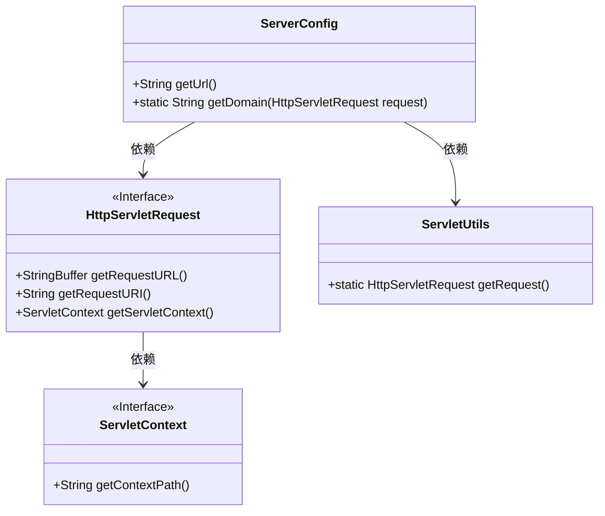
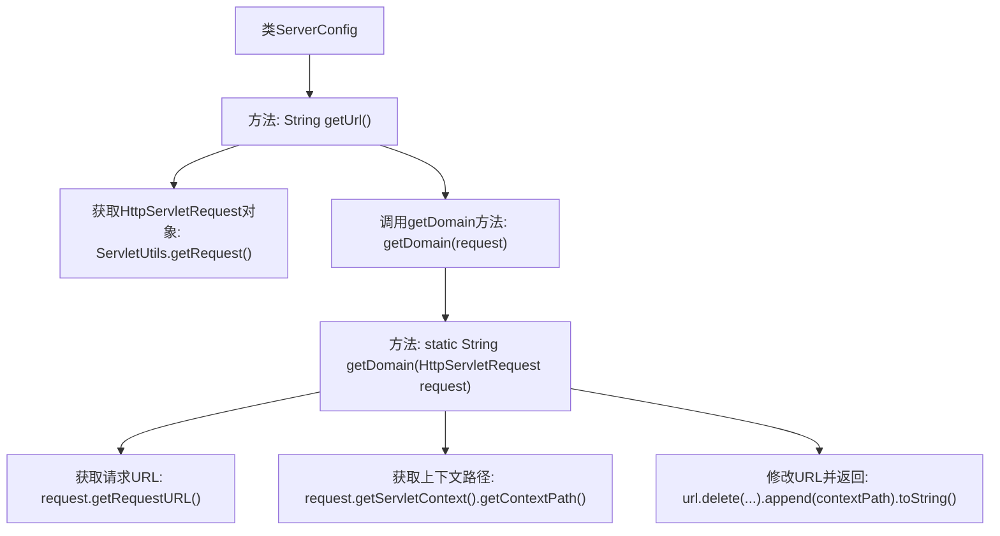

# 基础信息

|      |      |
|------|------|
| 名称 | ServerConfig |
| 编码语言 | .java |
| 代码路径 | RuoYi-main/ruoyi-common/src/main/java/com/ruoyi/common/config/ServerConfig.java |
| 包名 | com.ruoyi.common.config |
| 依赖项 | ['javax.servlet.http.HttpServletRequest', 'org.springframework.stereotype.Component', 'com.ruoyi.common.utils.ServletUtils'] |
| 概述说明 | ServerConfig类用于获取包含域名、端口和上下文路径的完整服务地址。 |

# 说明

ServerConfig类的主要功能是获取完整的服务地址，该方法整合了域名、端口和上下文路径，确保能够准确生成服务的完整访问地址。通过调用该方法，用户可以方便地获取到服务的基础信息，为后续的网络请求或服务调用提供必要的地址参数。

# 类列表 Class Summary

| 名称   | 类型  | 说明 |
|-------|------|-------------|
| ServerConfig | class | ServerConfig类提供获取完整服务地址的方法，包括域名、端口和上下文路径。 |

## 类 ServerConfig

|      |      |
|------|------|
| 访问范围 | @Component;public |
| 类型 | class |
| 名称 | ServerConfig |
| 说明 | ServerConfig类提供获取完整服务地址的方法，包括域名、端口和上下文路径。 |

### UML类图

**描述：**  
`ServerConfig` 类通过 `ServletUtils` 获取 `HttpServletRequest` 对象，并利用该对象获取完整的请求路径。`HttpServletRequest` 是一个接口，提供了获取请求URL、URI和ServletContext的方法。`ServletContext` 也是一个接口，用于获取上下文路径。`ServerConfig` 类通过 `getUrl` 方法调用 `getDomain` 方法，最终返回服务地址。

### 内部方法调用关系图

这段代码定义了一个名为 `ServerConfig` 的类，其中包含两个方法：`getUrl()` 和 `getDomain(HttpServletRequest request)`。`getUrl()` 方法通过 `ServletUtils.getRequest()` 获取当前的 `HttpServletRequest` 对象，并调用 `getDomain(request)` 方法来获取完整的服务地址。`getDomain` 方法通过 `request.getRequestURL()` 获取请求的URL，并通过 `request.getServletContext().getContextPath()` 获取上下文路径，最后将两者拼接并返回完整的服务地址。

### 字段列表 Field List

| 名称  | 类型  | 说明 |
|-------|-------|------|

### 方法列表 Method List

| 名称  | 类型  | 说明 |
|-------|-------|------|
| getUrl | String | 获取当前请求的域名并返回。 |
| getDomain | String | 获取HTTP请求的域名并附加上下文路径。 |

